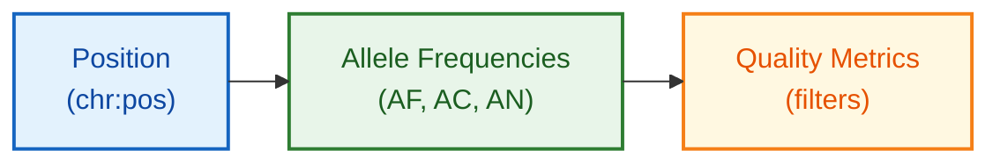

# TOPMed Schema Documentation

**Document ID:** SCHEMA-TOPMED
**Version:** 1.0
**Source Version:** Freeze 8

---

## TL;DR

TOPMed provides allele frequencies from deep whole-genome sequencing of 180,000+ diverse individuals. Public access via Bravo browser offers variant-level frequencies; individual-level data requires dbGaP authorization.

---

## Database Statistics

| Metric | Value | Source |
|--------|-------|--------|
| Individuals | 180,000+ | Freeze 8 |
| Sequencing Depth | ~30x WGS | High-coverage |
| Variants | 400,000,000+ | Discovered |
| Rare Variants | 97% of SNVs | AF < 0.5% |
| Studies | 80+ | Contributing |

---

## Entity Relationship Overview



---

## Core Tables/Entities

### Bravo API Response

**Description:** Variant frequency from Bravo browser

| Field | Type | Required | Description |
|-------|------|----------|-------------|
| chrom | string | Yes | Chromosome |
| pos | integer | Yes | Position (1-based) |
| ref | string | Yes | Reference allele |
| alt | string | Yes | Alternate allele |
| allele_freq | float | Yes | Allele frequency |
| allele_count | integer | Yes | Allele count |
| allele_num | integer | Yes | Total alleles |
| filter | string | Yes | PASS or filter reason |
| het_count | integer | No | Heterozygote count |
| hom_count | integer | No | Homozygote count |

### dbGaP Individual Data (Authorized Access)

| Field | Type | Description |
|-------|------|-------------|
| NWD_ID | string | TOPMed sample ID |
| study_phs | string | dbGaP study accession |
| genotype | string | Individual genotype |
| phenotype | varies | Study-specific phenotypes |

---

## Data Formats

| Format | Description |
|--------|-------------|
| Primary | VCF (dbGaP) |
| Public | Bravo API (JSON) |
| Imputation | M3VCF reference panel |
| Encoding | UTF-8 |

---

## Sample Record

```json
{
  "chrom": "1",
  "pos": 10177,
  "ref": "A",
  "alt": "AC",
  "allele_freq": 0.4251,
  "allele_count": 153036,
  "allele_num": 360000,
  "filter": "PASS"
}
```

---

## Glossary

| Term | Definition |
|------|------------|
| Freeze | Periodic data release version |
| NWD | TOPMed sample identifier prefix |
| Bravo | Public frequency browser for TOPMed |
| dbGaP | Database of Genotypes and Phenotypes |

---

## References

1. https://bravo.sph.umich.edu/
2. https://www.nhlbiwgs.org/
3. Taliun et al. (2021) Nature. DOI: 10.1038/s41586-021-03205-y
