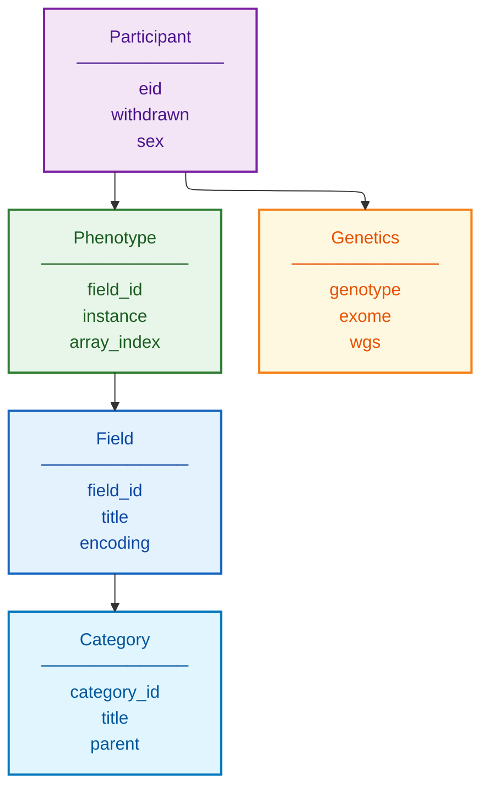

# UK Biobank Schema Documentation

**Document ID:** SCHEMA-UK-BIOBANK
**Version:** 1.0
**Source Version:** Current (continuously updated)

---

## TL;DR

UK Biobank provides linked genetic and phenotypic data from 500,000 UK participants. Data structures include genotyping arrays, exome/genome sequencing, and 10,000+ phenotype fields organized by category with standardized encoding. Participant data uses encrypted identifiers (eid) with field-instance-array notation.

---

## Database Statistics

| Metric | Value | Source |
|--------|-------|--------|
| Participants | 500,000 | Total enrolled |
| Genotyped | 500,000 | Array data |
| Exome Sequenced | 470,000+ | 50x coverage |
| WGS | 200,000+ | 30x coverage |
| Phenotype Fields | 10,000+ | Categories |
| MRI Imaging | 100,000+ | Brain/body |
| Follow-up Years | 15+ | Longitudinal |

---

## Entity Relationship Overview



---

## Core Tables/Entities

### Participant

**Description:** Enrolled participant with encrypted identifier

| Field | Type | Required | Description |
|-------|------|----------|-------------|
| eid | integer | Yes | Encrypted participant ID |
| withdrawn | boolean | Yes | Consent withdrawal status |
| sex | integer | Yes | 0=Female, 1=Male |
| assessment_centre | integer | Yes | Enrollment location |
| date_of_assessment | date | Yes | Baseline visit date |

### Phenotype Data

**Description:** Field values using field-instance-array notation

| Field | Type | Required | Description |
|-------|------|----------|-------------|
| eid | integer | Yes | Participant ID |
| field_id | integer | Yes | Data-field identifier |
| instance | integer | Yes | Visit instance (0=baseline) |
| array_index | integer | Yes | Array position (for multi-value) |
| value | varies | Yes | Encoded or raw value |

### Field Definition

**Description:** Data-field metadata and encoding

| Field | Type | Required | Description |
|-------|------|----------|-------------|
| field_id | integer | Yes | Unique field identifier |
| title | string | Yes | Field name |
| availability | string | Yes | Data availability level |
| value_type | string | Yes | Integer, Continuous, Categorical, etc. |
| encoding_id | integer | No | Categorical encoding reference |
| units | string | No | Measurement units |
| instance_count | integer | Yes | Number of instances |
| array_count | integer | Yes | Array dimensions |

### Category

**Description:** Hierarchical category organization

| Field | Type | Required | Description |
|-------|------|----------|-------------|
| category_id | integer | Yes | Category identifier |
| title | string | Yes | Category name |
| parent_id | integer | No | Parent category |

### Key Categories

| ID | Category | Description |
|----|----------|-------------|
| 100001 | Demographics | Age, sex, ethnicity |
| 100002 | Lifestyle | Diet, exercise, smoking |
| 100003 | Medical Conditions | ICD-10 diagnoses |
| 100004 | Measurements | Physical measurements |
| 100005 | Biomarkers | Blood/urine assays |
| 100006 | Genetics | Array/sequencing data |

### Genetic Data

**Description:** Genotype and sequencing data formats

| Data Type | Format | Description |
|-----------|--------|-------------|
| Array Genotypes | PLINK bed/bim/fam | 800K+ markers |
| Imputed Genotypes | BGEN | 90M+ variants |
| Exome Variants | PLINK, VCF | 50x exome |
| WGS Variants | VCF | 30x genome |

### Genotype Fields

| Field | Type | Required | Description |
|-------|------|----------|-------------|
| eid | integer | Yes | Participant ID |
| genotyping_array | string | No | Array type used |
| batch | string | No | Genotyping batch |
| plate | string | No | Plate ID |
| well | string | No | Well position |
| sex_inferred | integer | No | Genetically inferred sex |
| heterozygosity | float | No | Sample heterozygosity |
| missingness | float | No | Genotype call rate |

---

## Data Formats

| Format | Description |
|--------|-------------|
| Phenotypes | Tab-separated, R/Stata/SAS |
| Genotypes | PLINK, BGEN, VCF |
| Imaging | DICOM, NIfTI |
| Encoding | UTF-8, ISO-8859-1 |
| Reference | GRCh37 (array), GRCh38 (WGS) |

---

## Sample Record

```json
{
  "participant": {
    "eid": 1234567,
    "sex": 1,
    "assessment_centre": 11010,
    "date_of_assessment": "2010-03-15"
  },
  "phenotypes": [
    {
      "field_id": 21001,
      "instance": 0,
      "array_index": 0,
      "title": "Body mass index (BMI)",
      "value": 25.4,
      "units": "kg/m2"
    },
    {
      "field_id": 30760,
      "instance": 0,
      "array_index": 0,
      "title": "HDL cholesterol",
      "value": 1.52,
      "units": "mmol/L"
    }
  ],
  "genetics": {
    "genotyped": true,
    "exome_sequenced": true,
    "wgs_sequenced": true,
    "genetic_sex": 1,
    "genetic_ethnic_grouping": "European"
  },
  "common_fields": {
    "31-0.0": "Male",
    "21001-0.0": 25.4,
    "21002-0.0": 180,
    "22001-0.0": 1
  }
}
```

---

## Glossary

| Term | Definition |
|------|------------|
| eid | Encrypted participant identifier |
| Instance | Assessment visit number (0=baseline, 1=repeat, etc.) |
| Array Index | Position in multi-value fields |
| Field ID | Unique data-field identifier |
| RAP | Research Analysis Platform (DNANexus) |
| UDI | Unique Data Identifier notation |
| BGEN | Binary GEN format for imputed data |

---

## References

1. https://www.ukbiobank.ac.uk/
2. Sudlow et al. (2015) PLOS Med. DOI: 10.1371/journal.pmed.1001779
3. https://biobank.ndph.ox.ac.uk/showcase/
