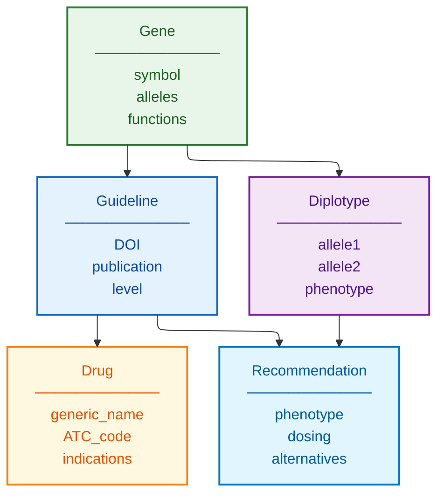

# CPIC Schema Documentation

**Document ID:** SCHEMA-CPIC
**Version:** 1.0
**Source Version:** Current (continuously updated)

---

## TL;DR

CPIC provides structured clinical pharmacogenomics guidelines linking gene-drug pairs to therapeutic recommendations. Data includes allele function tables, diplotype-phenotype translations, and dosing recommendations accessed via PharmGKB.

---

## Database Statistics

| Metric | Value | Source |
|--------|-------|--------|
| Published Guidelines | 33 | CPIC website |
| Gene-Drug Pairs | 75+ | Covered |
| Priority Genes | 25 | Level A evidence |
| Evidence Levels | A, B, C, D | Classification |
| Update Cycle | Continuous | As evidence emerges |

---

## Entity Relationship Overview



---

## Core Tables/Entities

### Guideline

**Description:** CPIC guideline document

| Field | Type | Required | Description |
|-------|------|----------|-------------|
| guideline_id | string | Yes | Unique identifier |
| gene | string | Yes | HGNC symbol |
| drug | string | Yes | Generic drug name |
| publication_doi | string | Yes | DOI reference |
| cpic_level | string | Yes | A, B, C, or D |
| last_updated | date | Yes | Update date |

### Allele Function Table

**Description:** Allele-to-function mapping

| Field | Type | Required | Description |
|-------|------|----------|-------------|
| gene | string | Yes | Gene symbol |
| allele | string | Yes | Star allele (e.g., *1) |
| function | string | Yes | Normal/Decreased/No function |
| clinical_function | string | No | Clinical interpretation |
| activity_score | float | No | Numeric activity |

### Recommendation

**Description:** Therapeutic recommendation

| Field | Type | Required | Description |
|-------|------|----------|-------------|
| phenotype | string | Yes | Metabolizer status |
| drug | string | Yes | Drug name |
| recommendation | string | Yes | Dosing guidance |
| strength | string | Yes | Strong/Moderate/Optional |
| implications | string | No | Clinical implications |

---

## Data Formats

| Format | Description |
|--------|-------------|
| Primary | Excel supplements |
| Alternative | PharmGKB JSON/TSV |
| Encoding | UTF-8 |
| Access | Web + API |

---

## Sample Record

```json
{
  "gene": "CYP2D6",
  "drug": "codeine",
  "phenotype": "CYP2D6 Poor Metabolizer",
  "recommendation": "Avoid codeine use due to lack of efficacy. Consider alternative analgesics.",
  "strength": "Strong",
  "level": "A"
}
```

---

## Glossary

| Term | Definition |
|------|------------|
| Level A | Genetic information should be used to change prescribing |
| Level B | Genetic information could be used to change prescribing |
| Activity Score | Numeric representation of enzyme activity |
| Diplotype | Combination of two alleles |

---

## References

1. https://cpicpgx.org/
2. https://www.pharmgkb.org/cpic
3. Relling & Klein (2011) Clin Pharmacol Ther. DOI: 10.1038/clpt.2010.279
