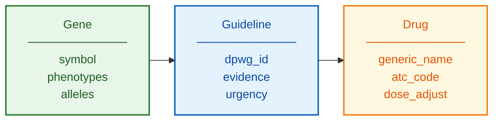

# DPWG Schema Documentation

**Document ID:** SCHEMA-DPWG
**Version:** 1.0
**Source Version:** Current (via PharmGKB)

---

## TL;DR

DPWG provides Dutch pharmacogenetics guidelines integrated into the G-Standaard national drug database. Guidelines are accessible internationally via PharmGKB with structured gene-drug recommendations and urgency classifications.

---

## Database Statistics

| Metric | Value | Source |
|--------|-------|--------|
| Gene-Drug Pairs | 100+ | Covered |
| Active Guidelines | 90+ | Current |
| Genes Covered | 15+ | Primary PGx genes |
| Evidence Levels | Strong, Moderate, Limited | Classification |
| Implementation | G-Standaard | Dutch national |

---

## Entity Relationship Overview



---

## Core Tables/Entities

### Guideline

**Description:** DPWG recommendation

| Field | Type | Required | Description |
|-------|------|----------|-------------|
| gene | string | Yes | HGNC symbol |
| drug | string | Yes | Generic name |
| atc_code | string | Yes | WHO ATC code |
| phenotype | string | Yes | Metabolizer status |
| recommendation | string | Yes | Action to take |
| urgency | string | Yes | Urgent/Non-urgent |
| evidence_level | string | Yes | Strong/Moderate/Limited |

### Phenotype Mapping

**Description:** Genotype to phenotype translation

| Field | Type | Required | Description |
|-------|------|----------|-------------|
| gene | string | Yes | Gene symbol |
| diplotype | string | Yes | Allele combination |
| phenotype | string | Yes | Predicted phenotype |
| activity_score | float | No | When applicable |

---

## Data Formats

| Format | Description |
|--------|-------------|
| Primary | G-Standaard (Dutch) |
| International | PharmGKB JSON/TSV |
| Encoding | UTF-8 |
| Access | Web + API |

---

## Sample Record

```json
{
  "gene": "CYP2C19",
  "drug": "clopidogrel",
  "atc_code": "B01AC04",
  "phenotype": "CYP2C19 Poor Metabolizer",
  "recommendation": "Avoid clopidogrel. Use alternative antiplatelet (prasugrel, ticagrelor).",
  "urgency": "Urgent",
  "evidence_level": "Strong"
}
```

---

## Urgency Classification

| Level | Description | Action |
|-------|-------------|--------|
| Urgent | Therapeutic failure or adverse event likely | Immediate intervention |
| Non-urgent | Suboptimal therapy possible | Consider at next prescription |

---

## Glossary

| Term | Definition |
|------|------------|
| G-Standaard | Dutch national drug database |
| KNMP | Royal Dutch Pharmacists Association |
| ATC | Anatomical Therapeutic Chemical classification |

---

## References

1. https://www.pharmgkb.org/page/dpwg
2. https://www.knmp.nl/
3. Swen et al. (2011) Clin Pharmacol Ther. DOI: 10.1038/clpt.2011.34
