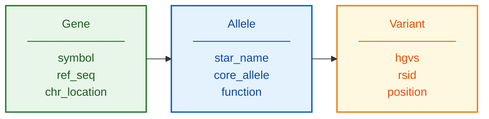

# PharmVar Schema Documentation

**Document ID:** SCHEMA-PHARMVAR
**Version:** 1.0
**Source Version:** Current (continuously updated)

---

## TL;DR

PharmVar provides the official nomenclature and definitions for pharmacogene star alleles. Each allele entry includes defining variants, reference sequence positions, and functional status. Data is available via web interface, API, and downloadable files.

---

## Database Statistics

| Metric | Value | Source |
|--------|-------|--------|
| Genes | 30+ | Catalogued |
| Total Alleles | 3,000+ | Defined |
| CYP2D6 Alleles | 150+ | Most complex |
| CYP2C19 Alleles | 40+ | Common PGx gene |
| Reference Sequences | Gene-specific | NG sequences |

---

## Entity Relationship Overview



---

## Core Tables/Entities

### Gene

**Description:** Pharmacogene entry

| Field | Type | Required | Description |
|-------|------|----------|-------------|
| gene_symbol | string | Yes | HGNC symbol |
| ref_seq_id | string | Yes | NG reference sequence |
| chromosome | string | Yes | Chromosomal location |
| strand | string | Yes | + or - |
| num_alleles | integer | Yes | Total allele count |

### Allele

**Description:** Star allele definition

| Field | Type | Required | Description |
|-------|------|----------|-------------|
| allele_name | string | Yes | Star notation (e.g., *4) |
| core_allele | string | Yes | Core allele (e.g., *4.001) |
| function | string | No | No/Decreased/Normal function |
| activity_value | float | No | Activity score |
| defining_variants | array | Yes | List of variants |

### Variant

**Description:** Defining variant for allele

| Field | Type | Required | Description |
|-------|------|----------|-------------|
| hgvs_g | string | Yes | Genomic HGVS |
| hgvs_c | string | No | Coding HGVS |
| hgvs_p | string | No | Protein HGVS |
| rsid | string | No | dbSNP ID |
| impact | string | No | Effect type |

---

## Data Formats

| Format | Description |
|--------|-------------|
| Primary | TSV downloads |
| Alternative | FASTA sequences |
| API | REST endpoints |
| Encoding | UTF-8 |

---

## Sample Record

```json
{
  "gene": "CYP2D6",
  "allele": "*4",
  "core_allele": "*4.001",
  "function": "No function",
  "activity_value": 0,
  "defining_variants": [
    {
      "hgvs_g": "NC_000022.11:g.42128945C>T",
      "hgvs_c": "NM_000106.6:c.506-1G>A",
      "rsid": "rs3892097",
      "impact": "Splice defect"
    }
  ]
}
```

---

## Star Allele Naming

| Pattern | Example | Description |
|---------|---------|-------------|
| *N | *4 | Core allele group |
| *N.NNN | *4.001 | Specific suballele |
| *NxN | *1x2 | Gene duplication |
| *N+*N | *36+*10 | Hybrid/tandem |

---

## Glossary

| Term | Definition |
|------|------------|
| Core allele | Base allele sharing key defining variants |
| Suballele | Specific haplotype within core allele |
| Defining variant | Variant required for allele assignment |
| Activity value | Numeric enzyme activity (0, 0.5, 1, etc.) |

---

## References

1. https://www.pharmvar.org/
2. Gaedigk et al. (2018) Clin Pharmacol Ther. DOI: 10.1002/cpt.910
