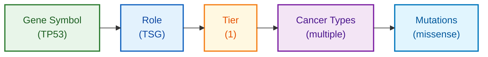

# Cancer Gene Census Schema Documentation

**Document ID:** SCHEMA-CANCER-GENE-CENSUS
**Version:** 1.0
**Source Version:** Current (COSMIC)

---

## TL;DR

The Cancer Gene Census (CGC) catalogs genes with documented cancer-causing mutations. Each entry includes gene role (oncogene/TSG), tier classification, associated cancer types, and mutation types. Data is part of COSMIC and requires registration for download.

---

## Database Statistics

| Metric | Value | Source |
|--------|-------|--------|
| Total Genes | 736 | CGC |
| Tier 1 Genes | 588 | Strong evidence |
| Tier 2 Genes | 148 | Emerging evidence |
| Oncogenes | 300+ | Activation |
| Tumor Suppressors | 300+ | Inactivation |

---

## Entity Relationship Overview



---

## Core Tables/Entities

### CGC Gene Entry

**Description:** Cancer gene census record

| Field | Type | Required | Description |
|-------|------|----------|-------------|
| Gene Symbol | string | Yes | HGNC symbol |
| Name | string | Yes | Full gene name |
| Entrez GeneId | integer | Yes | NCBI gene ID |
| Genome Location | string | Yes | Chromosomal location |
| Tier | integer | Yes | 1 (strong) or 2 (emerging) |
| Hallmark | string | No | Cancer hallmarks |
| Role in Cancer | string | Yes | oncogene, TSG, fusion |
| Mutation Types | string | Yes | Types observed |
| Translocation Partner | string | No | Fusion partners |
| Cancer Types | string | Yes | Associated cancers |
| Synonyms | string | No | Alternative names |

---

## Data Formats

| Format | Description |
|--------|-------------|
| Primary | TSV download |
| Alternative | Excel |
| Encoding | UTF-8 |
| Access | Registered download |

---

## Sample Record

```tsv
Gene Symbol	Name	Entrez GeneId	Genome Location	Tier	Hallmark	Role in Cancer	Mutation Types	Cancer Types
TP53	tumor protein p53	7157	17p13.1	1	genome instability	TSG	Mis, N, F	breast, colorectal, lung, ovarian, many others
BRAF	B-Raf proto-oncogene	673	7q34	1	proliferative signalling	oncogene	Mis	melanoma, colorectal, thyroid, NSCLC
```

---

## Role Classification

| Role | Description | Example |
|------|-------------|---------|
| oncogene | Activated by mutation | BRAF, KRAS |
| TSG | Inactivated by mutation | TP53, BRCA1 |
| fusion | Forms oncogenic fusion | BCR, ABL1 |

---

## Tier Definitions

| Tier | Evidence Level | Criteria |
|------|---------------|----------|
| 1 | Strong | Documented mutation causality |
| 2 | Emerging | Suggestive evidence, ongoing research |

---

## Mutation Type Codes

| Code | Description |
|------|-------------|
| Mis | Missense substitution |
| N | Nonsense substitution |
| F | Frameshift |
| S | Splice site |
| D | Large deletion |
| T | Translocation |
| A | Amplification |

---

## Glossary

| Term | Definition |
|------|------------|
| TSG | Tumor Suppressor Gene |
| CGC | Cancer Gene Census |
| Hallmark | Cancer hallmark capability |

---

## References

1. https://cancer.sanger.ac.uk/census
2. Sondka et al. (2018) Nat Rev Cancer. DOI: 10.1038/s41568-018-0060-1
