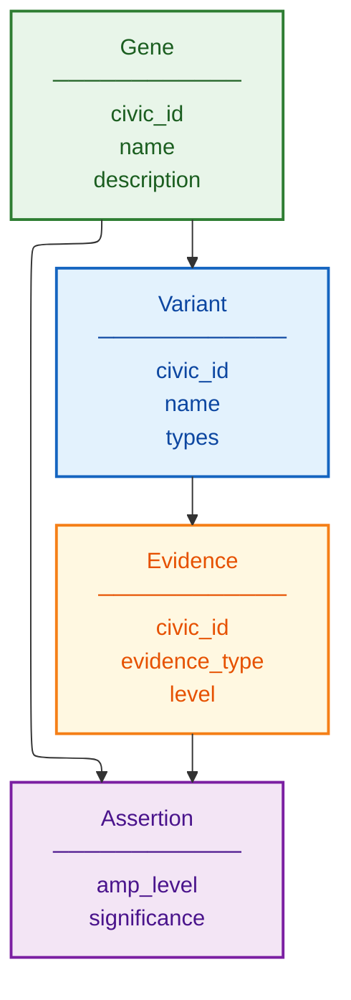

# CIViC Schema Documentation

**Document ID:** SCHEMA-CIVIC
**Version:** 1.0
**Source Version:** Current (continuously updated)

---

## TL;DR

CIViC provides crowdsourced clinical interpretations linking cancer variants to therapeutic, diagnostic, prognostic, and predisposing significance. Data follows AMP/ASCO/CAP guidelines with evidence items, assertions, and variant-level annotations accessible via GraphQL API.

---

## Database Statistics

| Metric | Value | Source |
|--------|-------|--------|
| Genes | 500+ | Curated |
| Variants | 3,000+ | Annotated |
| Evidence Items | 8,000+ | Published |
| Assertions | 200+ | Expert-reviewed |
| Contributors | 400+ | Community |

---

## Entity Relationship Overview



---

## Core Tables/Entities

### Gene

**Description:** Cancer-related gene

| Field | Type | Required | Description |
|-------|------|----------|-------------|
| id | integer | Yes | CIViC gene ID |
| name | string | Yes | HGNC symbol |
| entrez_id | integer | Yes | NCBI Entrez ID |
| description | string | No | Gene description |
| aliases | array | No | Alternative names |

### Variant

**Description:** Genomic variant with clinical relevance

| Field | Type | Required | Description |
|-------|------|----------|-------------|
| id | integer | Yes | CIViC variant ID |
| gene_id | integer | Yes | Parent gene |
| name | string | Yes | Variant name (e.g., V600E) |
| variant_types | array | Yes | SO terms |
| coordinates | object | No | Genomic coordinates |
| hgvs_expressions | array | No | HGVS nomenclature |

### Evidence Item

**Description:** Clinical evidence linking variant to significance

| Field | Type | Required | Description |
|-------|------|----------|-------------|
| id | integer | Yes | Evidence ID (EID) |
| variant_id | integer | Yes | Linked variant |
| disease | object | Yes | Cancer type (DOID) |
| evidence_type | string | Yes | Predictive/Diagnostic/Prognostic/Predisposing |
| evidence_level | string | Yes | A/B/C/D/E |
| evidence_direction | string | Yes | Supports/Does Not Support |
| clinical_significance | string | Yes | Sensitivity/Resistance/etc. |
| source | object | Yes | Publication reference |
| drugs | array | No | Therapies (for Predictive) |

---

## API Endpoints

| Endpoint | Method | Description |
|----------|--------|-------------|
| GraphQL | POST | /api/graphql |
| REST (deprecated) | GET | /api/variants |
| Nightly downloads | GET | TSV/JSON files |

---

## Data Formats

| Format | Description |
|--------|-------------|
| Primary | GraphQL API |
| Download | TSV, JSON |
| Encoding | UTF-8 |
| Release | Nightly builds |

---

## Sample Record

```json
{
  "id": 12,
  "gene": {"name": "BRAF", "id": 5},
  "name": "V600E",
  "evidence_items": [{
    "id": 1234,
    "evidence_type": "Predictive",
    "evidence_level": "A",
    "clinical_significance": "Sensitivity/Response",
    "disease": {"name": "Melanoma"},
    "drugs": [{"name": "Vemurafenib"}],
    "source": {"citation": "Chapman et al., 2011", "pmid": "21639808"}
  }]
}
```

---

## Evidence Levels

| Level | Description | Source |
|-------|-------------|--------|
| A | Validated association | FDA/guidelines |
| B | Clinical evidence | Clinical trials |
| C | Case study | Case reports |
| D | Preclinical | Cell line/model |
| E | Inferential | Indirect evidence |

---

## Glossary

| Term | Definition |
|------|------------|
| EID | Evidence Item ID |
| AID | Assertion ID |
| DOID | Disease Ontology ID |
| AMP | Association for Molecular Pathology |

---

## References

1. https://civicdb.org/
2. Griffith et al. (2017) Nat Genet. DOI: 10.1038/ng.3774
