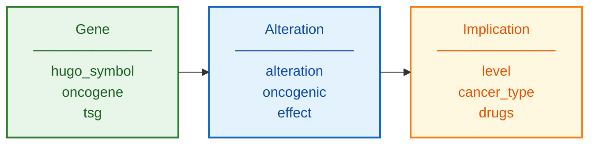

# OncoKB Schema Documentation

**Document ID:** SCHEMA-ONCOKB
**Version:** 1.0
**Source Version:** Current (continuously updated)

---

## TL;DR

OncoKB provides expert-curated annotations linking cancer variants to oncogenic effects and therapeutic implications with FDA/guideline-based evidence levels. Data includes mutations, CNAs, fusions, and tumor mutational burden with tiered actionability.

---

## Database Statistics

| Metric | Value | Source |
|--------|-------|--------|
| Genes | 700+ | Annotated |
| Variants | 5,000+ | Curated |
| Cancer Types | 100+ | Covered |
| Level 1 Evidence | 100+ | FDA-approved |
| Therapeutic Implications | 3,000+ | Documented |

---

## Entity Relationship Overview



---

## Core Tables/Entities

### Gene Annotation

**Description:** Gene-level oncogenic status

| Field | Type | Required | Description |
|-------|------|----------|-------------|
| hugoSymbol | string | Yes | HGNC symbol |
| oncogene | boolean | Yes | Is oncogene |
| tsg | boolean | Yes | Is tumor suppressor |
| geneAliases | array | No | Alternative names |
| background | string | No | Gene description |

### Alteration

**Description:** Genomic alteration

| Field | Type | Required | Description |
|-------|------|----------|-------------|
| gene | object | Yes | Gene reference |
| alteration | string | Yes | Alteration name (V600E) |
| name | string | Yes | Full name |
| alterationType | string | Yes | Mutation/CNA/Fusion |
| consequence | string | No | Protein consequence |
| proteinStart | integer | No | Protein position start |
| proteinEnd | integer | No | Protein position end |

### Therapeutic Implication

**Description:** Treatment implication

| Field | Type | Required | Description |
|-------|------|----------|-------------|
| level | string | Yes | Evidence level (1, 2, 3A, 3B, 4, R1, R2) |
| alterations | array | Yes | Associated alterations |
| cancerTypes | array | Yes | Applicable cancer types |
| drugs | array | Yes | Recommended therapies |
| pmids | array | No | Supporting publications |
| abstracts | array | No | Conference abstracts |
| description | string | No | Clinical context |

---

## API Endpoints

| Endpoint | Method | Description |
|----------|--------|-------------|
| /api/v1/annotate/mutations | POST | Annotate mutations |
| /api/v1/genes/{gene} | GET | Gene information |
| /api/v1/levels | GET | Level descriptions |
| /api/v1/drugs | GET | Drug list |

---

## Data Formats

| Format | Description |
|--------|-------------|
| Primary | REST API (JSON) |
| Download | Data files (registered) |
| Encoding | UTF-8 |
| Access | API token required |

---

## Sample Record

```json
{
  "gene": {"hugoSymbol": "BRAF"},
  "alteration": "V600E",
  "oncogenic": "Oncogenic",
  "mutationEffect": {
    "knownEffect": "Gain-of-function"
  },
  "treatments": [{
    "level": "1",
    "cancerTypes": [{"mainType": "Melanoma"}],
    "drugs": [{"drugName": "Vemurafenib"}, {"drugName": "Dabrafenib"}]
  }]
}
```

---

## Evidence Levels

| Level | Category | Description |
|-------|----------|-------------|
| 1 | Therapeutic | FDA-approved, same tumor type |
| 2 | Therapeutic | Standard care, same tumor type |
| 3A | Therapeutic | Compelling evidence, same tumor type |
| 3B | Therapeutic | Standard care, different tumor type |
| 4 | Therapeutic | Compelling evidence, different tumor type |
| R1 | Resistance | Standard care resistance |
| R2 | Resistance | Compelling resistance evidence |

---

## Oncogenic Classifications

| Classification | Description |
|----------------|-------------|
| Oncogenic | Known oncogenic effect |
| Likely Oncogenic | Strong evidence of oncogenic effect |
| Predicted Oncogenic | Computational prediction |
| Likely Neutral | Evidence suggests benign |
| Inconclusive | Insufficient evidence |

---

## Glossary

| Term | Definition |
|------|------------|
| MSK | Memorial Sloan Kettering |
| MTB | Molecular Tumor Board |
| TMB | Tumor Mutational Burden |
| MSI | Microsatellite Instability |

---

## References

1. https://www.oncokb.org/
2. Chakravarty et al. (2017) JCO Precis Oncol. DOI: 10.1200/PO.17.00011
