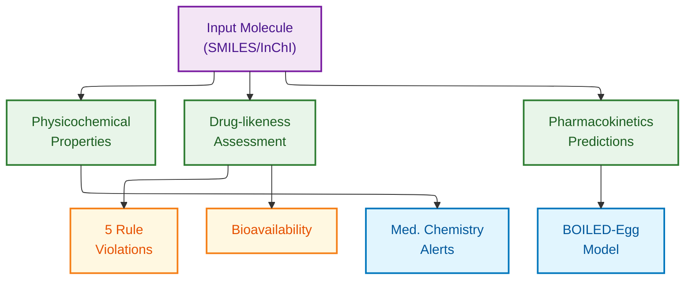

# SwissADME Schema Documentation

**Document ID:** SCHEMA-SWISSADME
**Version:** 1.0
**Source Version:** SwissADME v1.0 (2017+)

---

## TL;DR

SwissADME provides comprehensive ADME property predictions via web interface, returning physicochemical descriptors, drug-likeness assessments, pharmacokinetic predictions, and medicinal chemistry alerts as structured JSON/CSV output for up to 100 compounds per query.

---

## Database Statistics

| Metric | Value | Source |
|--------|-------|--------|
| Physicochemical Descriptors | 20+ | Computed on-the-fly |
| Drug-likeness Filters | 5 rule sets | Lipinski, Veber, Egan, Ghose, Muegge |
| CYP Predictions | 5 isoforms | CYP1A2, CYP2C19, CYP2C9, CYP2D6, CYP3A4 |
| Max Batch Size | 100 compounds | Per query limit |
| PAINS Alerts | 480+ patterns | Pan-assay interference |

---

## Entity Relationship Overview



---

## Core Output Entities

### Molecular Identity

**Description:** Input molecule identifiers and canonical representations

| Field | Type | Required | Description |
|-------|------|----------|-------------|
| Molecule | String | Yes | Molecule name or index |
| Canonical_SMILES | String | Yes | Standardized SMILES notation |
| InChIKey | String | Yes | InChI key identifier |
| Formula | String | Yes | Molecular formula |

### Physicochemical Properties

**Description:** Computed molecular descriptors for property prediction

| Field | Type | Required | Description | Range |
|-------|------|----------|-------------|-------|
| MW | Float | Yes | Molecular weight (Da) | >0 |
| Heavy_Atoms | Integer | Yes | Non-hydrogen atom count | >0 |
| Aromatic_Heavy_Atoms | Integer | Yes | Aromatic heavy atoms | >=0 |
| Fraction_Csp3 | Float | Yes | Fraction sp3 carbons | 0-1 |
| Rotatable_Bonds | Integer | Yes | Rotatable bond count | >=0 |
| HBD | Integer | Yes | H-bond donors | >=0 |
| HBA | Integer | Yes | H-bond acceptors | >=0 |
| MR | Float | Yes | Molar refractivity | >0 |
| TPSA | Float | Yes | Topological polar surface area (A^2) | >=0 |

### Lipophilicity Predictions

**Description:** Multiple LogP prediction methods

| Field | Type | Required | Description |
|-------|------|----------|-------------|
| iLOGP | Float | Yes | In-house physics-based method |
| XLOGP3 | Float | Yes | Atomistic method |
| WLOGP | Float | Yes | Wildman-Crippen method |
| MLOGP | Float | Yes | Moriguchi method |
| SILICOS_IT_LogP | Float | Yes | SILICOS-IT method |
| Consensus_LogP | Float | Yes | Average of 5 methods |

### Water Solubility Predictions

**Description:** Aqueous solubility estimations

| Field | Type | Required | Description |
|-------|------|----------|-------------|
| ESOL_LogS | Float | Yes | ESOL method log S |
| ESOL_Solubility | Float | Yes | ESOL solubility (mg/mL) |
| ESOL_Class | String | Yes | Solubility class |
| Ali_LogS | Float | Yes | Ali method log S |
| Ali_Solubility | Float | Yes | Ali solubility (mg/mL) |
| Ali_Class | String | Yes | Solubility class |
| SILICOS_IT_LogS | Float | Yes | SILICOS-IT log S |
| SILICOS_IT_Solubility | Float | Yes | SILICOS-IT solubility (mg/mL) |
| SILICOS_IT_Class | String | Yes | Solubility class |

### Drug-likeness Assessment

**Description:** Compliance with multiple drug-likeness rule sets

| Field | Type | Required | Description |
|-------|------|----------|-------------|
| Lipinski_Violations | Integer | Yes | Lipinski Rule of 5 violations (0-4) |
| Ghose_Violations | Integer | Yes | Ghose filter violations |
| Veber_Violations | Integer | Yes | Veber filter violations |
| Egan_Violations | Integer | Yes | Egan filter violations |
| Muegge_Violations | Integer | Yes | Muegge filter violations |
| Bioavailability_Score | Float | Yes | Abbott bioavailability score (0-1) |
| Leadlikeness_Violations | Integer | Yes | Lead-likeness violations |

### Pharmacokinetics Predictions

**Description:** ADME and permeability predictions

| Field | Type | Required | Description |
|-------|------|----------|-------------|
| GI_Absorption | String | Yes | GI absorption (High/Low) |
| BBB_Permeant | String | Yes | BBB permeation (Yes/No) |
| Pgp_Substrate | String | Yes | P-glycoprotein substrate (Yes/No) |
| CYP1A2_Inhibitor | String | Yes | CYP1A2 inhibition (Yes/No) |
| CYP2C19_Inhibitor | String | Yes | CYP2C19 inhibition (Yes/No) |
| CYP2C9_Inhibitor | String | Yes | CYP2C9 inhibition (Yes/No) |
| CYP2D6_Inhibitor | String | Yes | CYP2D6 inhibition (Yes/No) |
| CYP3A4_Inhibitor | String | Yes | CYP3A4 inhibition (Yes/No) |
| Log_Kp | Float | Yes | Skin permeation (cm/s) |

### Medicinal Chemistry Assessment

**Description:** Structural alerts and synthetic considerations

| Field | Type | Required | Description |
|-------|------|----------|-------------|
| PAINS_Alerts | Integer | Yes | PAINS pattern matches |
| Brenk_Alerts | Integer | Yes | Brenk structural alerts |
| Synthetic_Accessibility | Float | Yes | SA score (1-10, lower=easier) |

---

## Drug-Likeness Rules Detail

### Lipinski Rule of Five

| Criterion | Threshold | Field |
|-----------|-----------|-------|
| Molecular Weight | <= 500 Da | MW |
| LogP | <= 5 | Consensus_LogP |
| H-bond Donors | <= 5 | HBD |
| H-bond Acceptors | <= 10 | HBA |

### Veber Rules

| Criterion | Threshold | Field |
|-----------|-----------|-------|
| TPSA | <= 140 A^2 | TPSA |
| Rotatable Bonds | <= 10 | Rotatable_Bonds |

### Egan Rules

| Criterion | Threshold | Field |
|-----------|-----------|-------|
| LogP | <= 5.88 | WLOGP |
| TPSA | <= 131.6 A^2 | TPSA |

### Ghose Rules

| Criterion | Range | Field |
|-----------|-------|-------|
| Molecular Weight | 160-480 Da | MW |
| LogP | -0.4 to 5.6 | WLOGP |
| Molar Refractivity | 40-130 | MR |
| Total Atoms | 20-70 | Heavy_Atoms |

### Muegge Rules

| Criterion | Range | Field |
|-----------|-------|-------|
| Molecular Weight | 200-600 Da | MW |
| LogP | -2 to 5 | XLOGP3 |
| TPSA | <= 150 A^2 | TPSA |
| Rings | <= 7 | Num_Rings |
| Carbons | > 4 | Num_Carbons |
| Heteroatoms | > 1 | Num_Heteroatoms |
| Rotatable Bonds | <= 15 | Rotatable_Bonds |
| HBD | <= 5 | HBD |
| HBA | <= 10 | HBA |

---

## BOILED-Egg Model

**Description:** Brain or Intestinal EstimateD permeation method

| Region | TPSA Range | WLOGP Range | Interpretation |
|--------|------------|-------------|----------------|
| White (Egg White) | <= 142 | -2.3 to 6.8 | High GI absorption |
| Yellow (Yolk) | <= 79 | 0.4 to 6.0 | High BBB permeation |
| Gray (Outside) | >142 or out of range | Out of range | Poor absorption |

---

## API Endpoints

| Endpoint | Method | Description |
|----------|--------|-------------|
| http://www.swissadme.ch | GET | Web interface |
| http://www.swissadme.ch/index.php | POST | Submit SMILES |

**Note:** SwissADME is primarily a web interface without a formal REST API. Programmatic access requires form submission or web scraping.

---

## Data Formats

| Format | Description |
|--------|-------------|
| Primary | CSV export from web interface |
| Input | SMILES or MOL/SDF |
| Encoding | UTF-8 |
| Visual | BOILED-Egg plot (PNG) |

---

## Sample Input

```
# Multiple SMILES (one per line)
CC(=O)OC1=CC=CC=C1C(=O)O	Aspirin
CC(=O)NC1=CC=C(C=C1)O	Paracetamol
CN1C=NC2=C1C(=O)N(C(=O)N2C)C	Caffeine
```

---

## Sample Output Record

```json
{
  "Molecule": "Aspirin",
  "Canonical_SMILES": "CC(=O)OC1=CC=CC=C1C(=O)O",
  "InChIKey": "BSYNRYMUTXBXSQ-UHFFFAOYSA-N",
  "Formula": "C9H8O4",
  "MW": 180.16,
  "Heavy_Atoms": 13,
  "Aromatic_Heavy_Atoms": 6,
  "Fraction_Csp3": 0.11,
  "Rotatable_Bonds": 3,
  "HBD": 1,
  "HBA": 4,
  "MR": 44.46,
  "TPSA": 63.60,
  "Consensus_LogP": 1.19,
  "ESOL_Class": "Soluble",
  "Lipinski_Violations": 0,
  "Ghose_Violations": 0,
  "Veber_Violations": 0,
  "Egan_Violations": 0,
  "Muegge_Violations": 0,
  "Bioavailability_Score": 0.85,
  "GI_Absorption": "High",
  "BBB_Permeant": "Yes",
  "Pgp_Substrate": "No",
  "CYP1A2_Inhibitor": "No",
  "CYP2C19_Inhibitor": "No",
  "CYP2C9_Inhibitor": "No",
  "CYP2D6_Inhibitor": "No",
  "CYP3A4_Inhibitor": "No",
  "Log_Kp": -6.26,
  "PAINS_Alerts": 0,
  "Brenk_Alerts": 0,
  "Synthetic_Accessibility": 1.34
}
```

---

## Solubility Classes

| Class | Log S Range | Interpretation |
|-------|-------------|----------------|
| Insoluble | < -10 | Very poor solubility |
| Poorly soluble | -10 to -6 | Poor solubility |
| Moderately soluble | -6 to -4 | Moderate solubility |
| Soluble | -4 to -2 | Good solubility |
| Very soluble | -2 to 0 | Very good solubility |
| Highly soluble | > 0 | Excellent solubility |

---

## Glossary

| Term | Definition |
|------|------------|
| ADME | Absorption, Distribution, Metabolism, Excretion |
| TPSA | Topological Polar Surface Area - sum of surfaces of polar atoms |
| HBD | Hydrogen Bond Donor - atoms that can donate H in H-bonding |
| HBA | Hydrogen Bond Acceptor - atoms that can accept H in H-bonding |
| LogP | Partition coefficient (octanol/water) |
| LogS | Aqueous solubility (log of mol/L) |
| BBB | Blood-Brain Barrier |
| Pgp | P-glycoprotein - efflux transporter |
| CYP | Cytochrome P450 - metabolizing enzyme family |
| PAINS | Pan-Assay Interference Compounds |
| SA Score | Synthetic Accessibility Score |
| BOILED-Egg | Brain Or Intestinal EstimateD permeation |
| Fraction Csp3 | Ratio of sp3 hybridized carbons to total carbons |
| MR | Molar Refractivity - measure of molecular volume/polarizability |

---

## References

1. Daina A, Michielin O, Zoete V. (2017) "SwissADME: a free web tool to evaluate pharmacokinetics, drug-likeness and medicinal chemistry friendliness of small molecules." Sci Rep. 7:42717. DOI: 10.1038/srep42717
2. Daina A, Zoete V. (2016) "A BOILED-Egg To Predict Gastrointestinal Absorption and Brain Penetration of Small Molecules." ChemMedChem. 11:1117-1121.
3. Lipinski CA, et al. (2001) "Experimental and computational approaches to estimate solubility and permeability in drug discovery and development settings." Adv Drug Deliv Rev. 46:3-26.

---

## Related Documents

- [SwissADME Download Instructions](./download.md)
- [SuperCYP](../supercyp/README.md) - CYP interaction database
- [DrugBank](../../2.2.pharmaceuticals/drugbank/README.md) - Drug properties
