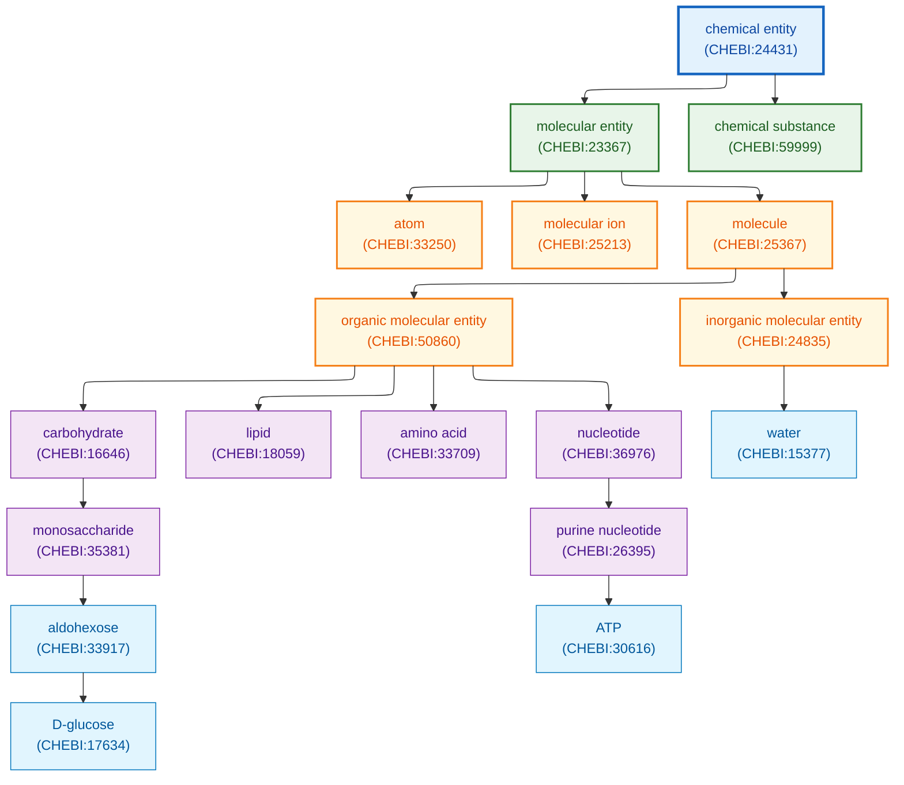
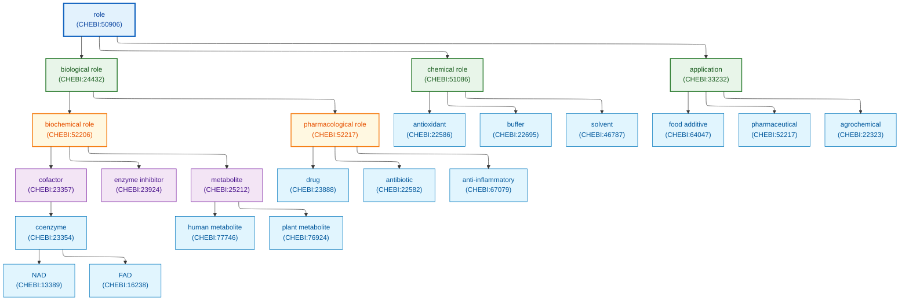

**Parent:** [Schema Documentation](./README.md)

# ChEBI (Chemical Entities of Biological Interest) Schema

**Source:** https://www.ebi.ac.uk/chebi/
**Maintained by:** European Bioinformatics Institute (EBI)
**License:** CC BY 4.0
**Format:** OBO, OWL, SDF, TSV

---

## TL;DR

ChEBI is a freely available dictionary of molecular entities focused on small chemical compounds. It provides a hierarchical ontology of chemical structures, biological roles, and chemical relationships. Key features include:

- **175,000+ chemical entities** with 50,000+ fully curated (3-star)
- **2,500+ biological/chemical roles** organized in role ontology
- **Complete structural data** including InChI, SMILES, formula, mass
- **Standard formats:** OBO ontology, OWL, SDF structure files
- **API access:** REST, SOAP, OLS (Ontology Lookup Service)
- **Cross-references** to PubChem, KEGG, DrugBank, HMDB, Rhea, Reactome

---

## Overview

ChEBI (Chemical Entities of Biological Interest) is the reference ontology for small molecules in life sciences. Every compound is assigned a unique CHEBI identifier and classified within a hierarchical structure that includes both chemical classification (structural features) and biological roles (biochemical functions, pharmacological activities).

---

## Chemical Ontology Hierarchy

ChEBI organizes chemicals into a hierarchical ontology based on structural features:



---

## Role Ontology

ChEBI assigns biological and chemical roles that describe function rather than structure:



---

## Entry Structure

### Core Fields

| Field | Type | Description | Example |
|-------|------|-------------|---------|
| `CHEBI_ID` | String | Primary identifier | CHEBI:17234 |
| `name` | String | Primary name | D-glucose |
| `definition` | String | Textual definition | An aldohexose used as energy source |
| `synonyms` | String[] | Alternative names | dextrose, grape sugar, blood sugar |
| `formula` | String | Molecular formula | C6H12O6 |
| `mass` | Float | Monoisotopic mass | 180.06339 |
| `charge` | Integer | Formal charge | 0 |
| `star` | Integer | Curation level (1-3) | 3 |

### Chemical Structure Fields

| Field | Type | Description | Example |
|-------|------|-------------|---------|
| `InChI` | String | IUPAC International Chemical Identifier | InChI=1S/C6H12O6/c7-1-2-3(8)... |
| `InChIKey` | String | Hashed InChI (27 chars) | WQZGKKKJIJFFOK-GASJEMHNSA-N |
| `SMILES` | String | SMILES notation | OC[C@H]1OC(O)[C@H](O)[C@@H](O)[C@@H]1O |
| `mol_file` | String | MDL MOL block | V2000/V3000 format structure |

### Ontology Relationship Fields

| Field | Type | Description | Example |
|-------|------|-------------|---------|
| `is_a` | CHEBI_ID[] | Parent classes | CHEBI:4194 (D-aldohexose) |
| `has_role` | CHEBI_ID[] | Biological/chemical roles | CHEBI:77746 (human metabolite) |
| `has_part` | CHEBI_ID[] | Structural components | - |
| `is_conjugate_acid_of` | CHEBI_ID | Conjugate base | CHEBI:18391 |
| `is_conjugate_base_of` | CHEBI_ID | Conjugate acid | - |
| `is_enantiomer_of` | CHEBI_ID | Mirror image isomer | CHEBI:37627 (L-glucose) |
| `is_tautomer_of` | CHEBI_ID | Tautomeric form | - |

### Cross-Reference Fields

| Field | Type | Description | Example |
|-------|------|-------------|---------|
| `KEGG_COMPOUND` | String | KEGG Compound ID | C00031 |
| `PubChem_CID` | Integer | PubChem Compound ID | 5793 |
| `HMDB` | String | Human Metabolome DB | HMDB0000122 |
| `DrugBank` | String | DrugBank ID | DB09341 |
| `LIPID_MAPS` | String | LIPID MAPS ID | - |
| `CAS` | String | CAS Registry Number | 50-99-7 |

---

## Data Formats

### OBO Format

ChEBI's native ontology format for terms and relationships:

```obo
[Term]
id: CHEBI:17234
name: D-glucose
def: "An aldohexose used as a source of energy and metabolic intermediate. It is produced during photosynthesis from water and carbon dioxide and constitutes the primary product of plant metabolism. It occurs naturally in grapes, honey, and many fruits." []
subset: 3_STAR
synonym: "D-glucopyranose" RELATED [ChEBI]
synonym: "Dextrose" RELATED [KEGG_COMPOUND]
synonym: "Grape sugar" RELATED [ChEBI]
synonym: "blood sugar" RELATED [ChEBI]
xref: CAS:50-99-7
xref: DrugBank:DB09341
xref: Drug_Central:1233
xref: HMDB:HMDB0000122
xref: KEGG:C00031
xref: MetaCyc:Glucopyranose
xref: PDBeChem:GLC
xref: PubChem:5793
xref: Wikipedia:Glucose
property_value: http://purl.obolibrary.org/obo/chebi/charge "0" xsd:string
property_value: http://purl.obolibrary.org/obo/chebi/formula "C6H12O6" xsd:string
property_value: http://purl.obolibrary.org/obo/chebi/inchi "InChI=1S/C6H12O6/c7-1-2-3(8)4(9)5(10)6(11)12-2/h2-11H,1H2/t2-,3-,4+,5-,6?/m1/s1" xsd:string
property_value: http://purl.obolibrary.org/obo/chebi/inchikey "WQZGKKKJIJFFOK-GASJEMHNSA-N" xsd:string
property_value: http://purl.obolibrary.org/obo/chebi/mass "180.15588" xsd:string
property_value: http://purl.obolibrary.org/obo/chebi/monoisotopicmass "180.06339" xsd:string
property_value: http://purl.obolibrary.org/obo/chebi/smiles "OC[C@H]1OC(O)[C@H](O)[C@@H](O)[C@@H]1O" xsd:string
is_a: CHEBI:4194 ! D-aldohexose
is_a: CHEBI:17925 ! alpha-D-glucose
relationship: has_role CHEBI:77746 ! human metabolite
relationship: has_role CHEBI:75772 ! Saccharomyces cerevisiae metabolite
relationship: has_role CHEBI:76924 ! plant metabolite
relationship: is_conjugate_acid_of CHEBI:18391 ! D-gluconate
relationship: is_enantiomer_of CHEBI:37627 ! L-glucose
```

### SDF Format

Structure-Data File format for chemical structures:

```sdf
D-glucose
  ChEBI  3D

 24 24  0  0  1  0  0  0  0  0999 V2000
    1.0469    0.5284    0.0659 C   0  0  2  0  0  0  0  0  0  0  0  0
    0.5191   -0.4041    1.1387 C   0  0  1  0  0  0  0  0  0  0  0  0
   -0.9932   -0.5107    1.0384 C   0  0  2  0  0  0  0  0  0  0  0  0
   -1.5631    0.8769    0.7887 C   0  0  1  0  0  0  0  0  0  0  0  0
   -0.9731    1.4343   -0.5066 C   0  0  1  0  0  0  0  0  0  0  0  0
    0.5475    1.4693   -0.3531 O   0  0  0  0  0  0  0  0  0  0  0  0
    2.4675    0.4891    0.1791 C   0  0  0  0  0  0  0  0  0  0  0  0
    3.0002   -0.2887   -0.9780 O   0  0  0  0  0  0  0  0  0  0  0  0
    0.8318   -0.0061    2.4934 O   0  0  0  0  0  0  0  0  0  0  0  0
   -1.3422   -1.3697   -0.1634 O   0  0  0  0  0  0  0  0  0  0  0  0
   -3.0004    0.7806    0.6436 O   0  0  0  0  0  0  0  0  0  0  0  0
   -1.3050    0.6895   -1.6490 O   0  0  0  0  0  0  0  0  0  0  0  0
    [... hydrogen atoms ...]
M  END
> <CHEBI_ID>
CHEBI:17234

> <CHEBI_NAME>
D-glucose

> <FORMULA>
C6H12O6

> <MASS>
180.15588

> <MONOISOTOPIC_MASS>
180.06339

> <CHARGE>
0

> <STAR>
3

> <INCHI>
InChI=1S/C6H12O6/c7-1-2-3(8)4(9)5(10)6(11)12-2/h2-11H,1H2/t2-,3-,4+,5-,6?/m1/s1

> <INCHIKEY>
WQZGKKKJIJFFOK-GASJEMHNSA-N

> <SMILES>
OC[C@H]1OC(O)[C@H](O)[C@@H](O)[C@@H]1O

$$$$
```

### JSON Format (API Response)

```json
{
  "chebiId": "CHEBI:17234",
  "chebiAsciiName": "D-glucose",
  "definition": "An aldohexose used as a source of energy and metabolic intermediate.",
  "status": "CHECKED",
  "star": 3,
  "entityStar": 3,
  "formulae": [
    {
      "source": "ChEBI",
      "data": "C6H12O6"
    }
  ],
  "mass": 180.15588,
  "monoisotopicMass": 180.06339,
  "charge": 0,
  "inchi": "InChI=1S/C6H12O6/c7-1-2-3(8)4(9)5(10)6(11)12-2/h2-11H,1H2/t2-,3-,4+,5-,6?/m1/s1",
  "inchiKey": "WQZGKKKJIJFFOK-GASJEMHNSA-N",
  "smiles": "OC[C@H]1OC(O)[C@H](O)[C@@H](O)[C@@H]1O",
  "synonyms": [
    {"source": "ChEBI", "type": "SYNONYM", "data": "D-glucopyranose"},
    {"source": "KEGG COMPOUND", "type": "SYNONYM", "data": "Dextrose"},
    {"source": "ChEBI", "type": "SYNONYM", "data": "Grape sugar"},
    {"source": "ChEBI", "type": "SYNONYM", "data": "blood sugar"}
  ],
  "databaseLinks": [
    {"type": "CAS Registry Number", "data": "50-99-7"},
    {"type": "DrugBank accession", "data": "DB09341"},
    {"type": "HMDB accession", "data": "HMDB0000122"},
    {"type": "KEGG COMPOUND accession", "data": "C00031"},
    {"type": "PubChem accession", "data": "5793"}
  ],
  "ontologyParents": [
    {"chebiId": "CHEBI:4194", "chebiName": "D-aldohexose", "type": "is_a"},
    {"chebiId": "CHEBI:17925", "chebiName": "alpha-D-glucose", "type": "is_a"}
  ],
  "ontologyChildren": [
    {"chebiId": "CHEBI:4167", "chebiName": "D-glucose 6-phosphate", "type": "is_a"}
  ],
  "compoundOrigins": [
    {"speciesText": "Homo sapiens", "speciesAccession": "9606", "sourceType": "KEGG"},
    {"speciesText": "Saccharomyces cerevisiae", "speciesAccession": "4932", "sourceType": "MetaCyc"}
  ]
}
```

---

## API Access

### ChEBI Web Services (SOAP)

**WSDL:** `https://www.ebi.ac.uk/webservices/chebi/2.0/webservice?wsdl`

| Operation | Description |
|-----------|-------------|
| `getCompleteEntity` | Full entry with all data |
| `getLiteEntity` | Basic entry without structure |
| `getStructureSearch` | Structure-based search |
| `getSubstructureSearch` | Substructure search |
| `getSimilaritySearch` | Similarity search |
| `getOntologyParents` | Parent terms |
| `getOntologyChildren` | Child terms |

### ChEBI Search API (REST)

```bash
# Search by name
curl "https://www.ebi.ac.uk/chebi/advancedSearchFT.do?searchString=glucose&queryBean.stars=3&maximumResults=10"

# Search by ID
curl "https://www.ebi.ac.uk/chebi/searchId.do?chebiId=CHEBI:17234"

# Advanced search with filters
curl "https://www.ebi.ac.uk/chebi/advancedSearchFT.do?searchString=amino%20acid&queryBean.stars=3&queryBean.maximumResults=50"
```

### OLS API (Ontology Lookup Service)

```bash
# Get ChEBI ontology metadata
curl "https://www.ebi.ac.uk/ols/api/ontologies/chebi"

# Get term by ID
curl "https://www.ebi.ac.uk/ols/api/ontologies/chebi/terms/http%253A%252F%252Fpurl.obolibrary.org%252Fobo%252FCHEBI_17234"

# Get children of a term
curl "https://www.ebi.ac.uk/ols/api/ontologies/chebi/terms/http%253A%252F%252Fpurl.obolibrary.org%252Fobo%252FCHEBI_17234/children"

# Get parents of a term
curl "https://www.ebi.ac.uk/ols/api/ontologies/chebi/terms/http%253A%252F%252Fpurl.obolibrary.org%252Fobo%252FCHEBI_17234/parents"

# Search terms
curl "https://www.ebi.ac.uk/ols/api/search?q=caffeine&ontology=chebi&rows=10"

# Get hierarchical ancestors
curl "https://www.ebi.ac.uk/ols/api/ontologies/chebi/terms/http%253A%252F%252Fpurl.obolibrary.org%252Fobo%252FCHEBI_17234/hierarchicalAncestors"
```

### OLS API Response Format

```json
{
  "iri": "http://purl.obolibrary.org/obo/CHEBI_17234",
  "label": "D-glucose",
  "description": ["An aldohexose used as a source of energy..."],
  "synonyms": ["dextrose", "grape sugar", "blood sugar"],
  "ontology_name": "chebi",
  "ontology_prefix": "CHEBI",
  "short_form": "CHEBI_17234",
  "obo_id": "CHEBI:17234",
  "is_defining_ontology": true,
  "has_children": true,
  "is_root": false,
  "_links": {
    "parents": {"href": "..."},
    "children": {"href": "..."},
    "ancestors": {"href": "..."},
    "descendants": {"href": "..."}
  }
}
```

---

## Bulk Downloads

**FTP:** `https://ftp.ebi.ac.uk/pub/databases/chebi/`

### Ontology Files

| File | Description | Size |
|------|-------------|------|
| `chebi.obo.gz` | Full OBO ontology | ~150 MB |
| `chebi_lite.obo.gz` | Lite version (no structures) | ~30 MB |
| `chebi.owl.gz` | OWL format | ~200 MB |
| `chebi_core.obo.gz` | Core ontology only | ~10 MB |

### Structure Files

| File | Description | Size |
|------|-------------|------|
| `ChEBI_complete.sdf.gz` | All structures (SDF) | ~1.5 GB |
| `ChEBI_complete_3star.sdf.gz` | 3-star entries only | ~500 MB |

### Mapping/Reference Files

| File | Description |
|------|-------------|
| `database_accession.tsv` | Cross-references to external DBs |
| `relation.tsv` | Ontology relationships |
| `names.tsv.gz` | Names and synonyms |
| `chemical_data.tsv` | Formula, mass, charge |
| `compounds.tsv.gz` | Complete compound table |
| `reference.tsv.gz` | Literature references |

### Archive Structure

```
chebi/
├── archive/                    # Historical releases
│   ├── rel234/
│   └── ...
├── Flat_file_tab_delimited/   # TSV files
│   ├── compounds.tsv.gz
│   ├── database_accession.tsv
│   ├── names.tsv.gz
│   ├── relation.tsv
│   └── reference.tsv.gz
├── SDF/                        # Structure files
│   ├── ChEBI_complete.sdf.gz
│   └── ChEBI_complete_3star.sdf.gz
├── ontology/                   # Ontology files
│   ├── chebi.obo.gz
│   ├── chebi_lite.obo.gz
│   └── chebi.owl.gz
└── README                      # Version info
```

---

## Statistics

| Statistic | Count (approx.) |
|-----------|-----------------|
| Total entities | 175,000+ |
| 3-star (fully curated) | 50,000+ |
| 2-star (partially curated) | 30,000+ |
| 1-star (automated) | 95,000+ |
| Chemical roles | 2,500+ |
| Ontology relationships | 400,000+ |

### Curation Levels

| Star Rating | Description |
|-------------|-------------|
| 3-star | Fully manually curated with verified structure |
| 2-star | Partially curated with some manual verification |
| 1-star | Automatically generated from external sources |

---

## Cross-References to Pathways

ChEBI serves as the chemical reference for major pathway databases:

| Pathway Database | Integration Type | Example |
|------------------|------------------|---------|
| **Reactome** | Reaction participants | SimpleEntity references CHEBI |
| **Rhea** | Substrate/product identifiers | All compounds use CHEBI IDs |
| **KEGG** | Compound cross-reference | CHEBI:17234 = C00031 |
| **MetaCyc** | Compound identifiers | Compound cross-references |
| **UniProt** | Cofactor/ligand annotations | Protein annotations |
| **GO** | Chemical function terms | Molecular function links |

### Reactome Integration

```json
{
  "reactomeEntity": {
    "dbId": 29358,
    "stId": "R-ALL-29358",
    "displayName": "D-glucose [cytosol]",
    "referenceEntity": {
      "databaseName": "ChEBI",
      "identifier": "17234",
      "url": "https://www.ebi.ac.uk/chebi/searchId.do?chebiId=CHEBI:17234"
    }
  }
}
```

### Rhea Integration

```sparql
PREFIX rh: <http://rdf.rhea-db.org/>
PREFIX chebi: <http://purl.obolibrary.org/obo/CHEBI_>

SELECT ?reaction ?equation
WHERE {
  ?reaction rh:side ?side ;
            rh:equation ?equation .
  ?side rh:contains ?participant .
  ?participant rh:compound chebi:17234 .
}
```

---

## Sample Entries

### ATP (CHEBI:30616)

```json
{
  "chebiId": "CHEBI:30616",
  "chebiAsciiName": "ATP",
  "definition": "An adenosine 5'-phosphate in which the 5'-phosphate is a triphosphate group.",
  "status": "CHECKED",
  "star": 3,
  "formulae": [{"data": "C10H12N5O13P3"}],
  "mass": 503.14928,
  "charge": -4,
  "inchi": "InChI=1S/C10H16N5O13P3/c11-8-5-9(13-2-12-8)15(3-14-5)10-7(17)6(16)4(26-10)1-25-30(21,22)28-31(23,24)27-29(18,19)20/h2-4,6-7,10,16-17H,1H2,(H,21,22)(H,23,24)(H2,11,12,13)(H2,18,19,20)/p-4/t4-,6-,7-,10-/m1/s1",
  "smiles": "Nc1ncnc2n(cnc12)[C@@H]1O[C@H](COP([O-])(=O)OP([O-])(=O)OP([O-])([O-])=O)[C@@H](O)[C@H]1O",
  "roles": [
    {"chebiId": "CHEBI:23354", "chebiName": "coenzyme"},
    {"chebiId": "CHEBI:67079", "chebiName": "anti-inflammatory agent"},
    {"chebiId": "CHEBI:77746", "chebiName": "human metabolite"}
  ]
}
```

### Caffeine (CHEBI:27732)

```json
{
  "chebiId": "CHEBI:27732",
  "chebiAsciiName": "caffeine",
  "definition": "A trimethylxanthine in which the three methyl groups are located at positions 1, 3, and 7.",
  "status": "CHECKED",
  "star": 3,
  "formulae": [{"data": "C8H10N4O2"}],
  "mass": 194.19076,
  "charge": 0,
  "inchi": "InChI=1S/C8H10N4O2/c1-10-4-9-6-5(10)7(13)12(3)8(14)11(6)2/h4H,1-3H3",
  "smiles": "Cn1cnc2c1c(=O)n(C)c(=O)n2C",
  "roles": [
    {"chebiId": "CHEBI:35337", "chebiName": "central nervous system stimulant"},
    {"chebiId": "CHEBI:48607", "chebiName": "adenosine receptor antagonist"},
    {"chebiId": "CHEBI:76924", "chebiName": "plant metabolite"}
  ],
  "databaseLinks": [
    {"type": "CAS Registry Number", "data": "58-08-2"},
    {"type": "DrugBank accession", "data": "DB00201"},
    {"type": "KEGG COMPOUND accession", "data": "C07481"},
    {"type": "PubChem accession", "data": "2519"}
  ]
}
```

---

## Usage Notes

### Best Practices

1. **Use 3-star entries** for curated, reliable data
2. **Check star rating** before using structural data
3. **Use InChIKey** for exact structure matching
4. **Query by role** to find functional classes
5. **Cross-reference** with pathway databases for context

### Common Queries

```python
# Python example using OLS API
import requests

def get_chebi_entry(chebi_id):
    """Fetch ChEBI entry via OLS API."""
    url = f"https://www.ebi.ac.uk/ols/api/ontologies/chebi/terms"
    params = {"obo_id": chebi_id}
    response = requests.get(url, params=params)
    return response.json()

def search_by_role(role_chebi_id, limit=50):
    """Find compounds with a specific biological role."""
    url = f"https://www.ebi.ac.uk/ols/api/ontologies/chebi/terms"
    params = {
        "obo_id": role_chebi_id,
        "size": limit
    }
    response = requests.get(url + "/descendants", params=params)
    return response.json()

# Get human metabolites
human_metabolites = search_by_role("CHEBI:77746")

# Get enzyme inhibitors
inhibitors = search_by_role("CHEBI:23924")
```

---

## Update Frequency

| Update Type | Frequency |
|-------------|-----------|
| New entries | Monthly |
| Ontology updates | Monthly |
| Cross-reference sync | Monthly |
| Major releases | Quarterly |

---

## Related Schemas

- [reactome-schema.md](./reactome-schema.md) - Pathway database using ChEBI for small molecules
- [chembl-schema.md](./chembl-schema.md) - Drug-like molecules with bioactivity data
- [foodb.md](./foodb.md) - Food compounds linked to ChEBI
- [pharmgkb-schema.md](./pharmgkb-schema.md) - Pharmacogenomics with drug references

---

## Schema

### Core Fields

| Field | Type | Description | Example |
|-------|------|-------------|---------|
| `id` | string | Primary identifier | "CHEBI:17234" |
| `name` | string | Entity name | "D-glucose" |
| `type` | string | Record type | "chemical_entity" |

### Relationships

| Relation | Target | Cardinality |
|----------|--------|-------------|
| `associated_with` | Entity | N:M |

---

## Download

| Source | Method | URL |
|--------|--------|-----|
| ChEBI | FTP | https://ftp.ebi.ac.uk/pub/databases/chebi/ |
| ChEBI OBO | FTP | https://ftp.ebi.ac.uk/pub/databases/chebi/ontology/chebi.obo.gz |
| ChEBI Structures | FTP | https://ftp.ebi.ac.uk/pub/databases/chebi/SDF/ChEBI_complete.sdf.gz |

**Access Requirements:** Open access, no registration required

---

## License

| Resource | License | Commercial Use |
|----------|---------|----------------|
| ChEBI | CC BY 4.0 | Yes |

---

## Glossary

| Term | Definition | Example |
|------|------------|---------|
| `CHEBI_ID` | ChEBI primary identifier in CHEBI:##### format | CHEBI:17234 |
| `InChI` | IUPAC International Chemical Identifier for structure | InChI=1S/C6H12O6/... |
| `InChIKey` | 27-character hashed InChI for fast lookup | WQZGKKKJIJFFOK-GASJEMHNSA-N |
| `SMILES` | Simplified Molecular Input Line Entry System notation | OC[C@H]1OC(O)... |
| `star` | Curation level rating (1-3, with 3 being fully curated) | 3 |
| `mass` | Monoisotopic molecular mass in Daltons | 180.06339 |
| `formula` | Molecular formula showing atom composition | C6H12O6 |
| `charge` | Formal charge of the molecular entity | 0, -4 |
| `is_a` | Ontology subclass relationship | is_a: CHEBI:4194 |
| `has_role` | Biological or chemical role assignment | has_role: CHEBI:77746 |

### Domain-Specific Terms

| Term | Definition | Related To |
|------|------------|------------|
| Molecular Entity | Single molecule or group of bonded atoms | ChEBI root class |
| Chemical Role | Function based on chemical properties | antioxidant, buffer, solvent |
| Biological Role | Function in living systems | metabolite, cofactor, drug |
| Pharmacological Role | Therapeutic or pharmacological activity | antibiotic, analgesic |
| Conjugate Acid/Base | Acid-base pair differing by one proton | is_conjugate_acid_of relation |
| Enantiomer | Mirror image stereoisomer | is_enantiomer_of relation |
| Tautomer | Isomers differing in proton/electron position | is_tautomer_of relation |
| Murko Framework | Core molecular scaffold after removing substituents | Structural classification |
| 3-Star Entry | Fully manually curated entry with verified structure | Highest quality tier |
| Role Ontology | Hierarchical classification of molecular functions | Separate from structural ontology |

### Acronyms

| Acronym | Expansion | Notes |
|---------|-----------|-------|
| ChEBI | Chemical Entities of Biological Interest | EMBL-EBI chemical ontology |
| InChI | IUPAC International Chemical Identifier | Standard structure identifier |
| SMILES | Simplified Molecular-Input Line-Entry System | Line notation for structures |
| OBO | Open Biological Ontologies | Ontology format |
| OWL | Web Ontology Language | Semantic web format |
| SDF | Structure-Data File | MDL chemical file format |
| OLS | Ontology Lookup Service | EBI ontology browser |
| SOAP | Simple Object Access Protocol | Web service protocol |
| CAS | Chemical Abstracts Service | Registry number source |
| HMDB | Human Metabolome Database | Cross-reference database |
| KEGG | Kyoto Encyclopedia of Genes and Genomes | Cross-reference database |
| CC BY | Creative Commons Attribution | License type |

---

## Data Set Size

| Metric | Value |
|--------|-------|
| Records | 200,000+ |
| Storage | Unknown |
| Last updated | January 2026 |

---

## References

1. Hastings, J., et al. (2016). ChEBI in 2016: Improved services and an expanding collection of metabolites. Nucleic Acids Research, 44(D1), D1214-D1219.

2. de Matos, P., et al. (2010). ChEBI: a chemistry ontology and database. Journal of Cheminformatics, 2(S1), P6.

3. Degtyarenko, K., et al. (2008). ChEBI: a database and ontology for chemical entities of biological interest. Nucleic Acids Research, 36(Database issue), D344-D350.

---

*Schema version: 1.0*
*Last updated: 2026-01-21*
*ChEBI Release: 234 (January 2026)*
