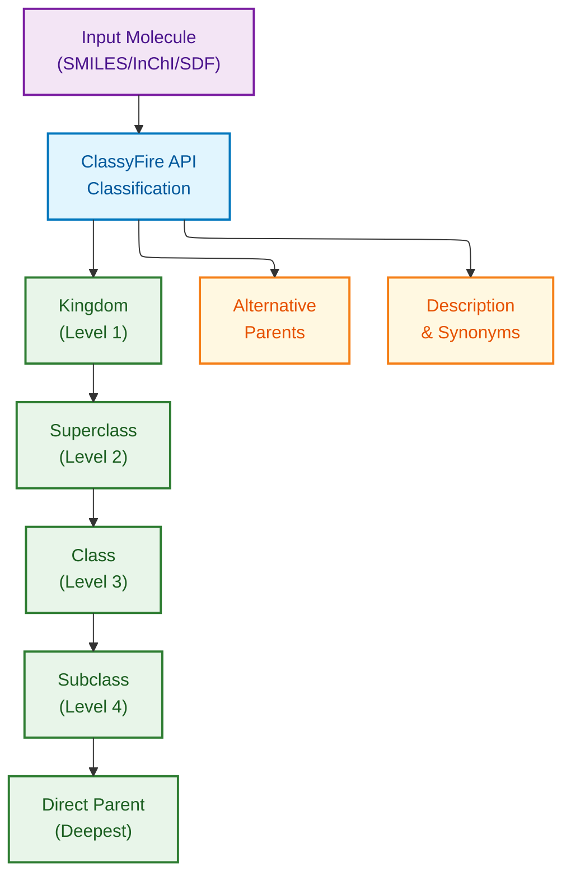

# ClassyFire Schema Documentation

**Document ID:** SCHEMA-CLASSYFIRE
**Version:** 2.1
**Source Version:** ClassyFire/ChemOnt 2.1 (2019+)

---

## TL;DR

ClassyFire provides hierarchical chemical taxonomy classification via web interface and REST API. It classifies compounds into kingdoms, superclasses, classes, and subclasses based on 7,000+ structural rules, returning JSON/XML responses with classification levels, ChemOnt identifiers, and confidence scores.

---

## Database Statistics

| Metric | Value | Source |
|--------|-------|--------|
| Chemical Categories | 4,825+ | ChemOnt ontology |
| Classification Rules | 7,000+ | Structural patterns |
| Kingdoms | 11 | Top-level categories |
| Superclasses | 37 | Second-level categories |
| Classes | 150+ | Third-level categories |
| Subclasses | 400+ | Fourth-level categories |
| Pre-classified Compounds | 80M+ | InChIKey lookup |

---

## Entity Relationship Overview



---

## ChemOnt Taxonomy Structure

### Kingdom Level (11 Kingdoms)

| Kingdom | ChemOnt ID | Description |
|---------|------------|-------------|
| Organic compounds | CHEMONTID:0000000 | Carbon-based compounds |
| Inorganic compounds | CHEMONTID:0000001 | Non-carbon based |
| Organometallic compounds | CHEMONTID:0000002 | Metal-carbon bonds |
| Organic salts | CHEMONTID:0000003 | Ionic organic compounds |
| Organic acids | CHEMONTID:0000004 | Acidic organics |
| Nucleosides, nucleotides, analogues | CHEMONTID:0000005 | Nucleic acid components |
| Lipids and lipid-like molecules | CHEMONTID:0000006 | Fatty compounds |
| Organic nitrogen compounds | CHEMONTID:0000007 | Nitrogen-containing |
| Organoheterocyclic compounds | CHEMONTID:0000008 | Heterocycles |
| Benzenoids | CHEMONTID:0000009 | Benzene derivatives |
| Phenylpropanoids and polyketides | CHEMONTID:0000010 | Natural products |

### Example Classification Path

```
Aspirin (CC(=O)OC1=CC=CC=C1C(=O)O):

Kingdom:      Organic compounds        (CHEMONTID:0000000)
    │
Superclass:   Benzenoids              (CHEMONTID:0000009)
    │
Class:        Benzene and substituted
              derivatives              (CHEMONTID:0000300)
    │
Subclass:     Phenol esters           (CHEMONTID:0002700)
    │
Direct Parent: Phenyl acetates         (CHEMONTID:0004200)
```

---

## Core API Response Entities

### Classification Result Object

**Description:** Complete classification response for a compound

| Field | Type | Required | Description |
|-------|------|----------|-------------|
| id | Integer | Yes | ClassyFire query ID |
| identifier | String | Yes | Input identifier |
| smiles | String | Yes | Canonical SMILES |
| inchikey | String | Yes | InChIKey |
| kingdom | Object | Yes | Kingdom classification |
| superclass | Object | Yes | Superclass classification |
| class | Object | Yes | Class classification |
| subclass | Object | No | Subclass (if applicable) |
| intermediate_nodes | Array | No | Intermediate categories |
| direct_parent | Object | Yes | Most specific classification |
| alternative_parents | Array | No | Alternative classification paths |
| molecular_framework | String | No | Structural framework |
| substituents | Array | No | Functional group substituents |
| description | String | No | Compound description |
| external_descriptors | Array | No | External annotations |
| predicted_chebi_terms | Array | No | Predicted ChEBI mappings |
| predicted_lipidmaps_terms | Array | No | Predicted LIPID MAPS |
| classification_version | String | Yes | ChemOnt version used |

### Classification Level Object

**Description:** Single classification level entity

| Field | Type | Required | Description |
|-------|------|----------|-------------|
| name | String | Yes | Category name |
| description | String | Yes | Category description |
| chemont_id | String | Yes | ChemOnt identifier (CHEMONTID:XXXXXXXX) |
| url | String | Yes | Link to category page |

### Entity Query Status Object

**Description:** Async query status for batch submissions

| Field | Type | Required | Description |
|-------|------|----------|-------------|
| id | Integer | Yes | Query ID |
| status | String | Yes | "in progress" / "Done" / "Error" |
| classification_status | String | Yes | Classification state |
| invalid_entities | Array | No | Failed compounds |
| entities | Array | No | Classified compounds |

---

## API Endpoints

### Classification Endpoints

| Endpoint | Method | Description |
|----------|--------|-------------|
| /entities.json | POST | Submit compound for classification |
| /entities/{id}.json | GET | Get classification results |
| /entities/{id}/status.json | GET | Check query status |
| /queries.json | POST | Batch submission |
| /queries/{id}.json | GET | Get batch results |
| /queries/{id}/entities.json | GET | Get batch entities |

### InChIKey Lookup Endpoints

| Endpoint | Method | Description |
|----------|--------|-------------|
| /entities/{inchikey}.json | GET | Pre-computed classification |
| /entities/batch.json | POST | Batch InChIKey lookup |

### Taxonomy Browser Endpoints

| Endpoint | Method | Description |
|----------|--------|-------------|
| /tax_nodes/{chemont_id}.json | GET | Get taxonomy node |
| /tax_nodes/{chemont_id}/children.json | GET | Get child categories |
| /tax_nodes/{chemont_id}/parents.json | GET | Get parent categories |

---

## Data Formats

| Format | Description |
|--------|-------------|
| Primary | JSON (API responses) |
| Alternative | XML (via Accept header) |
| Input | SMILES, InChI, InChIKey, SDF |
| Encoding | UTF-8 |

---

## Sample API Requests

### Single Compound Classification

```bash
# Submit for classification (async)
curl -X POST "http://classyfire.wishartlab.com/entities.json" \
  -H "Content-Type: application/json" \
  -d '{"label":"aspirin","smiles":"CC(=O)OC1=CC=CC=C1C(=O)O"}'

# Response: {"id": 123456, "status": "in progress"}

# Check status
curl "http://classyfire.wishartlab.com/entities/123456/status.json"

# Get results
curl "http://classyfire.wishartlab.com/entities/123456.json"
```

### InChIKey Lookup (Instant)

```bash
# Pre-computed lookup (no wait)
curl "http://classyfire.wishartlab.com/entities/BSYNRYMUTXBXSQ-UHFFFAOYSA-N.json"
```

### Batch Classification

```bash
# Submit batch
curl -X POST "http://classyfire.wishartlab.com/queries.json" \
  -H "Content-Type: application/json" \
  -d '{
    "label": "my_batch",
    "query_input": "CC(=O)OC1=CC=CC=C1C(=O)O\nCC(=O)NC1=CC=C(C=C1)O\nCN1C=NC2=C1C(=O)N(C(=O)N2C)C"
  }'

# Check batch status
curl "http://classyfire.wishartlab.com/queries/{id}/status.json"

# Get batch results
curl "http://classyfire.wishartlab.com/queries/{id}/entities.json"
```

---

## Sample Output Record

```json
{
  "id": 123456,
  "identifier": "aspirin",
  "smiles": "CC(=O)Oc1ccccc1C(=O)O",
  "inchikey": "BSYNRYMUTXBXSQ-UHFFFAOYSA-N",
  "kingdom": {
    "name": "Organic compounds",
    "description": "Compounds that contain at least one carbon atom.",
    "chemont_id": "CHEMONTID:0000000",
    "url": "http://classyfire.wishartlab.com/tax_nodes/C0000000"
  },
  "superclass": {
    "name": "Benzenoids",
    "description": "Aromatic compounds containing one or more benzene rings.",
    "chemont_id": "CHEMONTID:0000009",
    "url": "http://classyfire.wishartlab.com/tax_nodes/C0000009"
  },
  "class": {
    "name": "Benzene and substituted derivatives",
    "description": "Aromatic compounds containing one monocyclic ring system with 6 carbon atoms.",
    "chemont_id": "CHEMONTID:0000300",
    "url": "http://classyfire.wishartlab.com/tax_nodes/C0000300"
  },
  "subclass": {
    "name": "Phenol esters",
    "description": "Phenols with an ester group attached to the benzene ring.",
    "chemont_id": "CHEMONTID:0002700",
    "url": "http://classyfire.wishartlab.com/tax_nodes/C0002700"
  },
  "direct_parent": {
    "name": "Phenyl acetates",
    "description": "Phenols esterified with acetic acid.",
    "chemont_id": "CHEMONTID:0004200",
    "url": "http://classyfire.wishartlab.com/tax_nodes/C0004200"
  },
  "alternative_parents": [
    {
      "name": "Benzoic acids and derivatives",
      "chemont_id": "CHEMONTID:0000370",
      "url": "http://classyfire.wishartlab.com/tax_nodes/C0000370"
    },
    {
      "name": "Carboxylic acid esters",
      "chemont_id": "CHEMONTID:0000190",
      "url": "http://classyfire.wishartlab.com/tax_nodes/C0000190"
    }
  ],
  "substituents": [
    "Phenyl acetate",
    "Benzoic acid",
    "Carboxylic acid ester",
    "Carboxylic acid",
    "Aromatic compound"
  ],
  "molecular_framework": "Aromatic homomonocyclic compounds",
  "external_descriptors": [],
  "predicted_chebi_terms": [
    "CHEBI:15365"
  ],
  "classification_version": "2.1"
}
```

---

## ChemOnt ID Format

| Component | Format | Example |
|-----------|--------|---------|
| Prefix | CHEMONTID: | CHEMONTID: |
| Numeric ID | 7 digits | 0000300 |
| Full ID | CHEMONTID:XXXXXXX | CHEMONTID:0000300 |
| URL Format | C + 7 digits | C0000300 |

---

## Classification Hierarchy Levels

| Level | Count | Description | Example |
|-------|-------|-------------|---------|
| Kingdom | 11 | Broadest category | Organic compounds |
| Superclass | 37 | Major structural class | Benzenoids |
| Class | 150+ | Specific structure type | Benzene derivatives |
| Subclass | 400+ | Detailed category | Phenol esters |
| Intermediate | Variable | Additional levels | - |
| Direct Parent | 4,800+ | Most specific | Phenyl acetates |

---

## Multiple Parent Handling

ClassyFire uses alternative_parents to handle compounds that fit multiple classification paths:

```json
{
  "direct_parent": {
    "name": "Phenyl acetates",
    "chemont_id": "CHEMONTID:0004200"
  },
  "alternative_parents": [
    {"name": "Benzoic acids", "chemont_id": "CHEMONTID:0000370"},
    {"name": "Carboxylic esters", "chemont_id": "CHEMONTID:0000190"}
  ]
}
```

---

## Status Codes

| Status | Meaning |
|--------|---------|
| in progress | Classification running |
| Done | Classification complete |
| Error | Classification failed |

| HTTP Code | Meaning |
|-----------|---------|
| 200 | Success |
| 201 | Created (submission) |
| 404 | Not found |
| 429 | Rate limited |
| 500 | Server error |

---

## Glossary

| Term | Definition |
|------|------------|
| ChemOnt | Chemical Ontology - ClassyFire's taxonomy system |
| CHEMONTID | Unique identifier for ChemOnt categories |
| Kingdom | Highest classification level (11 categories) |
| Superclass | Second classification level |
| Class | Third classification level |
| Subclass | Fourth classification level |
| Direct Parent | Most specific applicable category |
| Alternative Parents | Additional valid classification paths |
| Molecular Framework | Structural skeleton description |
| InChIKey | IUPAC International Chemical Identifier Key |

---

## References

1. Djoumbou Feunang Y, et al. (2016) "ClassyFire: automated chemical classification with a comprehensive, computable taxonomy." J Cheminform. 8:61. DOI: 10.1186/s13321-016-0174-y
2. ClassyFire Web Service: http://classyfire.wishartlab.com
3. ChemOnt Ontology: http://classyfire.wishartlab.com/tax_nodes/C0000000

---

## Related Documents

- [ClassyFire Download Instructions](./download.md)
- [ChEBI](../chebi/README.md) - Chemical ontology
- [NPClassifier](../npclassifier/README.md) - Natural product classification
- [PubChem](../pubchem/README.md) - Chemical repository
