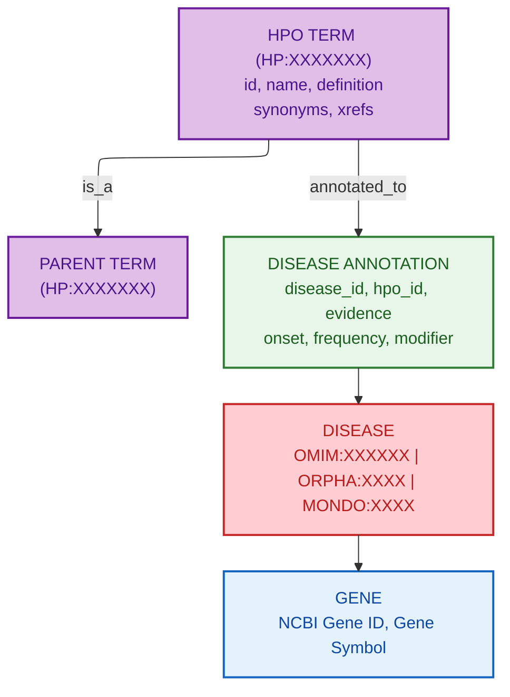

# HPO Phenotype Database Schema

**Document ID:** SCHEMA-HPO-PHENOTYPES
**Version:** 1.0
**Source Version:** v2026-01-08

---

## TL;DR

HPO provides a hierarchical ontology of 13,000+ phenotypic terms with disease annotations linking ~9,500 rare diseases to clinical features. Core formats are OBO/OWL for the ontology and TSV (HPOA) for phenotype annotations with evidence codes and frequency data.

---

## Database Statistics

| Metric | Value | Source |
|--------|-------|--------|
| Total Terms | 13,000+ | HPO Release Notes |
| Disease Annotations | 156,000+ | phenotype.hpoa |
| Annotated Diseases | ~9,500 | OMIM, Orphanet, DECIPHER |
| Gene Associations | ~4,300 genes | genes_to_phenotype.txt |
| Languages | 10+ | hp-international files |

---

## Entity Relationship Overview



---

## Core Tables/Entities

### HPO Term

**Description:** Individual phenotypic abnormality or clinical feature

| Field | Type | Required | Description |
|-------|------|----------|-------------|
| id | string | Yes | HPO identifier (HP:0000000) |
| name | string | Yes | Term name |
| def | string | No | Definition with source |
| synonym | list | No | Alternative names with types |
| xref | list | No | Cross-references (UMLS, SNOMED) |
| is_a | list | Yes | Parent term relationships |
| comment | string | No | Additional notes |
| created_by | string | No | Curator ID |
| creation_date | datetime | No | When created |

### Disease Annotation (phenotype.hpoa)

**Description:** Links diseases to phenotypic features

| Field | Type | Required | Description |
|-------|------|----------|-------------|
| database_id | string | Yes | Disease ID (OMIM:123456) |
| disease_name | string | Yes | Disease name |
| qualifier | string | No | NOT if phenotype excluded |
| hpo_id | string | Yes | HPO term ID |
| reference | string | Yes | Evidence source (PMID, OMIM) |
| evidence | enum | Yes | IEA, TAS, or PCS |
| onset | string | No | Age of onset (HP term) |
| frequency | string | No | HP term or fraction |
| sex | enum | No | MALE or FEMALE |
| modifier | string | No | Clinical modifiers |
| aspect | enum | Yes | P, I, C, M, or H |
| biocuration | string | Yes | Curator and date |

### Gene-Phenotype Link

**Description:** Maps genes to associated phenotypes

| Field | Type | Required | Description |
|-------|------|----------|-------------|
| gene_id | integer | Yes | NCBI Gene ID |
| gene_symbol | string | Yes | HGNC symbol |
| hpo_id | string | Yes | HPO term ID |
| hpo_name | string | Yes | Term name |
| frequency | string | No | Frequency info |
| disease_id | string | Yes | Source disease |

---

## API Endpoints

| Endpoint | Method | Description |
|----------|--------|-------------|
| https://hpo.jax.org/api/hpo/term/{id} | GET | Term details |
| https://hpo.jax.org/api/hpo/search | GET | Term search |
| http://purl.obolibrary.org/obo/hp.obo | GET | Full ontology |
| http://purl.obolibrary.org/obo/hp.owl | GET | OWL format |

---

## Data Formats

| Format | Description |
|--------|-------------|
| Primary | OBO (Open Biological Ontology) |
| Alternative | OWL, JSON |
| Annotations | TSV (HPOA format) |
| Encoding | UTF-8 |

---

## Sample Record

### OBO Term

```obo
[Term]
id: HP:0001250
name: Seizure
def: "A seizure is an event due to abnormal synchronous neuronal activity in the brain." [HPO:probinson, PMID:22983531]
synonym: "Epileptic seizure" EXACT []
synonym: "Convulsion" RELATED layperson []
xref: MSH:D012640
xref: SNOMEDCT_US:91175000
xref: UMLS:C0036572
is_a: HP:0012638 ! Abnormal nervous system physiology
```

### Annotation Record (TSV)

```tsv
OMIM:154700	Marfan syndrome		HP:0001166	OMIM:154700	TAS	HP:0003577	HP:0040283		HP:0012828	P	HPO:skoehler[2024-01-15]
```

### JSON Term

```json
{
  "id": "HP:0001250",
  "name": "Seizure",
  "definition": "A seizure is an event due to abnormal synchronous neuronal activity in the brain.",
  "synonyms": [
    {"label": "Epileptic seizure", "type": "EXACT"},
    {"label": "Convulsion", "type": "RELATED"}
  ],
  "xrefs": ["UMLS:C0036572", "MSH:D012640"],
  "parents": ["HP:0012638"]
}
```

---

## Glossary

| Term | Definition |
|------|------------|
| IEA | Inferred from Electronic Annotation (text mining) |
| TAS | Traceable Author Statement (expert curation) |
| PCS | Published Clinical Study (research evidence) |
| Aspect P | Phenotypic abnormality branch |
| Aspect I | Inheritance mode branch |
| HPOA | HPO Annotation format |
| Phenopacket | GA4GH data exchange standard using HPO |

---

## References

1. https://hpo.jax.org/
2. https://github.com/obophenotype/human-phenotype-ontology
3. https://obofoundry.org/ontology/hp.html
4. Kohler et al. (2024) Nucleic Acids Research

---

## See Also

- [HPO Overview](./README.md)
- [HPO Download Instructions](./download.md)
- [Full HPO Schema](../../3.1.disease.ontologies/hpo/schema.md) - Comprehensive schema documentation
