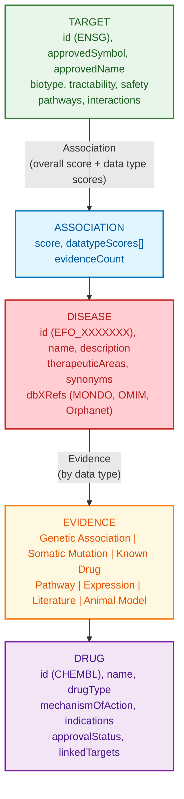

# Open Targets Platform Schema Documentation

**Document ID:** SCHEMA-OPEN-TARGETS
**Version:** 1.0
**Source Version:** 24.09 (September 2024)

---

## TL;DR

Open Targets integrates 20+ data sources to provide 14M+ target-disease associations with transparent evidence scoring. Data accessible via GraphQL API (recommended) or Parquet bulk downloads, using Ensembl gene IDs and EFO disease IDs.

---

## Database Statistics

| Metric | Value | Source |
|--------|-------|--------|
| Target-Disease Associations | 14M+ | Platform stats |
| Targets (Genes) | 62,000+ | Ensembl genes |
| Diseases | 20,000+ | EFO terms |
| Evidence Strings | 17M+ | All data types |
| Data Sources | 20+ | Integrated sources |
| Drugs | 12,000+ | ChEMBL drugs |

---

## Entity Relationship Overview



---

## Core Tables/Entities

### Target

**Description:** Gene/protein as potential drug target

| Field | Type | Required | Description |
|-------|------|----------|-------------|
| id | string | Yes | Ensembl gene ID (ENSG00000000000) |
| approvedSymbol | string | Yes | HGNC approved symbol |
| approvedName | string | Yes | Full gene name |
| biotype | string | Yes | Gene biotype |
| transcriptIds | list | No | Ensembl transcript IDs |
| proteinIds | object | No | UniProt mappings |
| tractability | object | No | Druggability assessment |
| safety | object | No | Safety liabilities |
| pathways | list | No | Reactome pathways |
| go | list | No | GO annotations |
| hallmarks | object | No | Cancer hallmarks |

### Disease

**Description:** Disease or phenotype from EFO

| Field | Type | Required | Description |
|-------|------|----------|-------------|
| id | string | Yes | EFO ID (EFO_0000000) |
| name | string | Yes | Disease name |
| description | string | No | Definition |
| therapeuticAreas | list | No | Therapeutic categories |
| synonyms | list | No | Alternative names |
| dbXRefs | object | No | Cross-refs (MONDO, OMIM) |
| ancestors | list | No | Parent EFO terms |
| descendants | list | No | Child terms |

### Association

**Description:** Aggregated target-disease relationship

| Field | Type | Required | Description |
|-------|------|----------|-------------|
| targetId | string | Yes | Ensembl gene ID |
| diseaseId | string | Yes | EFO disease ID |
| score | float | Yes | Overall score (0-1) |
| datatypeScores | object | No | Score per data type |
| evidenceCount | integer | Yes | Total evidence count |

### Evidence

**Description:** Individual evidence record

| Field | Type | Required | Description |
|-------|------|----------|-------------|
| id | string | Yes | Evidence ID |
| targetId | string | Yes | Ensembl gene ID |
| diseaseId | string | Yes | EFO disease ID |
| datasourceId | string | Yes | Source identifier |
| datatypeId | string | Yes | Data type category |
| score | float | Yes | Evidence score (0-1) |
| literature | list | No | PubMed references |

---

## Evidence Data Types

| Data Type | Sources | Fields |
|-----------|---------|--------|
| genetic_association | GWAS Catalog, Gene2Phenotype, ClinGen, ClinVar, EVA, Orphanet, UniProt | variantId, studyId, pValue, oddsRatio |
| somatic_mutation | Cancer Gene Census, IntOGen, ClinVar (somatic) | variantId, functionalConsequence |
| known_drug | ChEMBL | drugId, phase, status, mechanismOfAction |
| affected_pathway | Reactome, SLAPenrich | pathwayId, pathwayName |
| rna_expression | Expression Atlas | contrast, log2FoldChange, pValue |
| literature | Europe PMC | publicationYear, sentences |
| animal_model | IMPC, MGI | phenotypes, biologicalModels |

---

## Scoring System

### Overall Association Score

Harmonic sum of data type scores:

```
score = 1 / (1/s1 + 1/s2 + ... + 1/sn)
```

Where s1, s2, ... sn are scores from each data type.

### Data Type Score Components

| Data Type | Scoring Factors |
|-----------|-----------------|
| genetic_association | Study power, effect size, LD clumping |
| somatic_mutation | Sample count, mutation frequency |
| known_drug | Clinical phase, mechanism of action |
| affected_pathway | Pathway centrality, confidence |
| rna_expression | Fold change, significance |
| literature | Co-occurrence frequency, sentence count |
| animal_model | Phenotype match, model quality |

---

## API Endpoints

### GraphQL (Recommended)

```graphql
# Target-disease associations
query TargetAssociations($ensemblId: String!) {
  target(ensemblId: $ensemblId) {
    id
    approvedSymbol
    associatedDiseases {
      count
      rows {
        disease { id name }
        score
        datatypeScores {
          id
          score
        }
      }
    }
  }
}

# Disease associations
query DiseaseAssociations($efoId: String!) {
  disease(efoId: $efoId) {
    id
    name
    associatedTargets {
      count
      rows {
        target { id approvedSymbol }
        score
      }
    }
  }
}
```

### GraphQL Endpoint

```bash
curl -X POST https://api.platform.opentargets.org/api/v4/graphql \
  -H "Content-Type: application/json" \
  -d '{"query": "{ target(ensemblId: \"ENSG00000146648\") { approvedSymbol } }"}'
```

---

## Data Formats

| Format | Description |
|--------|-------------|
| Primary | GraphQL JSON responses |
| Bulk | Parquet (columnar format) |
| Alternative | JSON-lines |
| Encoding | UTF-8 |

---

## Sample Records

### Target (JSON)

```json
{
  "id": "ENSG00000146648",
  "approvedSymbol": "EGFR",
  "approvedName": "epidermal growth factor receptor",
  "biotype": "protein_coding",
  "tractability": {
    "smallmolecule": {
      "topCategory": "Discovery_Precedence_sm",
      "categories": ["Clinical_Precedence_sm", "Discovery_Precedence_sm"]
    },
    "antibody": {
      "topCategory": "Clinical_Precedence_ab",
      "categories": ["Clinical_Precedence_ab"]
    }
  }
}
```

### Association (JSON)

```json
{
  "targetId": "ENSG00000146648",
  "diseaseId": "EFO_0000311",
  "score": 0.87,
  "datatypeScores": [
    {"id": "known_drug", "score": 1.0},
    {"id": "genetic_association", "score": 0.65},
    {"id": "somatic_mutation", "score": 0.82},
    {"id": "affected_pathway", "score": 0.45}
  ],
  "evidenceCount": 1523
}
```

### Evidence (JSON)

```json
{
  "id": "d4ef8a7c-bc12-4f6a-9c7f-0e45da2f1b89",
  "targetId": "ENSG00000146648",
  "diseaseId": "EFO_0000311",
  "datasourceId": "chembl",
  "datatypeId": "known_drug",
  "score": 1.0,
  "drug": {
    "id": "CHEMBL941",
    "name": "GEFITINIB",
    "drugType": "Small molecule"
  },
  "clinicalPhase": 4,
  "mechanismOfAction": "EGFR inhibitor"
}
```

---

## Bulk Download Files

| File | Format | Size | Description |
|------|--------|------|-------------|
| targets | Parquet | ~500 MB | All targets |
| diseases | Parquet | ~50 MB | All diseases |
| associationByOverallDirect | Parquet | ~2 GB | Direct associations |
| associationByOverallIndirect | Parquet | ~5 GB | Including ancestors |
| evidence | Parquet | ~50 GB | All evidence |
| molecule | Parquet | ~200 MB | Drug molecules |
| mechanismOfAction | Parquet | ~10 MB | Drug mechanisms |

---

## Glossary

| Term | Definition |
|------|------------|
| EFO | Experimental Factor Ontology (disease IDs) |
| Ensembl ID | Gene identifier (ENSG00000000000) |
| Tractability | Assessment of druggability potential |
| Evidence String | Individual piece of evidence |
| Data Type | Category of evidence (genetic, drug, etc.) |
| Harmonic Sum | Scoring method that rewards breadth of evidence |
| Direct Association | Association to the exact disease term |
| Indirect Association | Association including disease descendants |

---

## References

1. https://platform.opentargets.org/
2. https://platform-docs.opentargets.org/
3. https://api.platform.opentargets.org/api/v4/graphql
4. Ochoa et al. (2023) "The Open Targets Platform" NAR

---

## See Also

- [Open Targets Overview](./README.md)
- [Open Targets Download Instructions](./download.md)
- [DisGeNET](../disgenet/README.md) - Complementary gene-disease resource
- [ChEMBL](../../../04.drugs.compounds/4.1.drug.databases/chembl/README.md) - Drug data source
