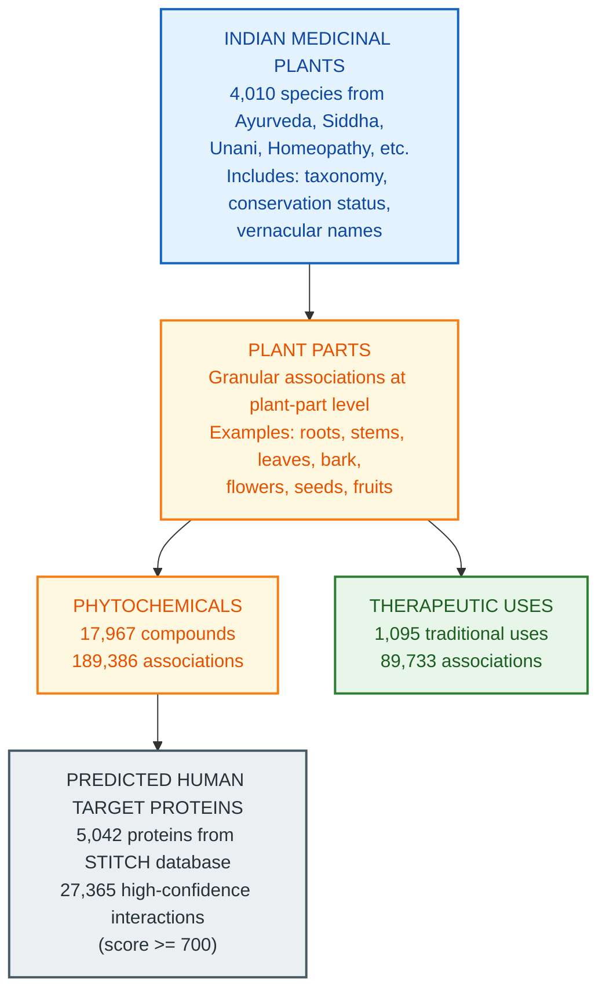

**Parent:** [Schema Documentation](./README.md)

# IMPPAT 2.0 Database Schema

**Document ID:** IMPPAT-SCHEMA
**Status:** Final
**Owner:** Data Engineering
**Last Updated:** January 2026
**Version:** 1.0
**Source Version:** IMPPAT 2.0 (June 2022)

---

## TL;DR

IMPPAT 2.0 (Indian Medicinal Plants, Phytochemistry And Therapeutics) is the largest digital database on phytochemicals of Indian medicinal plants with 4,010 plants, 17,967 phytochemicals, and 27,365 predicted protein-target interactions. Data is organized by plant parts with comprehensive ADMET properties, drug-likeness scores, and 1,875 molecular descriptors per compound. Licensed CC BY-NC 4.0.

---

## Database Statistics (Version 2.0)

| Entity | Count |
|--------|-------|
| **Indian Medicinal Plants** | 4,010 |
| **Phytochemicals** | 17,967 |
| **Therapeutic Uses** | 1,095 |
| **Plant-Part-Phytochemical Associations** | 189,386 |
| **Plant-Part-Therapeutic Use Associations** | 89,733 |
| **Predicted Human Target Proteins** | 5,042 |
| **Phytochemical-Target Interactions** | 27,365 |
| **2D/3D Molecular Descriptors per Compound** | 1,875 |
| **Drug-like Phytochemicals** | 1,335 |

---

## Data Access

### Primary URL
```
https://cb.imsc.res.in/imppat/
```

### API Availability
**No public REST API**. Data access via:
- Web interface queries
- TSV export from search results
- Structure downloads (SDF, MOL, MOL2, PDB, PDBQT)

### GitHub Repository
```
https://github.com/asamallab/IMPPAT2
```
Contains analysis scripts (not raw data).

---

## Data Model

### Core Entity Relationships



---

## Entity Schemas

### Plant Entity

```json
{
  "imppat_plant_id": "IMPPAT_PLANT_XXXXX",
  "botanical_name": "string",
  "family": "string",
  "synonyms": ["string array"],
  "vernacular_names": {
    "hindi": "string",
    "tamil": "string",
    "telugu": "string",
    "kannada": "string",
    "malayalam": "string",
    "bengali": "string",
    "gujarati": "string",
    "marathi": "string",
    "punjabi": "string",
    "oriya": "string"
  },
  "taxonomic_classification": {
    "kingdom": "string",
    "phylum": "string",
    "class": "string",
    "order": "string",
    "family": "string",
    "genus": "string",
    "species": "string"
  },
  "traditional_medicine_systems": ["Ayurveda", "Siddha", "Unani", "Homeopathy", "Sowa-Rigpa"],
  "iucn_conservation_status": "string",
  "external_links": {
    "the_plant_list": "url",
    "tropicos": "url",
    "mpns": "url",
    "ipni": "url",
    "pow": "url",
    "wfo": "url"
  }
}
```

### Phytochemical Entity

Six data tabs per compound on dedicated pages:

#### Tab 1: Summary
```json
{
  "imppat_id": "IMPPAT_CHEM_XXXXX",
  "compound_name": "string",
  "iupac_name": "string",
  "smiles": "string",
  "inchi": "string",
  "inchi_key": "string",
  "deepsmiles": "string (for ML applications)",
  "molecular_formula": "string",
  "molecular_weight": "float",
  "source_plants": ["plant_id array"],
  "source_plant_parts": ["string array"]
}
```

#### Tab 2: Physicochemical Properties
```json
{
  "molecular_weight": "float (Da)",
  "logP": "float (partition coefficient)",
  "topological_polar_surface_area": "float (Ų)",
  "hydrogen_bond_donors": "integer",
  "hydrogen_bond_acceptors": "integer",
  "rotatable_bonds": "integer",
  "heavy_atom_count": "integer",
  "ring_count": "integer",
  "aromatic_ring_count": "integer"
}
```

#### Tab 3: Drug-Likeness
```json
{
  "lipinski_rule_of_five": {
    "passes": "boolean",
    "violations": "integer",
    "mw_ok": "boolean (<= 500)",
    "logp_ok": "boolean (<= 5)",
    "hbd_ok": "boolean (<= 5)",
    "hba_ok": "boolean (<= 10)"
  },
  "ghose_filter": {
    "passes": "boolean",
    "violations": "integer"
  },
  "veber_filter": {
    "passes": "boolean",
    "rotatable_bonds_ok": "boolean (<= 10)",
    "tpsa_ok": "boolean (<= 140)"
  },
  "egan_filter": {
    "passes": "boolean"
  },
  "pfizer_3_75_rule": {
    "passes": "boolean",
    "logp_ok": "boolean",
    "tpsa_ok": "boolean"
  },
  "gsk_4_400_rule": {
    "passes": "boolean",
    "mw_ok": "boolean",
    "logp_ok": "boolean"
  },
  "np_likeness_score": "float (natural product likeness)",
  "weighted_qed_score": "float (quantitative estimate of drug-likeness)"
}
```

#### Tab 4: ADMET Properties (from SwissADME)
```json
{
  "absorption": {
    "gi_absorption": "High/Low",
    "pgp_substrate": "Yes/No",
    "water_solubility": "string (ESOL class)",
    "caco2_permeability": "float"
  },
  "distribution": {
    "bbb_permeant": "Yes/No",
    "vdss": "float (volume of distribution)"
  },
  "metabolism": {
    "cyp1a2_inhibitor": "Yes/No",
    "cyp2c19_inhibitor": "Yes/No",
    "cyp2c9_inhibitor": "Yes/No",
    "cyp2d6_inhibitor": "Yes/No",
    "cyp3a4_inhibitor": "Yes/No"
  },
  "excretion": {
    "clearance": "float"
  },
  "toxicity": {
    "ames_mutagenicity": "Yes/No",
    "hepatotoxicity": "Yes/No",
    "herg_inhibition": "Yes/No",
    "skin_sensitization": "Yes/No"
  }
}
```

**Note:** ADMET predictions unavailable for 493 compounds due to SMILES length restrictions in SwissADME.

#### Tab 5: Molecular Descriptors
```json
{
  "descriptor_count": 1875,
  "descriptor_types": {
    "2d_descriptors": ["list of 2D molecular descriptors"],
    "3d_descriptors": ["list of 3D molecular descriptors"]
  },
  "note": "1,875 2D and 3D chemical descriptors computed per compound"
}
```

#### Tab 6: Predicted Human Target Proteins
```json
{
  "targets": [
    {
      "protein_name": "string",
      "gene_symbol": "string",
      "hgnc_id": "string (HUGO Gene Nomenclature Committee)",
      "combined_score": "integer (>= 700)",
      "source": "STITCH"
    }
  ],
  "interaction_count": "integer",
  "high_confidence_threshold": 700
}
```

---

## Structural Classification

### Molecular Scaffolds

Three levels of scaffold abstraction (Murcko decomposition):

| Level | Code | Description |
|-------|------|-------------|
| Generic/Node/Bond | G/N/B | Full Murcko scaffold |
| Generic/Node | G/N | Atom types removed |
| Graph | Graph | Only topology preserved |

### Chemical Classification (NPClassifier)

```json
{
  "biosynthetic_pathway": "string (natural product classification)",
  "superclass": "string (ClassyFire prediction)",
  "class": "string",
  "subclass": "string",
  "functional_groups": ["string array"]
}
```

---

## Download Formats

### Structure Files

| Format | Extension | Use Case |
|--------|-----------|----------|
| SDF | .sdf | Standard 2D/3D |
| MOL | .mol | Single molecule |
| MOL2 | .mol2 | With atom types |
| PDB | .pdb | For docking |
| PDBQT | .pdbqt | AutoDock ready |

### Data Export

| Format | Content |
|--------|---------|
| TSV | Plant-phytochemical associations |
| TSV | Plant-therapeutic use associations |
| Excel | Supplementary tables from publication |

---

## Cross-References

### Identifier Mappings

| IMPPAT Field | External Database | Link Pattern |
|--------------|-------------------|--------------|
| Plant Name | The Plant List | Direct URL |
| Plant Name | Tropicos | Direct URL |
| Plant Name | MPNS | Direct URL |
| Plant Name | IPNI | Direct URL |
| Plant Name | POW (Plants of the World) | Direct URL |
| Plant Name | WFO (World Flora Online) | Direct URL |
| InChIKey | PubChem | UniChem mapping |
| Target Protein | HGNC | Gene nomenclature |
| Target Interactions | STITCH | Score >= 700 |

### UniChem Integration

IMPPAT provides external links to standard chemical databases via UniChem service.

---

## Data Quality

### FAIR Compliance

- **Findable**: Unique IMPPAT identifiers for plants and compounds
- **Accessible**: Web interface with export capabilities
- **Interoperable**: Standard formats (InChI, SMILES, SDF)
- **Reusable**: CC BY-NC 4.0 license, documented schema

### Target Prediction Quality

| Metric | Value |
|--------|-------|
| Source | STITCH database |
| Confidence Threshold | Combined score >= 700 |
| Coverage | 1,294 phytochemicals have predictions |
| Protein Coverage | 5,042 unique human proteins |
| Total Interactions | 27,365 high-confidence pairs |

---

## Web Interface Queries

### Search Options

1. **Plant Search**
   - By botanical name
   - By vernacular name (10 Indian languages)
   - By family
   - By therapeutic use

2. **Phytochemical Search**
   - By compound name
   - By SMILES/InChI
   - By molecular formula
   - By physicochemical properties
   - By drug-likeness filters

3. **Advanced Search**
   - Substructure search
   - Similarity search
   - Property range filters
   - Target-based search

---

## Sample Data Records

### Sample Plant Record

**Ashwagandha (Withania somnifera)**

| Field | Value |
|-------|-------|
| IMPPAT ID | IMPPAT_PLANT_03985 |
| Botanical Name | Withania somnifera |
| Family | Solanaceae |
| Traditional Systems | Ayurveda, Unani |
| IUCN Status | Not Evaluated |
| Phytochemicals | 127 compounds |
| Therapeutic Uses | Adaptogen, immunomodulator, anti-stress |

### Sample Phytochemical Record

**Withaferin A**

| Field | Value |
|-------|-------|
| IMPPAT ID | IMPPAT_CHEM_15234 |
| Name | Withaferin A |
| Formula | C28H38O6 |
| Molecular Weight | 470.60 |
| logP | 3.75 |
| TPSA | 96.36 Ų |
| Lipinski | Passes (0 violations) |
| GI Absorption | High |
| BBB Permeant | Yes |
| Predicted Targets | 23 proteins |

---

## Integration Recommendations

### Priority Integration Steps

1. **Export plant-phytochemical associations** via web TSV export
2. **Download structure files** (SDF) for compound library
3. **Map to PubChem** via InChIKey for standardization
4. **Link targets** via HGNC to UniProt IDs

### Complementary Databases

| Database | Purpose |
|----------|---------|
| NPACT | Validated cancer targets |
| NPASS | Quantitative activity data |
| CMAUP | Pathway annotations |
| STRING | Extended target networks |
| ChEMBL | Bioactivity validation |

### Data Harmonization

```python
# Example: Map IMPPAT to UniProt via HGNC
import pandas as pd

def map_imppat_to_uniprot(hgnc_id, hgnc_mapping):
    """Map IMPPAT HGNC IDs to UniProt accessions."""
    return hgnc_mapping.get(hgnc_id, {}).get('uniprot_id')

# IMPPAT uses HGNC for target annotation
# UniProt provides HGNC -> UniProt mapping in ID mapping service
```

---

## Data Format

| Format | Description | Use Case |
|--------|-------------|----------|
| Primary | Web Interface (HTML) | Interactive browsing |
| Alternative | TSV (Tab-separated) | Bulk imports |
| Structure | SDF, MOL, MOL2, PDB, PDBQT | Molecular structures |
| Encoding | UTF-8 | Text-based formats |

---

## Download

### Data Access Methods

| Method | URL | Format |
|--------|-----|--------|
| **Web Interface** | https://cb.imsc.res.in/imppat/ | Interactive queries |
| **Search** | Web-based search tools | HTML results |
| **Export** | TSV via query results | Tab-separated |
| **Structure Download** | Per compound | SDF, MOL, MOL2, PDB, PDBQT |
| **GitHub** | https://github.com/asamallab/IMPPAT2 | Analysis scripts only |

### Query Capabilities

```
Web-based search:
- Plant searches (botanical/vernacular names, family, therapeutic use)
- Phytochemical searches (name, SMILES/InChI, molecular formula, properties)
- Substructure/similarity searches
- Property-based filtering
- Target-based reverse lookup
```

---

## Data Set Size

| Component | Count | Size (Est.) |
|-----------|-------|------------|
| **Indian Medicinal Plants** | 4,010 | ~5 MB |
| **Phytochemicals** | 17,967 | ~50-100 MB |
| **Plant-Phytochemical Links** | 189,386 | ~10 MB |
| **Therapeutic Uses** | 1,095 | ~1 MB |
| **Plant-Therapeutic Links** | 89,733 | ~5 MB |
| **Human Target Proteins** | 5,042 | ~5 MB |
| **Compound-Target Interactions** | 27,365 | ~2 MB |
| **Total Database** | Various | ~100-150 MB |
| **Structure Files (SDF)** | Per compound | 100 KB - 1 MB each |

---

## License

**CC BY-NC 4.0** (Creative Commons Attribution-NonCommercial 4.0 International)

- **Permits**: Non-commercial use, sharing, adaptation
- **Requires**: Attribution to IMPPAT 2.0 and citation
- **Restricts**: Commercial use without separate agreement
- **Maintainer**: Institute of Mathematical Sciences, Chennai

---

## Limitations

1. **No REST API**: Manual export or web scraping required
2. **Commercial restriction**: CC BY-NC 4.0 limits commercial use
3. **ADMET gaps**: 493 compounds lack ADMET predictions
4. **Target predictions only**: No experimentally validated interactions
5. **Confidence threshold**: Only high-confidence (>=700) STITCH interactions included

---

## GitHub Repository Contents

The associated GitHub repository (asamallab/IMPPAT2) contains:

### Analysis Scripts

| Script | Purpose |
|--------|---------|
| ChemicalSimilarityNetwork.py | Tanimoto coefficient calculations |
| ChemicalStructureImages.py | SVG/PNG structure generation |
| DruglikenessProperties.py | Drug-likeness evaluation |
| MolecularProperties.py | Physicochemical computation |
| MolecularScaffolds.py | Scaffold analysis |
| MurckoScaffold.py | Modified RDKit scaffold code |

**Note**: Raw database files are NOT in the repository; access via web interface.

---

## References

1. Vivek-Ananth RP, et al. (2023). IMPPAT 2.0: An Enhanced and Expanded Phytochemical Atlas of Indian Medicinal Plants. ACS Omega, 8(9):8827-8845.

2. Mohanraj K, et al. (2018). IMPPAT: A curated database of Indian Medicinal Plants, Phytochemistry And Therapeutics. Scientific Reports, 8:4329.

3. GitHub Repository: https://github.com/asamallab/IMPPAT2

4. Official Website: https://cb.imsc.res.in/imppat/

---

## Implementation Details

### Tab Structure Breakdown

IMPPAT phytochemical records are organized as 6 interactive tabs on dedicated compound pages:

#### Tab 1: Summary
**Core Identity & Structure Data**

| Field | Format | Purpose |
|-------|--------|---------|
| IMPPAT ID | String (IMPHY######) | Unique compound identifier |
| Compound Name | String | Common chemical name |
| IUPAC Name | String | Systematic nomenclature |
| Molecular Formula | String | Elemental composition |
| Molecular Weight | Float | Mass in g/mol |
| Source Plants | Array | Plant origins |
| Plant Parts | Array | Tissue origin (root, leaf, bark, etc.) |
| 2D/3D Structures | SVG/PDB/MOL2 | Visual & 3D representations |
| SMILES | String | Linear molecular notation |
| InChI / InChIKey | String | Standardized identifiers |

#### Tab 2: Physicochemical Properties
**Molecular Characteristics (11 metrics)**

Computed via RDKit/PaDEL. Core properties used for drug-likeness assessment:
- Molecular weight, logP, TPSA, HBD/HBA
- Rotatable bonds, heavy atoms, aromatic rings
- Fraction sp3 carbons, stereocenters

#### Tab 3: Drug-Likeness
**Six Rule Filters + QED Score**

| Rule | Criteria | Status |
|------|----------|--------|
| Lipinski RO5 | MW≤500, logP≤5, HBD≤5, HBA≤10 | Pass/Fail + violations |
| Ghose | MW:160-480, logP:-0.4-5.6, atoms:20-70, MR:40-130 | Boolean |
| Veber | Rotatable bonds≤10, TPSA≤140 | Good/Poor |
| Egan | logP≤5.88, TPSA≤131.6 | Good/Poor |
| Pfizer 3/75 | logP>3 AND TPSA<75 flagged | Good/Poor |
| GSK 4/400 | MW≤400, logP≤4 | Good/Poor |
| QED Score | Quantitative estimate (0-1) | Float |

**Drug-like subset**: 1,335 compounds pass all 6 rules

#### Tab 4: ADMET Properties
**Pharmacokinetics (via SwissADME)**

Computed for 17,474 of 17,967 compounds (493 failed SMILES length validation)

| Category | Metrics |
|----------|---------|
| **Absorption** | GI absorption, P-gp substrate, water solubility class, Caco2 permeability |
| **Distribution** | BBB permeability, VDSS (volume distribution) |
| **Metabolism** | CYP1A2/2C19/2C9/2D6/3A4 inhibition (yes/no) |
| **Excretion** | Renal clearance predictions |
| **Toxicity** | PAINS alerts, Brenk alerts (105 patterns), mutagenicity, hepatotoxicity |

#### Tab 5: Molecular Descriptors
**1,875 Chemical Features (2D + 3D)**

Computed via PaDEL-Descriptor:

| Type | Count | Examples |
|------|-------|----------|
| 2D Descriptors | ~1,444 | Constitutional, topological, connectivity, BCUT, McGowan volume |
| 3D Descriptors | ~431 | Geometrical, surface area, volume, Burden eigenvalues |
| Fingerprints | 16,092 bits total | 10 types including Tanimoto coefficient |

Machine learning-ready features for similarity searching and predictive modeling.

#### Tab 6: Predicted Human Target Proteins
**27,365 Phytochemical-Target Interactions**

| Field | Value | Notes |
|-------|-------|-------|
| Target Count | 5,042 unique proteins | Human proteome coverage |
| Source | STITCH database | High-confidence predictions |
| Confidence Threshold | ≥700 score | Combined evidence score |
| Score Ranges | 150-1000 | Low (150), Medium (≥400), High (≥700) |
| Evidence Types | Experiments, Databases, Text mining, Predicted | STITCH evidence channels |
| Output | Protein name, HGNC symbol, HGNC ID, combined score | Target annotation |

### Key Field Mappings

**Molecular Structure → Standardization:**
- SMILES → PubChem CID (via UniChem)
- InChIKey → Cross-database lookup
- IUPAC Name → ChEMBL ID mapping

**Plant Origin → Identity:**
- Botanical name → The Plant List, Tropicos, WFO, IPNI
- Plant part → Tissue classification (root/leaf/bark/seed/fruit/flower/stem/tuber/rhizome/seed)
- Vernacular names → 10 Indian language mapping

**Target Proteins → External IDs:**
- HGNC Symbol → UniProt accession (via HGNC ID mapping service)
- HGNC ID → Gene Nomenclature Committee reference
- Protein → STRING network, PDB structures

### API/Download Specifics

#### Access Methods

| Method | Availability | Data Format | Use Case |
|--------|--------------|------------|----------|
| **Web Interface** | Public | Interactive HTML tabs | Browse/query single compounds |
| **TSV Export** | Public | Tab-separated values | Bulk plant-phytochemical associations |
| **Structure Download** | Public | SDF, MOL, MOL2, PDB, PDBQT | Molecular docking, visualization |
| **REST API** | **None** | N/A | Programmatic access not supported |

#### Web Query Capabilities

**Plant Search:**
- By botanical/vernacular name
- By family
- By therapeutic use
- By IUCN conservation status

**Phytochemical Search:**
- By compound name
- By SMILES/InChI/InChIKey
- By molecular formula
- By physicochemical properties (MW, logP, TPSA ranges)
- By drug-likeness filters (Lipinski, Ghose, etc.)
- By predicted target protein

**Advanced Filters:**
- Substructure search (SMARTS)
- Similarity search (Tanimoto coefficient)
- Multi-property range filtering
- Target-based reverse lookup

#### Structure File Downloads

**Available Formats per Compound:**
- **SDF** (.sdf) - Standard multi-molecule format with 2D/3D coordinates
- **MOL** (.mol) - Single molecule V2000 format
- **MOL2** (.mol2) - Tripos format with atom types
- **PDB** (.pdb) - Protein Data Bank format for docking
- **PDBQT** (.pdbqt) - AutoDock Vina-ready format

#### Export Strategy

**Recommended Data Acquisition Pipeline:**

1. **Web Query** - Search IMPPAT web interface for target plants/compounds
2. **TSV Export** - Download association tables (plant-phytochemical, plant-therapeutic)
3. **Structure Bulk Download** - Download all SDF files for compound library
4. **UniChem Mapping** - Cross-reference to PubChem/ChEMBL via InChIKey
5. **HGNC Lookup** - Map HGNC IDs to UniProt for target proteins

#### Rate Limiting & Access

- No documented API rate limits (no API exists)
- Web interface: Standard session-based access
- Download: Single-file or batch operations via web UI
- Recommended: Cache structure files locally post-download

#### Bulk Analysis Scripts

Associated GitHub repository (asamallab/IMPPAT2) provides analysis templates:
- Property calculation scripts (Python/RDKit)
- Similarity network generation
- Scaffold decomposition
- Drug-likeness evaluation

---

## Schema

### Core Fields

| Field | Type | Description | Example |
|-------|------|-------------|---------|
| `id` | string | Primary identifier | "IMPPAT0000001" |
| `name` | string | Entity name | "Curcumin" |
| `type` | string | Record type | "natural_product" |

### Relationships

| Relation | Target | Cardinality |
|----------|--------|-------------|
| `targets` | Protein / Gene | N:M |
| `found_in` | Plant Source | N:M |
| `associated_with` | Activity / Indication | N:M |

---

## Glossary

| Term | Definition | Example |
|------|------------|---------|
| `imppat_plant_id` | Unique identifier for medicinal plants in IMPPAT | IMPPAT_PLANT_03985 |
| `imppat_id` | Unique identifier for phytochemicals in IMPPAT | IMPPAT_CHEM_15234 |
| `botanical_name` | Scientific Latin name of a plant species | Withania somnifera |
| `deepsmiles` | DeepSMILES representation for machine learning applications | Extended SMILES format |
| `combined_score` | STITCH interaction confidence score (0-1000) | 700+ = high confidence |
| `qed_score` | Quantitative Estimate of Drug-likeness (0-1) | 0.85 = drug-like |
| `lipinski_rule_of_5` | Drug-likeness criteria counting violations (0-4) | 0 = passes all rules |
| `tpsa` | Topological Polar Surface Area in Angstrom squared | 40.46 |
| `logP` | Partition coefficient (lipophilicity measure) | 3.75 |
| `gi_absorption` | Gastrointestinal absorption prediction | High/Low |

### Domain-Specific Terms

| Term | Definition | Related To |
|------|------------|------------|
| Phytochemical | Natural chemical compound produced by plants | Core entity |
| Indian Medicinal Plant | Plant used in traditional Indian medicine systems | 4,010 species in IMPPAT |
| Plant Part | Specific tissue (root, leaf, bark, seed) containing compounds | Association specificity |
| Therapeutic Use | Traditional medicinal application of a plant | 1,095 uses documented |
| Drug-likeness | Properties suggesting oral drug potential | Lipinski, QED, Ghose filters |
| ADMET | Absorption, Distribution, Metabolism, Excretion, Toxicity | Pharmacokinetic properties |
| Target Protein | Human protein predicted to interact with phytochemical | STITCH predictions |
| Murcko Scaffold | Core molecular framework with substituents removed | Structural classification |

### Acronyms

| Acronym | Expansion | Notes |
|---------|-----------|-------|
| IMPPAT | Indian Medicinal Plants, Phytochemistry And Therapeutics | Database name |
| ADMET | Absorption, Distribution, Metabolism, Excretion, Toxicity | Pharmacokinetic profile |
| QED | Quantitative Estimate of Drug-likeness | Drug-likeness score |
| TPSA | Topological Polar Surface Area | Absorption predictor |
| HBD | Hydrogen Bond Donor | Lipinski parameter |
| HBA | Hydrogen Bond Acceptor | Lipinski parameter |
| MW | Molecular Weight | Daltons |
| BBB | Blood-Brain Barrier | Permeability prediction |
| CYP | Cytochrome P450 | Metabolizing enzymes |
| HGNC | HUGO Gene Nomenclature Committee | Gene naming authority |
| STITCH | Search Tool for Interactions of Chemicals | Target prediction source |
| SDF | Structure-Data File | Chemical file format |
| CC BY-NC | Creative Commons Attribution-NonCommercial | License type |
| IUCN | International Union for Conservation of Nature | Conservation status |
| SMARTS | SMILES Arbitrary Target Specification | Substructure search |

---

## Change Log

| Version | Date | Author | Changes |
|---------|------|--------|---------|
| 1.0 | January 2026 | Data Engineering | Initial schema documentation from publication and web interface analysis |
| 1.1 | January 2026 | Data Engineering | Added Implementation Details section with 6-tab structure, field mappings, API/download specifics |
