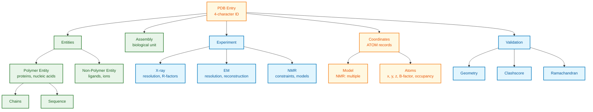

# PDB (Protein Data Bank) Schema Documentation

**Document ID:** SCHEMA-PDB
**Version:** 2026.01
**Source Version:** PDBx/mmCIF Dictionary v5.x

---

## TL;DR

The Protein Data Bank stores 220,000+ experimentally determined 3D structures of proteins, nucleic acids, and complexes. Primary format is mmCIF (PDBx) with extensive metadata including atomic coordinates, experimental details, and validation metrics. Structures are determined by X-ray crystallography, cryo-EM, and NMR.

---

## Database Statistics

| Metric | Value | Source |
|--------|-------|--------|
| Total structures | 220,000+ | RCSB PDB |
| Protein structures | 200,000+ | RCSB Statistics |
| Nucleic acid structures | 15,000+ | RCSB Statistics |
| X-ray structures | 180,000+ | RCSB Statistics |
| Cryo-EM structures | 25,000+ | RCSB Statistics |
| NMR structures | 14,000+ | RCSB Statistics |

---

## Entity Relationship Overview



---

## Core Tables/Entities

### Entry (Primary Record)

**Description:** Top-level PDB entry information.

| Field | Type | Required | Description |
|-------|------|----------|-------------|
| entry.id | string | Yes | PDB ID (e.g., 1TUP) |
| struct.title | string | Yes | Structure title |
| struct_keywords.pdbx_keywords | string | No | Classification |
| pdbx_database_status.recvd_initial_deposition_date | date | Yes | Deposition date |
| pdbx_database_status.status_code | enum | Yes | REL, HOLD, OBS, etc. |
| audit_author | array | Yes | Depositor information |

### Entity

**Description:** Distinct molecular components.

| Field | Type | Required | Description |
|-------|------|----------|-------------|
| entity.id | integer | Yes | Entity identifier |
| entity.type | enum | Yes | polymer, non-polymer, water |
| entity.src_method | enum | No | nat, man, syn |
| entity.pdbx_description | string | Yes | Entity description |
| entity_poly.type | enum | Conditional | polypeptide(L), polyribonucleotide, etc. |
| entity_poly.pdbx_seq_one_letter_code | string | Conditional | Sequence |

### Atom Site (Coordinates)

**Description:** Atomic coordinate data.

| Field | Type | Required | Description |
|-------|------|----------|-------------|
| atom_site.id | integer | Yes | Atom serial number |
| atom_site.type_symbol | string | Yes | Element symbol |
| atom_site.label_atom_id | string | Yes | Atom name |
| atom_site.label_comp_id | string | Yes | Residue name |
| atom_site.label_asym_id | string | Yes | Chain ID |
| atom_site.label_seq_id | integer | Yes | Residue number |
| atom_site.Cartn_x | float | Yes | X coordinate (Angstroms) |
| atom_site.Cartn_y | float | Yes | Y coordinate |
| atom_site.Cartn_z | float | Yes | Z coordinate |
| atom_site.occupancy | float | Yes | Occupancy (0-1) |
| atom_site.B_iso_or_equiv | float | Yes | B-factor |
| atom_site.pdbx_PDB_model_num | integer | No | Model number (NMR) |

### Experimental Methods

#### X-ray Crystallography

| Field | Type | Description |
|-------|------|-------------|
| refine.ls_d_res_high | float | Resolution (Angstroms) |
| refine.ls_R_factor_R_work | float | R-work |
| refine.ls_R_factor_R_free | float | R-free |
| exptl_crystal.density_Matthews | float | Matthews coefficient |
| diffrn.ambient_temp | float | Data collection temperature |

#### Cryo-EM

| Field | Type | Description |
|-------|------|-------------|
| em_3d_reconstruction.resolution | float | Resolution (Angstroms) |
| em_3d_reconstruction.resolution_method | string | Resolution method (FSC) |
| em_imaging.accelerating_voltage | integer | Voltage (kV) |
| em_imaging.microscope_model | string | Microscope |
| em_entity_assembly.name | string | Complex name |

#### NMR

| Field | Type | Description |
|-------|------|-------------|
| pdbx_nmr_exptl.type | string | Experiment type |
| pdbx_nmr_spectrometer.field_strength | float | Field strength (MHz) |
| pdbx_nmr_ensemble.conformers_calculated_total_number | integer | Models calculated |
| pdbx_nmr_ensemble.conformers_submitted_total_number | integer | Models deposited |

---

## API Endpoints

| Endpoint | Method | Description |
|----------|--------|-------------|
| `/rest/v1/core/entry/{id}` | GET | Entry metadata |
| `/rest/v1/core/polymer_entity/{id}/{entity_id}` | GET | Polymer entity |
| `/rest/v1/core/nonpolymer_entity/{id}/{entity_id}` | GET | Ligand entity |
| `/rest/v1/core/assembly/{id}/{assembly_id}` | GET | Biological assembly |
| `/graphql` | POST | GraphQL queries |
| `/rcsbsearch/v2/query` | POST | Advanced search |

---

## Data Formats

| Format | Description |
|--------|-------------|
| Primary | mmCIF/PDBx (.cif) |
| Legacy | PDB format (.pdb) - limited |
| XML | PDBML (.xml) |
| Binary | BCIF (.bcif) |
| Encoding | ASCII, UTF-8 |
| Compression | gzip |

---

## Sample Record

### mmCIF Format (Abbreviated)

```
data_1TUP
#
_entry.id   1TUP
#
_struct.title   'CRYSTAL STRUCTURE OF THE TETRAMERIZATION DOMAIN OF P53'
#
_exptl.method   'X-RAY DIFFRACTION'
#
_refine.ls_d_res_high   1.70
_refine.ls_R_factor_R_work   0.194
_refine.ls_R_factor_R_free   0.256
#
_entity.id               1
_entity.type             polymer
_entity.pdbx_description 'Cellular tumor antigen p53'
#
_entity_poly.entity_id      1
_entity_poly.type           'polypeptide(L)'
_entity_poly.pdbx_seq_one_letter_code
;CSALNSSYIN
;
#
loop_
_atom_site.group_PDB
_atom_site.id
_atom_site.type_symbol
_atom_site.label_atom_id
_atom_site.label_comp_id
_atom_site.label_asym_id
_atom_site.label_seq_id
_atom_site.Cartn_x
_atom_site.Cartn_y
_atom_site.Cartn_z
_atom_site.occupancy
_atom_site.B_iso_or_equiv
ATOM   1    N  N   CYS A 1   10.123  20.456  30.789  1.00  15.23
ATOM   2    C  CA  CYS A 1   11.234  21.567  31.890  1.00  14.56
ATOM   3    C  C   CYS A 1   12.345  22.678  32.901  1.00  13.89
...
```

### JSON (via API)

```json
{
  "entry": {
    "id": "1TUP"
  },
  "struct": {
    "title": "CRYSTAL STRUCTURE OF THE TETRAMERIZATION DOMAIN OF P53"
  },
  "rcsb_entry_info": {
    "resolution_combined": [1.7],
    "experimental_method": "X-ray",
    "deposited_polymer_monomer_count": 210,
    "polymer_entity_count": 1,
    "nonpolymer_entity_count": 0
  },
  "exptl": [
    {
      "method": "X-RAY DIFFRACTION"
    }
  ],
  "refine": [
    {
      "ls_d_res_high": 1.7,
      "ls_R_factor_R_work": 0.194,
      "ls_R_factor_R_free": 0.256
    }
  ]
}
```

---

## Quality Metrics

| Metric | Good | Acceptable | Description |
|--------|------|------------|-------------|
| Resolution | < 2.0 A | < 3.0 A | X-ray/EM data quality |
| R-free | < 0.25 | < 0.30 | Model accuracy |
| Clashscore | < 5 | < 20 | Steric clashes |
| Ramachandran outliers | < 0.2% | < 2% | Backbone geometry |
| RSRZ outliers | < 2% | < 5% | Fit to density |

---

## Chemical Component Dictionary

| Field | Type | Description |
|-------|------|-------------|
| comp_id | string | 3-letter code (e.g., ATP) |
| name | string | Chemical name |
| type | string | Component type |
| formula | string | Molecular formula |
| formula_weight | float | Molecular weight |
| pdbx_smiles | string | SMILES notation |
| pdbx_inchi | string | InChI identifier |

---

## Glossary

| Term | Definition |
|------|------------|
| PDB ID | 4-character alphanumeric identifier |
| Entity | Distinct molecular component |
| Chain | Polymer instance in asymmetric unit |
| Assembly | Biologically relevant complex |
| B-factor | Atomic displacement parameter |
| Occupancy | Fraction of sites occupied |
| Resolution | Minimum observable detail |
| R-factor | Agreement between model and data |

---

## References

1. wwPDB consortium. (2019). Protein Data Bank: the single global archive for 3D macromolecular structure data. Nucleic Acids Research. https://doi.org/10.1093/nar/gky949
2. PDBx/mmCIF Dictionary: https://mmcif.wwpdb.org/
3. RCSB PDB Data API: https://data.rcsb.org/
