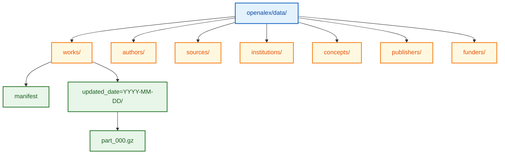

# OpenAlex - Download Documentation

## Overview

OpenAlex provides free access via REST API (rate-limited) and complete database snapshots on AWS S3. All data is CC0 (public domain).

## REST API

### Base URL

```
https://api.openalex.org
```

### Entity Endpoints

```bash
# Get single work
curl "https://api.openalex.org/works/W2741809807"

# Get by DOI
curl "https://api.openalex.org/works/doi:10.1038/s41586-019-1666-5"

# Get author
curl "https://api.openalex.org/authors/A5023888391"

# Get author by ORCID
curl "https://api.openalex.org/authors/orcid:0000-0002-1825-0097"

# Get institution
curl "https://api.openalex.org/institutions/I136199984"

# Get institution by ROR
curl "https://api.openalex.org/institutions/ror:03vek6s52"
```

### Search and Filter

```bash
# Search works by title
curl "https://api.openalex.org/works?search=CRISPR%20gene%20editing"

# Filter by publication year
curl "https://api.openalex.org/works?filter=publication_year:2024"

# Filter by institution
curl "https://api.openalex.org/works?filter=authorships.institutions.id:I136199984"

# Filter by concept
curl "https://api.openalex.org/works?filter=concepts.id:C71924100"

# Filter by open access
curl "https://api.openalex.org/works?filter=is_oa:true"

# Combined filters
curl "https://api.openalex.org/works?filter=publication_year:2024,is_oa:true,concepts.id:C71924100"
```

### Pagination

```bash
# Cursor-based pagination (recommended)
curl "https://api.openalex.org/works?filter=publication_year:2024&per-page=200&cursor=*"

# Use returned next_cursor for subsequent pages
curl "https://api.openalex.org/works?filter=publication_year:2024&per-page=200&cursor=IlsxNzA..."
```

### Grouping and Aggregation

```bash
# Group by publication year
curl "https://api.openalex.org/works?group_by=publication_year"

# Group by concept
curl "https://api.openalex.org/works?filter=authorships.institutions.id:I136199984&group_by=concepts.id"

# Group by OA status
curl "https://api.openalex.org/works?filter=publication_year:2024&group_by=open_access.oa_status"
```

### Select Fields

```bash
# Return only specific fields
curl "https://api.openalex.org/works?filter=publication_year:2024&select=id,doi,title,cited_by_count"
```

## Rate Limits

| Access Type | Rate Limit |
|-------------|------------|
| Anonymous | 10 requests/second |
| With email (polite pool) | 10 requests/second (priority queue) |
| Premium API | Higher limits (contact OpenAlex) |

### Polite Pool Access

Add your email to requests for better rate limiting:

```bash
curl "https://api.openalex.org/works?mailto=your@email.com&filter=..."
```

## Bulk Data Snapshot

### AWS S3 Location

```
s3://openalex/data/
```

### Snapshot Structure



### Download Commands

```bash
# List available snapshots
aws s3 ls s3://openalex/data/works/ --no-sign-request

# Download works snapshot
aws s3 sync s3://openalex/data/works/ ./openalex/works/ --no-sign-request

# Download specific entity type
aws s3 sync s3://openalex/data/authors/ ./openalex/authors/ --no-sign-request
```

### File Format

Each file contains one JSON object per line (JSONL format), gzip compressed:

```bash
# Decompress and view
zcat part_000.gz | head -1 | jq .
```

## Python Examples

### API Access

```python
import requests
import time

def get_works_by_institution(institution_id, max_results=10000):
    """Retrieve all works from an institution."""
    base_url = "https://api.openalex.org/works"
    works = []
    cursor = "*"

    while len(works) < max_results:
        params = {
            "filter": f"authorships.institutions.id:{institution_id}",
            "per-page": 200,
            "cursor": cursor,
            "mailto": "your@email.com"
        }

        response = requests.get(base_url, params=params)
        data = response.json()

        if not data.get("results"):
            break

        works.extend(data["results"])
        cursor = data["meta"].get("next_cursor")

        if not cursor:
            break

        time.sleep(0.1)

    return works[:max_results]
```

### Snapshot Processing

```python
import gzip
import json

def process_snapshot_file(filepath):
    """Process a gzipped JSONL snapshot file."""
    with gzip.open(filepath, 'rt') as f:
        for line in f:
            work = json.loads(line)
            yield work

# Example: Filter high-impact works
for work in process_snapshot_file('part_000.gz'):
    if work.get('cited_by_count', 0) > 100:
        print(f"{work['doi']}: {work['title']}")
```

## Data Size Estimates

| Entity Type | Approximate Count | Compressed Size |
|-------------|-------------------|-----------------|
| Works | 250M+ | ~500 GB |
| Authors | 90M+ | ~50 GB |
| Sources | 250K+ | <1 GB |
| Institutions | 110K+ | <1 GB |
| Concepts | 65K+ | <1 GB |

## Update Frequency

| Access Method | Update Frequency |
|---------------|------------------|
| API | Real-time |
| Snapshot | Monthly |
| Merged IDs file | Monthly |

## See Also

- [Schema Documentation](./schema.md)
- [OpenAlex Data Snapshot Guide](https://docs.openalex.org/download-all-data)
