# gutMGene Schema Documentation

**Document ID:** SCHEMA-GUTMGENE
**Version:** 2023.01
**Source Version:** gutMGene v2.0

---

## TL;DR

gutMGene catalogs experimentally validated associations between gut microbiota and host gene expression changes. Each entry links a microbial species to host genes showing altered expression, with supporting evidence from literature. Data covers 500+ microbes, 10,000+ host genes, and 50,000+ interaction pairs.

---

## Database Statistics

| Metric | Value | Source |
|--------|-------|--------|
| Microbe-gene associations | 50,000+ | gutMGene Stats |
| Microbial species | 500+ | gutMGene Stats |
| Host genes | 10,000+ | gutMGene Stats |
| Tissues/organs | 30+ | gutMGene Stats |
| Publications curated | 1,000+ | gutMGene Stats |

---

## Entity Relationship Overview

```mermaid
graph TD
    accTitle: gutMGene Association Structure
    accDescr: Structure of microbe-gene associations showing microbe, host gene, effect, and evidence

    Assoc[gutMGene Association]:::data

    Microbe[Microbe]:::service
    HostGene[Host Gene]:::service
    Effect[Effect]:::process
    Evidence[Evidence]:::external

    Assoc --> Microbe
    Assoc --> HostGene
    Assoc --> Effect
    Assoc --> Evidence

    TaxID[NCBI Taxon ID]:::service
    Species[Species name]:::service
    Strain[Strain]:::service
    Microbe --> TaxID
    Microbe --> Species
    Microbe --> Strain

    Symbol[Gene symbol]:::service
    EntrezID[Entrez Gene ID]:::service
    HostSpecies[Species]:::service
    HostGene --> Symbol
    HostGene --> EntrezID
    HostGene --> HostSpecies

    Direction[Direction<br/>up/down]:::process
    FoldChange[Fold change]:::process
    Tissue[Tissue/condition]:::process
    Effect --> Direction
    Effect --> FoldChange
    Effect --> Tissue

    PMID[PMID]:::external
    ExpType[Experiment type]:::external
    Model[Model system]:::external
    Evidence --> PMID
    Evidence --> ExpType
    Evidence --> Model

    classDef data fill:#FFF8E1,stroke:#F57F17,stroke-width:2px,color:#E65100
    classDef service fill:#E8F5E9,stroke:#2E7D32,stroke-width:2px,color:#1B5E20
    classDef process fill:#E1F5FE,stroke:#0277BD,stroke-width:2px,color:#01579B
    classDef external fill:#ECEFF1,stroke:#455A64,stroke-width:2px,color:#263238
```



---

## Core Tables/Entities

### Microbe-Gene Association

**Description:** Core association between microbe and host gene.

| Field | Type | Required | Description |
|-------|------|----------|-------------|
| association_id | integer | Yes | Unique association ID |
| microbe_taxid | integer | Yes | NCBI Taxonomy ID |
| microbe_name | string | Yes | Scientific name |
| gene_symbol | string | Yes | Host gene symbol |
| gene_id | integer | Yes | NCBI Entrez Gene ID |
| host_species | string | Yes | Host organism |
| direction | enum | Yes | up, down, altered |
| tissue | string | No | Tissue/organ affected |
| condition | string | No | Experimental condition |
| pmid | integer | Yes | PubMed ID |

### Microbe Entity

| Field | Type | Required | Description |
|-------|------|----------|-------------|
| taxid | integer | Yes | NCBI Taxonomy ID |
| scientific_name | string | Yes | Species name |
| common_name | string | No | Common name |
| gram_stain | string | No | Gram positive/negative |
| oxygen_req | string | No | Aerobic/anaerobic |
| phylum | string | No | Taxonomic phylum |

### Host Gene Entity

| Field | Type | Required | Description |
|-------|------|----------|-------------|
| gene_id | integer | Yes | NCBI Entrez Gene ID |
| symbol | string | Yes | Official gene symbol |
| name | string | No | Full gene name |
| species | string | Yes | Host species |
| chromosome | string | No | Chromosome location |
| gene_type | string | No | protein-coding, ncRNA |

### Evidence Details

| Field | Type | Required | Description |
|-------|------|----------|-------------|
| pmid | integer | Yes | PubMed ID |
| experiment_type | string | No | GF colonization, antibiotics, etc. |
| method | string | No | RNA-seq, microarray, qPCR |
| model | string | No | Germ-free mice, cell line |
| fold_change | float | No | Expression fold change |
| p_value | float | No | Statistical significance |

---

## Data Formats

| Format | Description |
|--------|-------------|
| Primary | TSV (downloadable tables) |
| Alternative | Excel (web export) |
| Encoding | UTF-8 |

---

## Sample Record

```json
{
  "association_id": 12345,
  "microbe": {
    "taxid": 853,
    "name": "Faecalibacterium prausnitzii",
    "phylum": "Firmicutes"
  },
  "gene": {
    "symbol": "IL10",
    "gene_id": 3586,
    "name": "interleukin 10",
    "species": "Homo sapiens"
  },
  "effect": {
    "direction": "up",
    "fold_change": 2.5,
    "tissue": "colon",
    "condition": "germ-free colonization"
  },
  "evidence": {
    "pmid": 28123456,
    "experiment_type": "mono-colonization",
    "method": "RNA-seq",
    "model": "germ-free mice"
  }
}
```

### TSV Format

```
microbe_taxid	microbe_name	gene_symbol	gene_id	direction	fold_change	tissue	pmid
853	Faecalibacterium prausnitzii	IL10	3586	up	2.5	colon	28123456
816	Bacteroides vulgatus	TNF	7124	down	0.4	intestine	29234567
```

---

## Effect Direction Categories

| Direction | Description | Typical Interpretation |
|-----------|-------------|------------------------|
| up | Increased expression | Microbe activates gene |
| down | Decreased expression | Microbe suppresses gene |
| altered | Changed (direction varies) | Context-dependent |

---

## Experiment Types

| Type | Description |
|------|-------------|
| Germ-free colonization | Mono-association of GF animals |
| Antibiotic treatment | Microbiome depletion |
| Probiotic supplementation | Addition of specific strains |
| FMT | Fecal microbiota transplant |
| Co-culture | In vitro cell-microbe culture |
| Correlation | Observational association |

---

## Model Systems

| Model | Description | Use Case |
|-------|-------------|----------|
| Germ-free mice | Axenic animals | Causation |
| SPF mice | Specific pathogen-free | Baseline |
| Cell lines | Caco-2, HT-29 | Mechanism |
| Organoids | 3D intestinal | Translational |
| Human cohorts | Observational | Association |

---

## Tissue Categories

| Category | Tissues |
|----------|---------|
| Intestinal | Colon, Ileum, Jejunum, Cecum |
| Immune | Spleen, Lymph node, Peyer's patches |
| Metabolic | Liver, Adipose, Pancreas |
| Neural | Brain, Hippocampus, Hypothalamus |
| Systemic | Blood, Serum |

---

## Cross-References

| Database | ID Type | Usage |
|----------|---------|-------|
| NCBI Taxonomy | taxid | Microbe identification |
| NCBI Gene | gene_id | Host gene identification |
| PubMed | PMID | Literature evidence |
| KEGG | Pathway | Pathway enrichment |
| GO | GO terms | Functional annotation |

---

## Glossary

| Term | Definition |
|------|------------|
| Germ-free (GF) | Animal raised without microbes |
| Mono-colonization | Single species colonization |
| Dysbiosis | Microbiome imbalance |
| Host-microbe crosstalk | Bidirectional communication |
| Postbiotic | Microbial metabolite effect |

---

## References

1. Cheng L, et al. (2022). gutMGene: a comprehensive database for target genes of gut microbes and microbial metabolites. Nucleic Acids Research. https://doi.org/10.1093/nar/gkab786
2. gutMGene Website: http://bio-annotation.cn/gutmgene
