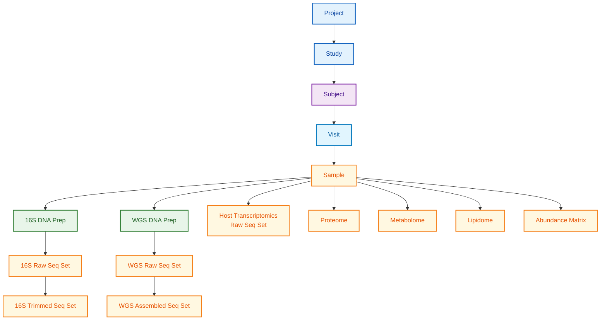

**Parent:** [Schema Documentation](./README.md)

# Human Microbiome Project (HMP) - Schema Documentation

**Document ID:** SCHEMA-HMP
**Status:** Final
**Last Updated:** January 2026
**Data Source URL:** https://portal.hmpdacc.org/
**GitHub Schemas:** https://github.com/ihmpdcc/osdf-schemas

---

## TL;DR

The Human Microbiome Project (HMP) provides 48+ TB of microbiome data including 16S rRNA, whole-genome shotgun (WGS) sequencing, transcriptomics, proteomics, metabolomics, and lipidome data. Data is structured using OSDF (Open Science Data Framework) JSON schemas with strict HIPAA-compliant anonymization. Available on AWS Open Data Registry for cloud-based analysis.

---

## Overview

The HMP and integrative Human Microbiome Project (iHMP) characterize the human microbiome and its role in health and disease across multiple body sites. The project includes three major studies:

| Study | Focus | Description |
|-------|-------|-------------|
| HMP1 | Healthy Cohort | Baseline microbiome characterization |
| IBDMDB | IBD Multi'omics | Inflammatory bowel disease |
| T2D | Prediabetes | Type 2 diabetes progression |
| MOMS-PI | Pregnancy | Pregnancy and preterm birth |

---

## Database Statistics

| Metric | Value |
|--------|-------|
| Total Data Volume | 48+ TB |
| Studies | 4 major studies |
| Data Types | 16S, WGS, RNA-seq, Proteomics, Metabolomics |
| File Formats | FASTA, FASTQ, SFF, BIOM, TSV |
| Cloud Availability | AWS Open Data Registry |
| Schema Format | JSON Schema |

---

## License

| Attribute | Value |
|-----------|-------|
| License Type | CC BY 4.0 (Creative Commons Attribution 4.0) |
| Academic Use | Free with attribution |
| Commercial Use | Permitted with attribution |
| Data Sharing | Open access |
| Privacy | HIPAA-compliant anonymization |

---

## Data Access

### Portal Access
- **Main Portal:** https://portal.hmpdacc.org/
- **Data Browser:** https://portal.hmpdacc.org/search/f
- **Cart Downloads:** Select files and download via cart

### AWS Open Data
```bash
# List available data
aws s3 ls s3://human-microbiome-project/

# Download specific study data
aws s3 sync s3://human-microbiome-project/HMASM/ ./HMASM/ --no-sign-request
```

### API Access
- **OSDF API:** REST API for programmatic access
- **Base URL:** https://osdf.igs.umaryland.edu/

---

## Schema Hierarchy

The HMP uses a hierarchical data model:



---

## Core Schemas

### 1. Subject Schema

Characterizes subjects from which samples were obtained (HIPAA-limited fields).

| Field | Type | Required | Description |
|-------|------|----------|-------------|
| rand_subject_id | string | Yes | Randomized subject ID (1-32 chars) |
| gender | enum | Yes | male, female, unknown |
| race | enum | No | african_american, american_indian_or_alaska_native, asian, caucasian, hispanic_or_latino, native_hawaiian, ethnic_other, unknown |
| subtype | string | Yes | Subject classification |
| tags | array[string] | Yes | Descriptive tags (unique values) |

**Sample JSON:**
```json
{
  "rand_subject_id": "HMP2_J12345",
  "gender": "female",
  "race": "caucasian",
  "subtype": "healthy",
  "tags": ["HMP1", "healthy_cohort", "stool"]
}
```

### 2. Visit Schema

Records clinical visits for longitudinal studies.

| Field | Type | Required | Description |
|-------|------|----------|-------------|
| visit_id | string | Yes | Unique visit identifier |
| visit_number | integer | Yes | Sequential visit number (min: 1) |
| interval | integer | Yes | Days since last visit (0 for first) |
| date | string | No | Visit date (ISO format) |
| clinic_id | string | No | Clinical site identifier |
| subtype | string | Yes | Visit classification |
| tags | array[string] | Yes | Descriptive tags |

**Sample JSON:**
```json
{
  "visit_id": "V12345_001",
  "visit_number": 1,
  "interval": 0,
  "date": "2015-06-15",
  "clinic_id": "CLINIC_BCM",
  "subtype": "baseline",
  "tags": ["baseline", "stool_collection"]
}
```

### 3. Sample Schema

Physical samples with body site and MIxS metadata.

| Field | Type | Required | Description |
|-------|------|----------|-------------|
| name | string | No | Descriptive sample name |
| fma_body_site | string | Yes | FMA ontology term for body site |
| body_site | reference | No | Reference to body site schema |
| supersite | reference | No | Body supersite reference |
| int_sample_id | string | No | Center-specific sample ID |
| mixs | object | Yes | MIxS (Minimal Information) fields |
| subtype | string | No | Sample classification |
| tags | array[string] | Yes | Descriptive tags |

**Sample JSON:**
```json
{
  "name": "Stool_Sample_001",
  "fma_body_site": "UBERON:0001988",
  "mixs": {
    "biome": "ENVO:00000446",
    "body_product": "UBERON:0001988",
    "collection_date": "2015-06-15",
    "env_package": "human-gut",
    "geo_loc_name": "USA: Maryland",
    "lat_lon": "38.9072 -77.0369",
    "material": "feces"
  },
  "subtype": "stool",
  "tags": ["stool", "gut_microbiome", "HMP1"]
}
```

### 4. Study Schema

Top-level study organization.

| Field | Type | Required | Description |
|-------|------|----------|-------------|
| name | string | Yes | Study name (3-128 chars) |
| description | string | Yes | Study description (3-512 chars) |
| contact | string | Yes | Primary contact (3-128 chars) |
| center | reference | Yes | Sequencing center reference |
| srp_id | string | No | NCBI SRA project ID |
| bp_id | string | No | NCBI BioProject ID |
| subtype | string | No | Study classification |
| tags | array[string] | Yes | Descriptive tags |

**Sample JSON:**
```json
{
  "name": "iHMP IBDMDB Study",
  "description": "Inflammatory Bowel Disease Multi'omics Database studying the gut microbiome in IBD patients and healthy controls",
  "contact": "Dr. Jane Smith (jsmith@example.edu)",
  "center": {"$ref": "center:broad"},
  "srp_id": "SRP123456",
  "bp_id": "PRJNA123456",
  "subtype": "longitudinal",
  "tags": ["IBD", "longitudinal", "multiomics"]
}
```

---

## Sequencing Schemas

### 5. 16S DNA Prep Schema

Preparation metadata for 16S rRNA sequencing.

| Field | Type | Required | Description |
|-------|------|----------|-------------|
| prep_id | string | Yes | Nucleic acid prep ID |
| lib_layout | string | Yes | Library layout (fragment/paired) |
| lib_selection | string | Yes | Selection method |
| mimarks | object | Yes | GSC MIMARKS fields |
| ncbi_taxon_id | string | Yes | NCBI taxonomy ID |
| sequencing_center | string | Yes | Sequencing facility |
| sequencing_contact | string | Yes | Contact name and email |
| storage_duration | integer | Yes | Storage time in days |
| srs_id | string | No | NCBI SRS sample ID |
| frag_size | integer | No | Target fragment size |
| comment | string | Yes | Free-text notes (max 512) |
| subtype | string | No | Prep classification |
| tags | array[string] | Yes | Descriptive tags |

### 6. WGS DNA Prep Schema

Preparation metadata for whole-genome shotgun sequencing.

| Field | Type | Required | Description |
|-------|------|----------|-------------|
| prep_id | string | Yes | Nucleic acid prep ID |
| lib_layout | string | Yes | Library layout |
| lib_selection | string | Yes | Selection method |
| mims | object | Yes | GSC MIMS fields |
| ncbi_taxon_id | string | Yes | NCBI taxonomy ID |
| sequencing_center | string | Yes | Sequencing facility |
| sequencing_contact | string | Yes | Contact info |
| storage_duration | integer | Yes | Storage time in days |
| subtype | string | Yes | Prep classification |
| comment | string | Yes | Free-text notes |
| tags | array[string] | Yes | Descriptive tags |

### 7. 16S Raw Sequence Set Schema

Raw 16S rRNA sequence files.

| Field | Type | Required | Description |
|-------|------|----------|-------------|
| checksums | object | Yes | File integrity (md5, sha1, sha256) |
| format | enum | Yes | fasta, fastq, sff |
| format_doc | string | Yes | Format documentation URL |
| size | integer | Yes | File size in bytes |
| exp_length | integer | Yes | Expected base count |
| seq_model | string | Yes | Sequencing instrument model |
| sequence_type | enum | No | nucleotide, peptide |
| study | reference | Yes | Study reference |
| urls | array[string] | Yes | Download URLs (min 1) |
| private_files | boolean | No | Privacy flag |
| comment | string | Yes | Free-text notes |
| subtype | string | Yes | Sequence set classification |
| tags | array[string] | Yes | Descriptive tags |

**Sample JSON:**
```json
{
  "checksums": {
    "md5": "d41d8cd98f00b204e9800998ecf8427e",
    "sha256": "e3b0c44298fc1c149afbf4c8996fb92427ae41e4649b934ca495991b7852b855"
  },
  "format": "fastq",
  "format_doc": "https://en.wikipedia.org/wiki/FASTQ_format",
  "size": 1234567890,
  "exp_length": 15000000,
  "seq_model": "Illumina MiSeq",
  "study": {"$ref": "study:ibdmdb"},
  "urls": ["https://downloads.hmpdacc.org/data/IBDMDB/16S/sample001.fastq.gz"],
  "comment": "16S V4 region sequencing",
  "subtype": "16s_raw",
  "tags": ["16S", "V4", "MiSeq"]
}
```

### 8. WGS Raw Sequence Set Schema

Raw whole-genome shotgun sequence files (same structure as 16S Raw Seq Set).

---

## Multi-omics Schemas

### 9. Host Transcriptomics Raw Seq Set

| Field | Type | Required | Description |
|-------|------|----------|-------------|
| checksums | object | Yes | File integrity verification |
| format | enum | Yes | fasta, fastq, sff |
| format_doc | string | Yes | Format documentation URL |
| size | integer | Yes | File size in bytes |
| exp_length | integer | Yes | Expected read count |
| seq_model | string | Yes | Sequencing platform |
| sequence_type | enum | No | nucleotide, peptide |
| study | string | Yes | iHMP study reference |
| urls | array[string] | Yes | Download URLs |
| comment | string | Yes | Free-text notes |
| subtype | string | Yes | Classification |
| tags | array[string] | Yes | Descriptive tags |

### 10. Proteome Schema

Mass spectrometry proteomics data.

| Field | Type | Required | Description |
|-------|------|----------|-------------|
| checksums | object | Yes | File integrity |
| analyzer | string | Yes | Mass analyzer (MS ontology) |
| detector | string | Yes | Detection equipment |
| source | string | Yes | Ion source info |
| instrument_name | string | Yes | Equipment make/model |
| protocol_name | string | Yes | Protocol with version |
| search_engine | string | Yes | Protein ID software |
| software | string | Yes | All software used |
| processing_method | string | Yes | Peak processing |
| data_processing_protocol | string | Yes | Data processing method |
| exp_description | string | Yes | Study objectives |
| sample_name | string | Yes | Sample reference |
| short_label | string | Yes | Experiment label |
| title | string | Yes | Experiment description |
| pride_id | string | Yes | PRIDE study ID |
| raw_url | array | Yes | Raw data URLs |
| peak_url | array | Yes | Peak file URLs |
| result_url | array | Yes | Result file URLs |
| other_url | array | Yes | Related file URLs |
| study | reference | Yes | Study reference |
| subtype | enum | Yes | host, microbiome |
| tags | array[string] | Yes | Descriptive tags |
| comment | string | Yes | Free-text notes |

### 11. Metabolome Schema

Metabolomics data files.

| Field | Type | Required | Description |
|-------|------|----------|-------------|
| checksums | object | Yes | File integrity (md5 required) |
| format | string | No | File format |
| format_doc | string | No | Format documentation URL |
| study | reference | Yes | iHMP study reference |
| subtype | enum | Yes | host, microbiome |
| urls | array[string] | Yes | Download URLs (min 1) |
| private_files | boolean | No | Privacy flag |
| comment | string | No | Free-text notes |
| tags | array[string] | Yes | Descriptive tags |

### 12. Lipidome Schema

Lipidomics data files.

| Field | Type | Required | Description |
|-------|------|----------|-------------|
| checksums | object | Yes | File integrity (md5 required) |
| format | string | No | File format |
| format_doc | string | No | Format documentation URL |
| study | reference | Yes | iHMP study reference |
| subtype | enum | Yes | host, microbiome |
| urls | array[string] | Yes | Download URLs (min 1) |
| private_files | boolean | No | Privacy flag |
| comment | string | No | Free-text notes |
| tags | array[string] | Yes | Descriptive tags |

### 13. Abundance Matrix Schema

Processed abundance data (OTU tables, functional profiles).

| Field | Type | Required | Description |
|-------|------|----------|-------------|
| checksums | object | Yes | File integrity |
| format | enum | Yes | tbl, csv, biom |
| format_doc | string | Yes | Format documentation URL |
| matrix_type | enum | Yes | See matrix types below |
| size | integer | Yes | File size in bytes |
| study | reference | Yes | iHMP study reference |
| urls | array[string] | Yes | Download URLs |
| parameters | string | No | Generation parameters |
| sop | string | No | SOP documentation URL |
| private_files | boolean | No | Privacy flag |
| comment | string | Yes | Free-text notes |
| subtype | string | Yes | Matrix classification |
| tags | array[string] | Yes | Descriptive tags |

**Matrix Types:**
- `16s_community` - 16S taxonomic profiles
- `wgs_community` - WGS taxonomic profiles
- `wgs_functional` - WGS functional profiles
- `microb_proteomic` - Microbial proteomics
- `microb_metatranscriptome` - Microbial metatranscriptomics
- `microb_metabolome` - Microbial metabolomics
- `microb_lipidome` - Microbial lipidomics
- `host_transcriptome` - Host transcriptomics
- `host_proteomic` - Host proteomics
- `host_metabolome` - Host metabolomics
- `host_lipidome` - Host lipidomics
- `host_cytokine` - Host cytokine profiles
- `host_serology` - Host serology
- `other` - Other data types

**Sample JSON:**
```json
{
  "checksums": {
    "md5": "d41d8cd98f00b204e9800998ecf8427e"
  },
  "format": "biom",
  "format_doc": "https://biom-format.org/",
  "matrix_type": "16s_community",
  "size": 52428800,
  "study": {"$ref": "study:ibdmdb"},
  "urls": ["https://downloads.hmpdacc.org/data/IBDMDB/16S/otu_table.biom"],
  "parameters": "QIIME2 DADA2 pipeline, Silva 138 database",
  "comment": "16S V4 OTU table at 97% identity",
  "subtype": "16s_otu",
  "tags": ["16S", "OTU", "community_profile", "DADA2"]
}
```

---

## Body Sites

The HMP catalogs microbiome samples from multiple body sites:

| Supersite | Body Sites |
|-----------|------------|
| Airways | Anterior nares, Throat |
| Gastrointestinal | Stool, Buccal mucosa, Tongue dorsum, Hard palate, Subgingival plaque, Supragingival plaque, Saliva |
| Oral | Attached keratinized gingiva, Palatine tonsils, Throat |
| Skin | Left/Right retroauricular crease, Left/Right antecubital fossa |
| Urogenital | Vagina (mid, posterior fornix, introitus) |

---

## Checksums Object

All file-containing schemas require checksums:

```json
{
  "checksums": {
    "md5": "d41d8cd98f00b204e9800998ecf8427e",
    "sha1": "da39a3ee5e6b4b0d3255bfef95601890afd80709",
    "sha256": "e3b0c44298fc1c149afbf4c8996fb92427ae41e4649b934ca495991b7852b855"
  }
}
```

| Algorithm | Pattern | Required |
|-----------|---------|----------|
| md5 | 32 hex chars | Yes |
| sha1 | 40 hex chars | No |
| sha256 | 64 hex chars | No |

---

## MIxS/MIMARKS/MIMS Fields

Genomic Standards Consortium minimum information fields:

| Field | Description |
|-------|-------------|
| biome | Environmental biome (ENVO term) |
| body_product | Body material (UBERON term) |
| collection_date | Sample collection date |
| env_package | Environment type |
| feature | Environmental feature |
| geo_loc_name | Geographic location |
| lat_lon | Latitude/longitude coordinates |
| material | Sample material type |
| project_name | Project identifier |
| rel_to_oxygen | Relationship to oxygen |
| samp_collect_device | Collection device |
| samp_mat_process | Sample processing |
| samp_size | Sample size |

---

## Data Download Examples

### Using AWS CLI
```bash
# Download all 16S data from IBDMDB
aws s3 sync s3://human-microbiome-project/HMASM/IBDMDB/16S/ ./IBDMDB_16S/ --no-sign-request

# Download WGS data
aws s3 sync s3://human-microbiome-project/HMASM/IBDMDB/WGS/ ./IBDMDB_WGS/ --no-sign-request
```

### Using Portal Cart
1. Navigate to https://portal.hmpdacc.org/search/f
2. Apply filters (study, data type, body site)
3. Add files to cart
4. Download manifest or files directly

---

## Common Query Patterns

### Find all stool samples from IBDMDB
```
study: IBDMDB
body_site: stool
node_type: sample
```

### Find all 16S data for a subject
```
subject_id: HMP2_J12345
node_type: 16s_raw_seq_set
```

### Find metabolome data
```
node_type: metabolome
subtype: microbiome
```

---

## Integration Notes

### Related Standards
- **MIxS:** Minimum Information about any (x) Sequence
- **MIMARKS:** Minimum Information About a Marker Gene Sequence
- **MIMS:** Minimum Information about a Metagenome Sequence
- **FMA:** Foundational Model of Anatomy (body sites)
- **ENVO:** Environment Ontology
- **UBERON:** Uber-anatomy ontology

### External References
- NCBI BioProject IDs (PRJNA prefix)
- NCBI SRA IDs (SRP, SRS, SRX, SRR prefixes)
- PRIDE archive IDs (proteomics)

---

## Data Format

| Format | Description | Use Case |
|--------|-------------|----------|
| Primary | FASTA, FASTQ (sequencing) | Raw reads |
| Alternative | BIOM (abundance matrix) | OTU/ASV tables |
| Alternative | JSON (OSDF schemas) | Structured metadata |
| Compression | gzip (.gz) | File compression |
| Encoding | UTF-8 | Text-based formats |

---

## Download

### Data Access Methods

| Method | URL | Format |
|--------|-----|--------|
| **Portal** | https://portal.hmpdacc.org/ | Interactive search |
| **AWS S3** | s3://human-microbiome-project/ | Direct sync |
| **OSDF API** | https://osdf.igs.umaryland.edu/ | REST JSON |
| **Portal Cart** | https://portal.hmpdacc.org/search/f | Select & download |

### Download Examples

```bash
# AWS CLI: Download IBDMDB 16S data
aws s3 sync s3://human-microbiome-project/HMASM/IBDMDB/16S/ ./IBDMDB_16S/ --no-sign-request

# AWS CLI: Download WGS data
aws s3 sync s3://human-microbiome-project/HMASM/IBDMDB/WGS/ ./IBDMDB_WGS/ --no-sign-request
```

---

## Data Set Size

| Component | Count/Volume | Storage |
|-----------|--------------|---------|
| **Total Data** | 48+ TB | ~50 TB |
| **16S Sequencing** | ~87,000 samples | ~15-20 TB |
| **WGS Sequencing** | ~32,000 samples | ~20-30 TB |
| **Metatranscriptomics** | ~5,000 samples | ~3-5 TB |
| **Proteomics** | ~3,000 samples | ~1-2 TB |
| **Metabolomics** | ~2,500 samples | ~500 GB |
| **Lipidomics** | ~1,500 samples | ~200 GB |
| **Individual raw sequence file** | Variable | 100 MB - 10 GB |

---

## Citation

```
Human Microbiome Project Consortium. (2012). Structure, function and
diversity of the healthy human microbiome. Nature, 486(7402), 207-214.

Integrative HMP (iHMP) Research Network Consortium. (2019). The
Integrative Human Microbiome Project. Nature, 569(7758), 641-648.

Data Portal: https://portal.hmpdacc.org/
```

---

## Sample Data

### Example Record
```json
{
  "sample_id": "SRS001001",
  "subject_id": "HSM001",
  "body_site": "tongue_dorsum",
  "organism": "Streptococcus mutans",
  "abundance": 0.0542,
  "sequence_count": 12450
}
```

### Sample Query Result
| sample_id | subject_id | body_site | organism | abundance |
|-----------|-----------|-----------|----------|-----------|
| SRS001001 | HSM001 | tongue_dorsum | Streptococcus mutans | 0.0542 |
| SRS001002 | HSM002 | stool | Bacteroides vulgatus | 0.1265 |

---

## Glossary

| Term | Definition | Example |
|------|------------|---------|
| `rand_subject_id` | Randomized identifier for study participant (HIPAA-compliant) | `HMP2_J12345` |
| `visit_number` | Sequential number indicating order of clinical visits | `1` |
| `fma_body_site` | Foundational Model of Anatomy term for sample location | `UBERON:0001988` |
| `matrix_type` | Classification of processed abundance data type | `16s_community` |
| `checksums` | File integrity verification hashes (md5, sha256) | `d41d8cd98f...` |
| `exp_length` | Expected number of bases or reads in sequence file | `15000000` |
| `seq_model` | Sequencing instrument make and model | `Illumina MiSeq` |
| `biome` | Environmental biome classification using ENVO ontology | `ENVO:00000446` |
| `subtype` | Classification distinguishing host vs microbiome data | `microbiome` |
| `pride_id` | PRIDE archive identifier for proteomics data | `PXD012345` |

### Domain-Specific Terms

| Term | Definition | Related To |
|------|------------|------------|
| 16S rRNA Sequencing | Targeted sequencing of bacterial ribosomal gene for taxonomy | 16S DNA Prep |
| Whole-Genome Shotgun | Untargeted sequencing of all DNA in sample | WGS DNA Prep |
| Multi-omics | Integration of multiple molecular data types (genomics, proteomics, metabolomics) | iHMP studies |
| Body Supersite | Broad anatomical region grouping multiple body sites | Airways, Gastrointestinal |
| Abundance Matrix | Processed data showing relative quantities of taxa or functions | OTU table, BIOM |
| Longitudinal Study | Research design tracking subjects over time | visit_number, interval |

### Acronyms

| Acronym | Expansion | Notes |
|---------|-----------|-------|
| HMP | Human Microbiome Project | NIH microbiome initiative |
| iHMP | Integrative Human Microbiome Project | Multi-omics extension |
| IBDMDB | Inflammatory Bowel Disease Multi'omics Database | iHMP IBD study |
| MOMS-PI | Multi-Omic Microbiome Study - Pregnancy Initiative | iHMP pregnancy study |
| T2D | Type 2 Diabetes | iHMP diabetes study |
| OSDF | Open Science Data Framework | HMP data model |
| MIxS | Minimum Information about any (x) Sequence | GSC metadata standard |
| MIMARKS | Minimum Information About a Marker Gene Sequence | 16S metadata standard |
| FMA | Foundational Model of Anatomy | Body site ontology |
| ENVO | Environment Ontology | Biome classification |
| BIOM | Biological Observation Matrix | Abundance data format |
| HIPAA | Health Insurance Portability and Accountability Act | Privacy regulation |

---

## Related Documents

- [gmrepo-schema.md](./gmrepo-schema.md) - Gut microbiome repository
- [unified-schema-analysis.md](./unified-schema-analysis.md) - Cross-database schema mapping
