# HOMD Schema Documentation

**Document ID:** SCHEMA-HOMD
**Version:** 2024.01
**Source Version:** HOMD v15.x

---

## TL;DR

HOMD (Human Oral Microbiome Database) provides comprehensive taxonomy, genome sequences, and phenotypic data for 770+ oral bacterial taxa. Features the Human Oral Microbiome Taxon (HOMT) numbering system for standardized identification of cultivated and uncultivated species. Essential for oral microbiome research and periodontal disease studies.

---

## Database Statistics

| Metric | Value | Source |
|--------|-------|--------|
| Oral taxa | 770+ | HOMD Statistics |
| Named species | 500+ | HOMD Statistics |
| Reference genomes | 1,800+ | HOMD Genomes |
| 16S rRNA sequences | 4,000+ | HOMD 16S |
| Phyla represented | 13 | HOMD Taxonomy |

---

## Entity Relationship Overview

```mermaid
graph TD
    accTitle: HOMD Taxon Structure
    accDescr: Hierarchical structure of oral microbiome taxa including taxonomy, sequences, and phenotype data

    Taxon[HOMD Taxon<br/>HOMT ID]:::data

    Taxonomy[Taxonomy]:::service
    Sequences[Sequences]:::data
    Phenotype[Phenotype]:::service
    Metadata[Metadata]:::external

    Taxon --> Taxonomy
    Taxon --> Sequences
    Taxon --> Phenotype
    Taxon --> Metadata

    Phylum[Phylum]:::service
    Class[Class]:::service
    Order[Order]:::service
    Family[Family]:::service
    Genus[Genus]:::service
    Species[Species]:::service
    Taxonomy --> Phylum
    Taxonomy --> Class
    Taxonomy --> Order
    Taxonomy --> Family
    Taxonomy --> Genus
    Taxonomy --> Species

    S16Ref[16S rRNA reference]:::data
    Genomes[Genome sequences]:::data
    Sequences --> S16Ref
    Sequences --> Genomes

    Gram[Gram stain]:::service
    Morph[Morphology]:::service
    Oxygen[Oxygen requirements]:::service
    Cultivation[Cultivation status]:::service
    Phenotype --> Gram
    Phenotype --> Morph
    Phenotype --> Oxygen
    Phenotype --> Cultivation

    Isolation[Isolation source]:::external
    Disease[Disease associations]:::external
    Strain[Strain collection]:::external
    Metadata --> Isolation
    Metadata --> Disease
    Metadata --> Strain

    classDef data fill:#FFF8E1,stroke:#F57F17,stroke-width:2px,color:#E65100
    classDef service fill:#E8F5E9,stroke:#2E7D32,stroke-width:2px,color:#1B5E20
    classDef external fill:#ECEFF1,stroke:#455A64,stroke-width:2px,color:#263238
```



---

## Core Tables/Entities

### Taxon Entry

**Description:** Core oral microbiome taxon record.

| Field | Type | Required | Description |
|-------|------|----------|-------------|
| homt_id | string | Yes | HOMD taxon ID (HMT-###) |
| ncbi_taxid | integer | No | NCBI Taxonomy ID |
| genus | string | Yes | Genus name |
| species | string | Yes | Species epithet or provisional name |
| full_name | string | Yes | Complete scientific name |
| cultivation_status | enum | Yes | Named, Unnamed, Provisional |
| type_strain | string | No | Type strain designation |
| phylum | string | Yes | Taxonomic phylum |

### 16S rRNA Sequence

| Field | Type | Required | Description |
|-------|------|----------|-------------|
| sequence_id | string | Yes | Sequence identifier |
| homt_id | string | Yes | Associated HOMT ID |
| sequence | string | Yes | 16S rRNA sequence |
| length | integer | Yes | Sequence length |
| region | string | No | Variable region (V1-V9) |
| genbank_acc | string | No | GenBank accession |
| clone_id | string | No | Clone identifier |

### Genome Entry

| Field | Type | Required | Description |
|-------|------|----------|-------------|
| genome_id | string | Yes | Genome identifier |
| homt_id | string | Yes | Associated HOMT ID |
| strain | string | Yes | Strain name |
| assembly_level | string | Yes | Complete, Draft, Contig |
| genome_size | integer | Yes | Size in bp |
| gc_content | float | Yes | GC percentage |
| ncbi_assembly | string | No | NCBI Assembly accession |
| gene_count | integer | No | Predicted genes |

### Phenotype Data

| Field | Type | Required | Description |
|-------|------|----------|-------------|
| homt_id | string | Yes | Associated HOMT ID |
| gram_stain | enum | No | positive, negative, variable |
| cell_shape | string | No | Coccus, rod, filament, etc. |
| oxygen_req | enum | No | aerobic, anaerobic, facultative |
| motility | boolean | No | Motile or not |
| spore_forming | boolean | No | Spore formation |
| growth_temp | string | No | Optimal temperature |

---

## HOMT ID System

### Format

```
HMT-###
Where ### is a 3-digit number (001-999)

Examples:
HMT-096: Streptococcus mutans
HMT-707: Porphyromonas gingivalis
HMT-274: Aggregatibacter actinomycetemcomitans
```

### Cultivation Status

| Status | Description | Naming |
|--------|-------------|--------|
| Named | Validly published name | Full binomial |
| Unnamed | Cultivated but not named | Genus sp. HMT-### |
| Provisional | Uncultivated, detected only | Genus [G-#] sp. HMT-### |

---

## Data Formats

| Format | Description |
|--------|-------------|
| Primary | FASTA (sequences) |
| Alternative | GenBank, Excel |
| Encoding | UTF-8 |

---

## Sample Record

### Taxon JSON

```json
{
  "homt_id": "HMT-096",
  "ncbi_taxid": 1309,
  "genus": "Streptococcus",
  "species": "mutans",
  "full_name": "Streptococcus mutans",
  "cultivation_status": "Named",
  "type_strain": "ATCC 25175",
  "phylum": "Firmicutes",
  "class": "Bacilli",
  "order": "Lactobacillales",
  "family": "Streptococcaceae",
  "phenotype": {
    "gram_stain": "positive",
    "cell_shape": "coccus",
    "oxygen_req": "facultative",
    "motility": false
  },
  "disease_association": ["dental caries", "endocarditis"],
  "oral_sites": ["teeth", "plaque", "saliva"]
}
```

### 16S FASTA

```
>HMT-096_clone_AY005451 Streptococcus mutans 16S rRNA gene
AGAGTTTGATCCTGGCTCAGGACGAACGCTGGCGGCGTGCCTAATACATGCAAGTCGAGC
GATGATTAAGAGCTTGCTCTTATTGAAGTTAGCGGCGGACGGGTGAGTAACACGTGGGTA
...
```

### Genome Entry

```json
{
  "genome_id": "HOMD_GEN_096_001",
  "homt_id": "HMT-096",
  "strain": "UA159",
  "assembly_level": "Complete",
  "genome_size": 2032807,
  "gc_content": 36.8,
  "ncbi_assembly": "GCF_000007465.2",
  "gene_count": 1963,
  "cds_count": 1895,
  "rrna_count": 5,
  "trna_count": 65
}
```

---

## Oral Site Classification

| Site Category | Specific Sites |
|---------------|----------------|
| Teeth | Enamel, Dentin, Root |
| Gingiva | Supragingival, Subgingival |
| Mucosal | Buccal, Tongue, Palate |
| Saliva | Whole saliva |
| Tonsils | Palatine, Lingual |
| Other | Nasopharynx, Sinuses |

---

## Disease Associations

| Disease | Key Taxa (HOMT IDs) |
|---------|---------------------|
| Dental caries | HMT-096, HMT-686, HMT-416 |
| Periodontitis | HMT-707, HMT-274, HMT-690 |
| Gingivitis | HMT-582, HMT-626 |
| Oral candidiasis | (Fungal, not in HOMD) |
| Halitosis | HMT-707, HMT-879 |

---

## Taxonomic Distribution

| Phylum | Named Species | Total Taxa |
|--------|--------------|------------|
| Firmicutes | 200+ | 280+ |
| Proteobacteria | 100+ | 150+ |
| Bacteroidetes | 80+ | 120+ |
| Actinobacteria | 60+ | 90+ |
| Fusobacteria | 30+ | 50+ |
| Spirochaetes | 20+ | 40+ |
| Other | 30+ | 40+ |

---

## Cross-References

| Database | ID Type | Usage |
|----------|---------|-------|
| NCBI Taxonomy | TaxID | Standard taxonomy |
| GenBank | Accession | Sequence links |
| NCBI Assembly | GCF/GCA | Genome links |
| ATCC/DSMZ | Strain numbers | Type strains |
| SILVA | Sequence IDs | 16S database |

---

## Glossary

| Term | Definition |
|------|------------|
| HOMT | Human Oral Microbiome Taxon |
| Provisional | Uncultivated species detected by sequence |
| Type strain | Reference strain for species definition |
| Supragingival | Above the gum line |
| Subgingival | Below the gum line (periodontal pocket) |
| Cariogenic | Capable of causing dental caries |
| Periodontopathogen | Associated with periodontal disease |

---

## References

1. Chen T, et al. (2010). The Human Oral Microbiome Database: a web accessible resource for investigating oral microbe taxonomic and genomic information. Database. https://doi.org/10.1093/database/baq013
2. Escapa IF, et al. (2018). New Insights into Human Nostril Microbiome from the Expanded Human Oral Microbiome Database (eHOMD). mSystems. https://doi.org/10.1128/mSystems.00187-18
3. HOMD Website: https://www.homd.org
