# gutMDisorder Schema Documentation

**Document ID:** SCHEMA-GUTMDISORDER
**Version:** 2023.01
**Source Version:** gutMDisorder v2.0

---

## TL;DR

gutMDisorder is a manually curated database of gut microbiota-disease associations linking 10,000+ microbe-disease pairs across 200+ conditions. Each association includes direction of change (increased/decreased), evidence from literature, and sample metadata. Essential for understanding dysbiosis patterns and identifying microbial biomarkers.

---

## Database Statistics

| Metric | Value | Source |
|--------|-------|--------|
| Microbe-disease pairs | 10,000+ | gutMDisorder Stats |
| Diseases | 200+ | gutMDisorder Stats |
| Microbial taxa | 2,000+ | gutMDisorder Stats |
| Publications curated | 2,000+ | gutMDisorder Stats |
| Disease categories | 15+ | gutMDisorder Stats |

---

## Entity Relationship Overview

```mermaid
graph TD
    accTitle: gutMDisorder Association Structure
    accDescr: Structure of gut microbiota-disease associations showing microbe, disease, and evidence data

    Assoc[gutMDisorder Association]:::data

    Microbe[Microbe]:::service
    Disease[Disease]:::user
    Association[Association]:::process
    Evidence[Evidence]:::external

    Assoc --> Microbe
    Assoc --> Disease
    Assoc --> Association
    Assoc --> Evidence

    TaxID[NCBI Taxon ID]:::service
    SpeciesName[Species name]:::service
    TaxRank[Taxonomic rank]:::service
    Microbe --> TaxID
    Microbe --> SpeciesName
    Microbe --> TaxRank

    DiseaseName[Disease name]:::user
    ICD10[ICD-10 code]:::user
    Category[Disease category]:::user
    Disease --> DiseaseName
    Disease --> ICD10
    Disease --> Category

    Direction[Direction<br/>increased/decreased]:::process
    SampleSize[Sample size]:::process
    StatSig[Statistical significance]:::process
    Association --> Direction
    Association --> SampleSize
    Association --> StatSig

    PMID[PMID]:::external
    StudyDesign[Study design]:::external
    DetectMethod[Detection method]:::external
    Evidence --> PMID
    Evidence --> StudyDesign
    Evidence --> DetectMethod

    classDef data fill:#FFF8E1,stroke:#F57F17,stroke-width:2px,color:#E65100
    classDef service fill:#E8F5E9,stroke:#2E7D32,stroke-width:2px,color:#1B5E20
    classDef process fill:#E1F5FE,stroke:#0277BD,stroke-width:2px,color:#01579B
    classDef user fill:#F3E5F5,stroke:#7B1FA2,stroke-width:2px,color:#4A148C
    classDef external fill:#ECEFF1,stroke:#455A64,stroke-width:2px,color:#263238
```



---

## Core Tables/Entities

### Microbe-Disease Association

**Description:** Core association between microbe and disease.

| Field | Type | Required | Description |
|-------|------|----------|-------------|
| association_id | integer | Yes | Unique association ID |
| microbe_taxid | integer | Yes | NCBI Taxonomy ID |
| microbe_name | string | Yes | Scientific name |
| microbe_rank | string | Yes | Taxonomic rank |
| disease_name | string | Yes | Disease name |
| disease_icd | string | No | ICD-10 code |
| disease_category | string | Yes | Disease category |
| direction | enum | Yes | increased, decreased, altered |
| pmid | integer | Yes | PubMed ID |

### Microbe Entity

| Field | Type | Required | Description |
|-------|------|----------|-------------|
| taxid | integer | Yes | NCBI Taxonomy ID |
| scientific_name | string | Yes | Species/genus name |
| rank | string | Yes | species, genus, family, etc. |
| phylum | string | No | Taxonomic phylum |
| gram_stain | string | No | positive/negative |

### Disease Entity

| Field | Type | Required | Description |
|-------|------|----------|-------------|
| disease_id | string | Yes | Internal disease ID |
| disease_name | string | Yes | Disease name |
| icd10_code | string | No | ICD-10 classification |
| mesh_id | string | No | MeSH identifier |
| doid | string | No | Disease Ontology ID |
| category | string | Yes | Disease category |

### Evidence Details

| Field | Type | Required | Description |
|-------|------|----------|-------------|
| pmid | integer | Yes | PubMed ID |
| study_design | string | No | Case-control, cohort, etc. |
| sample_size | integer | No | Total subjects |
| cases | integer | No | Disease cases |
| controls | integer | No | Healthy controls |
| method | string | No | 16S, WGS, culture |
| effect_size | float | No | Statistical effect |
| p_value | float | No | Significance |

---

## Data Formats

| Format | Description |
|--------|-------------|
| Primary | TSV (downloadable tables) |
| Alternative | Excel, JSON (web export) |
| Encoding | UTF-8 |

---

## Sample Record

```json
{
  "association_id": 12345,
  "microbe": {
    "taxid": 816,
    "name": "Bacteroides vulgatus",
    "rank": "species",
    "phylum": "Bacteroidetes"
  },
  "disease": {
    "name": "Type 2 Diabetes",
    "icd10": "E11",
    "mesh_id": "D003924",
    "category": "Metabolic disorders"
  },
  "association": {
    "direction": "decreased",
    "sample_size": 200,
    "cases": 100,
    "controls": 100
  },
  "evidence": {
    "pmid": 28123456,
    "study_design": "case-control",
    "method": "16S rRNA sequencing",
    "p_value": 0.001
  }
}
```

### TSV Format

```
microbe_taxid	microbe_name	disease_name	disease_icd	direction	pmid	sample_size
816	Bacteroides vulgatus	Type 2 Diabetes	E11	decreased	28123456	200
853	Faecalibacterium prausnitzii	Crohn's Disease	K50	decreased	29234567	150
821	Bacteroides thetaiotaomicron	Obesity	E66	increased	30345678	300
```

---

## Direction Categories

| Direction | Description | Interpretation |
|-----------|-------------|----------------|
| increased | Higher in disease | Potential pathogenic role |
| decreased | Lower in disease | Potential protective role |
| altered | Changed (inconsistent direction) | Context-dependent |

---

## Disease Categories

| Category | Examples |
|----------|----------|
| Metabolic | Diabetes, Obesity, NAFLD |
| Gastrointestinal | IBD, IBS, Colorectal cancer |
| Neurological | Parkinson's, Alzheimer's, Autism |
| Cardiovascular | Atherosclerosis, Hypertension |
| Autoimmune | Rheumatoid arthritis, Multiple sclerosis |
| Infectious | C. difficile infection |
| Psychiatric | Depression, Anxiety |
| Cancer | Colorectal, Pancreatic, Liver |
| Allergic | Asthma, Food allergy |
| Liver | Cirrhosis, Hepatitis |

---

## Taxonomic Distribution

| Phylum | Associations | Common Pattern |
|--------|--------------|----------------|
| Firmicutes | 40% | Often decreased in disease |
| Bacteroidetes | 30% | Variable by disease |
| Proteobacteria | 15% | Often increased (dysbiosis) |
| Actinobacteria | 10% | Variable |
| Other | 5% | Context-dependent |

---

## Study Design Types

| Design | Description | Evidence Level |
|--------|-------------|----------------|
| Case-control | Cases vs healthy controls | Moderate |
| Cohort | Prospective follow-up | High |
| Cross-sectional | Single time point | Lower |
| Longitudinal | Multiple time points | High |
| Meta-analysis | Combined studies | Highest |
| RCT | Interventional | Highest |

---

## Cross-References

| Database | ID Type | Usage |
|----------|---------|-------|
| NCBI Taxonomy | TaxID | Microbe identification |
| ICD-10 | Disease codes | Disease classification |
| MeSH | Mesh ID | Medical subject headings |
| PubMed | PMID | Literature evidence |
| Disease Ontology | DOID | Disease ontology |

---

## Glossary

| Term | Definition |
|------|------------|
| Dysbiosis | Imbalance in microbiome composition |
| Biomarker | Indicator of disease state |
| Effect size | Magnitude of association |
| Case-control | Study comparing disease vs healthy |
| Meta-analysis | Statistical combination of studies |

---

## References

1. Cheng L, et al. (2020). gutMDisorder: a comprehensive database for dysbiosis of the gut microbiota in disorders and interventions. Nucleic Acids Research. https://doi.org/10.1093/nar/gkz843
2. gutMDisorder Website: http://bio-annotation.cn/gutMDisorder
