# MASI Schema Documentation

**Document ID:** SCHEMA-MASI
**Version:** 2022.01
**Source Version:** MASI v1.0

---

## TL;DR

MASI catalogs molecular mechanisms by which gut microbiota influence host signaling through metabolites, receptors, and pathways. Contains 5,000+ signaling interactions linking 500+ microbial metabolites to 300+ host targets. Provides mechanistic detail beyond simple microbe-disease associations for understanding microbiome-host communication.

---

## Database Statistics

| Metric | Value | Source |
|--------|-------|--------|
| Signaling interactions | 5,000+ | MASI Stats |
| Microbial metabolites | 500+ | MASI Stats |
| Host targets | 300+ | MASI Stats |
| Signaling pathways | 100+ | MASI Stats |
| Publications | 500+ | MASI Stats |

---

## Entity Relationship Overview

```mermaid
graph TD
    accTitle: MASI Interaction Structure
    accDescr: Structure of microbiome-associated signaling interactions linking metabolites to host targets

    Interaction[MASI Interaction]:::data

    MicrobialSource[Microbial Source]:::service
    HostTarget[Host Target]:::service
    InteractionData[Interaction]:::process
    Outcome[Outcome]:::external

    Interaction --> MicrobialSource
    Interaction --> HostTarget
    Interaction --> InteractionData
    Interaction --> Outcome

    MicrobeSpecies[Microbe species]:::service
    Metabolite[Metabolite produced]:::data
    MicrobialSource --> MicrobeSpecies
    MicrobialSource --> Metabolite

    Receptor[Receptor/protein]:::service
    TargetGene[Target gene]:::service
    SigPathway[Signaling pathway]:::process
    HostTarget --> Receptor
    HostTarget --> TargetGene
    HostTarget --> SigPathway

    Effect[Effect<br/>activate/inhibit]:::process
    Mechanism[Mechanism]:::process
    Affinity[Affinity]:::process
    InteractionData --> Effect
    InteractionData --> Mechanism
    InteractionData --> Affinity

    PhysioEffect[Physiological effect]:::external
    DiseaseRel[Disease relevance]:::external
    TissueSpec[Tissue specificity]:::external
    Outcome --> PhysioEffect
    Outcome --> DiseaseRel
    Outcome --> TissueSpec

    classDef data fill:#FFF8E1,stroke:#F57F17,stroke-width:2px,color:#E65100
    classDef service fill:#E8F5E9,stroke:#2E7D32,stroke-width:2px,color:#1B5E20
    classDef process fill:#E1F5FE,stroke:#0277BD,stroke-width:2px,color:#01579B
    classDef external fill:#ECEFF1,stroke:#455A64,stroke-width:2px,color:#263238
```



---

## Core Tables/Entities

### Signaling Interaction

**Description:** Microbe-derived metabolite affecting host signaling.

| Field | Type | Required | Description |
|-------|------|----------|-------------|
| interaction_id | integer | Yes | Unique interaction ID |
| metabolite_id | string | Yes | Metabolite identifier |
| metabolite_name | string | Yes | Metabolite name |
| microbe_source | string | No | Producing microbe(s) |
| target_name | string | Yes | Host target name |
| target_type | string | Yes | Receptor, enzyme, etc. |
| effect | enum | Yes | activate, inhibit, modulate |
| pathway | string | No | Affected signaling pathway |
| pmid | integer | Yes | Literature reference |

### Metabolite Entity

| Field | Type | Required | Description |
|-------|------|----------|-------------|
| metabolite_id | string | Yes | Internal ID |
| name | string | Yes | Common name |
| pubchem_cid | integer | No | PubChem compound ID |
| hmdb_id | string | No | HMDB identifier |
| chebi_id | integer | No | ChEBI identifier |
| smiles | string | No | Chemical structure |
| metabolite_class | string | No | Chemical class |

### Host Target Entity

| Field | Type | Required | Description |
|-------|------|----------|-------------|
| target_id | string | Yes | Internal ID |
| symbol | string | Yes | Gene/protein symbol |
| name | string | Yes | Full name |
| uniprot_id | string | No | UniProt accession |
| target_type | string | Yes | GPCR, kinase, etc. |
| tissue_expression | array | No | Expression tissues |

### Pathway Information

| Field | Type | Required | Description |
|-------|------|----------|-------------|
| pathway_id | string | Yes | KEGG/Reactome ID |
| pathway_name | string | Yes | Pathway name |
| category | string | No | Pathway category |
| downstream_effects | array | No | Biological outcomes |

---

## Data Formats

| Format | Description |
|--------|-------------|
| Primary | TSV (if downloadable) |
| Alternative | Publication supplements |
| Encoding | UTF-8 |

---

## Sample Record

```json
{
  "interaction_id": 1234,
  "metabolite": {
    "name": "Butyrate",
    "pubchem_cid": 264,
    "hmdb_id": "HMDB0000039",
    "class": "Short-chain fatty acid",
    "microbe_sources": ["Faecalibacterium prausnitzii", "Roseburia intestinalis"]
  },
  "target": {
    "symbol": "GPR43",
    "name": "Free fatty acid receptor 2",
    "uniprot_id": "O15552",
    "type": "GPCR",
    "synonyms": ["FFAR2", "FFA2"]
  },
  "interaction": {
    "effect": "activate",
    "mechanism": "Agonist binding",
    "kd": "1.4 mM",
    "tissue": "Colon epithelium"
  },
  "pathway": {
    "kegg_id": "hsa04917",
    "name": "Prolactin signaling pathway",
    "downstream": ["Anti-inflammatory response", "Gut barrier function"]
  },
  "evidence": {
    "pmid": 28123456,
    "experiment_type": "Receptor binding assay"
  }
}
```

### TSV Format

```
metabolite_name	pubchem_cid	target_symbol	target_type	effect	pathway	pmid
Butyrate	264	GPR43	GPCR	activate	Prolactin signaling	28123456
Indole	798	AHR	Nuclear receptor	activate	Xenobiotic metabolism	29234567
Trimethylamine	1146	FMO3	Enzyme	substrate	TMAO pathway	30345678
```

---

## Metabolite Classes

| Class | Examples | Host Effects |
|-------|----------|--------------|
| Short-chain fatty acids | Butyrate, Propionate, Acetate | Anti-inflammatory, gut barrier |
| Indoles | Indole, Indole-3-acetic acid | AHR activation, immunity |
| Bile acid derivatives | Secondary bile acids | FXR, TGR5 signaling |
| Polyamines | Putrescine, Spermidine | Cell proliferation |
| Vitamins | B12, K2, Folate | Cofactors, metabolism |
| Amino acid derivatives | GABA, Serotonin precursors | Neuroactive |

---

## Host Target Types

| Type | Examples | Function |
|------|----------|----------|
| GPCR | GPR41, GPR43, GPR109A | SCFA sensing |
| Nuclear receptor | AHR, FXR, PXR | Transcriptional regulation |
| Enzyme | FMO3, CYP enzymes | Metabolite processing |
| Pattern recognition | TLR4, NOD2 | Immune activation |
| Ion channel | Various | Neuronal signaling |
| Transporter | SLC transporters | Metabolite uptake |

---

## Signaling Pathways

| Pathway | Metabolite Class | Effect |
|---------|------------------|--------|
| MAPK/ERK | Various | Proliferation |
| NF-kB | LPS, SCFAs | Inflammation |
| Wnt/beta-catenin | Butyrate | Differentiation |
| AMPK | SCFAs | Energy metabolism |
| Nrf2 | Indoles | Antioxidant response |
| Aryl hydrocarbon | Indoles, tryptophan | Barrier function |

---

## Effect Types

| Effect | Description | Example |
|--------|-------------|---------|
| activate | Increases activity | Butyrate activates GPR43 |
| inhibit | Decreases activity | Butyrate inhibits HDACs |
| modulate | Context-dependent | Bile acids modulate FXR |
| substrate | Acts as substrate | TMA processed by FMO3 |
| induce | Increases expression | LPS induces cytokines |
| suppress | Decreases expression | SCFAs suppress inflammation |

---

## Cross-References

| Database | ID Type | Usage |
|----------|---------|-------|
| PubChem | CID | Compound identification |
| HMDB | HMDB ID | Metabolite data |
| ChEBI | ChEBI ID | Chemical ontology |
| UniProt | Accession | Protein targets |
| KEGG | Pathway ID | Pathway mapping |
| Reactome | Pathway ID | Reaction details |

---

## Glossary

| Term | Definition |
|------|------------|
| SCFA | Short-chain fatty acid |
| GPCR | G protein-coupled receptor |
| AHR | Aryl hydrocarbon receptor |
| FXR | Farnesoid X receptor |
| Postbiotic | Beneficial microbial metabolite |
| Xenobiotic | Foreign compound |

---

## References

1. Microbiome-host signaling review literature
2. MASI database (if published): Contact maintainers for access
3. Related databases: HMDB, KEGG, Reactome
