# VMH (Virtual Metabolic Human) Schema Documentation

**Document ID:** SCHEMA-VMH
**Version:** 2024.01
**Source Version:** VMH 2024 / AGORA2

---

## TL;DR

VMH provides genome-scale metabolic reconstructions (GEMs) for human cells and 7,200+ gut microbes, enabling computational modeling of microbiome-host metabolism. Data includes reactions, metabolites, genes, and disease associations formatted for constraint-based modeling. Integrates AGORA microbial models with Recon3D human metabolism.

---

## Database Statistics

| Metric | Value | Source |
|--------|-------|--------|
| Microbial GEMs (AGORA2) | 7,206 | VMH Statistics |
| Human reactions (Recon3D) | 13,543 | VMH Statistics |
| Unique metabolites | 4,140 | VMH Statistics |
| Microbe-disease associations | 15,000+ | VMH Statistics |
| Total genes | 2,248 (human) | VMH Statistics |

---

## Entity Relationship Overview

```mermaid
graph TD
    accTitle: VMH Data Structure
    accDescr: Organization of Virtual Metabolic Human data including reconstructions, reactions, and metabolites

    VMH[VMH Data]:::infra

    Reconstructions[Metabolic Reconstructions]:::data
    Reactions[Reactions]:::process
    Metabolites[Metabolites]:::data
    PhenotypeData[Phenotype Data]:::service

    VMH --> Reconstructions
    VMH --> Reactions
    VMH --> Metabolites
    VMH --> PhenotypeData

    Human[Human<br/>Recon3D]:::data
    Microbes[Microbes<br/>AGORA2]:::data
    Reconstructions --> Human
    Reconstructions --> Microbes

    RxnID[Reaction ID]:::process
    Stoich[Stoichiometry]:::process
    GeneAssoc[Gene associations]:::service
    Subsystem[Subsystem]:::service
    Reactions --> RxnID
    Reactions --> Stoich
    Reactions --> GeneAssoc
    Reactions --> Subsystem

    VMHID[VMH ID]:::data
    Name[Name]:::data
    Formula[Formula]:::data
    Compartment[Compartment]:::data
    Metabolites --> VMHID
    Metabolites --> Name
    Metabolites --> Formula
    Metabolites --> Compartment

    MicrobeDisease[Microbe-disease]:::service
    DietMicrobiome[Diet-microbiome]:::service
    PhenotypeData --> MicrobeDisease
    PhenotypeData --> DietMicrobiome

    classDef infra fill:#E3F2FD,stroke:#1565C0,stroke-width:2px,color:#0D47A1
    classDef data fill:#FFF8E1,stroke:#F57F17,stroke-width:2px,color:#E65100
    classDef service fill:#E8F5E9,stroke:#2E7D32,stroke-width:2px,color:#1B5E20
    classDef process fill:#E1F5FE,stroke:#0277BD,stroke-width:2px,color:#01579B
```



---

## Core Tables/Entities

### Reaction

**Description:** Metabolic reaction in GEM format.

| Field | Type | Required | Description |
|-------|------|----------|-------------|
| rxn_id | string | Yes | Reaction identifier |
| name | string | Yes | Reaction name |
| formula | string | Yes | Stoichiometric formula |
| equation | string | Yes | Human-readable equation |
| subsystem | string | No | Metabolic subsystem |
| gpr | string | No | Gene-Protein-Reaction rule |
| lb | float | Yes | Lower bound (flux) |
| ub | float | Yes | Upper bound (flux) |
| reversibility | boolean | Yes | Reversible reaction |
| ec_number | string | No | EC classification |

### Metabolite

| Field | Type | Required | Description |
|-------|------|----------|-------------|
| met_id | string | Yes | Metabolite identifier |
| name | string | Yes | Metabolite name |
| formula | string | No | Chemical formula |
| charge | integer | No | Molecular charge |
| compartment | string | Yes | Cellular compartment |
| kegg_id | string | No | KEGG Compound ID |
| chebi_id | string | No | ChEBI ID |
| pubchem_id | string | No | PubChem CID |
| hmdb_id | string | No | HMDB ID |
| inchi | string | No | InChI structure |

### Gene

| Field | Type | Required | Description |
|-------|------|----------|-------------|
| gene_id | string | Yes | Gene identifier |
| symbol | string | Yes | Gene symbol |
| name | string | No | Gene name |
| entrez_id | integer | No | NCBI Entrez Gene ID |
| uniprot_id | string | No | UniProt accession |
| reactions | array | No | Associated reactions |

### Microbe Model (AGORA)

| Field | Type | Required | Description |
|-------|------|----------|-------------|
| model_id | string | Yes | AGORA model identifier |
| organism_name | string | Yes | Species name |
| ncbi_taxid | integer | Yes | NCBI Taxonomy ID |
| reactions_count | integer | Yes | Number of reactions |
| metabolites_count | integer | Yes | Number of metabolites |
| genes_count | integer | Yes | Number of genes |
| gram_stain | string | No | Gram positive/negative |

---

## VMH ID Conventions

### Metabolite IDs

```
Format: {abbreviation}[{compartment}]

Compartments:
[c] - cytosol
[e] - extracellular
[m] - mitochondria
[n] - nucleus
[r] - endoplasmic reticulum
[l] - lysosome
[x] - peroxisome
[g] - Golgi

Examples:
glc_D[c] - D-glucose, cytosol
atp[m] - ATP, mitochondria
o2[e] - Oxygen, extracellular
```

### Reaction IDs

```
Format: {PREFIX}{abbreviation}

Prefixes:
EX_ - Exchange reaction
DM_ - Demand reaction
sink_ - Sink reaction

Examples:
EX_glc_D(e) - Glucose exchange
HEX1 - Hexokinase 1
PFK - Phosphofructokinase
```

---

## Data Formats

| Format | Description |
|--------|-------------|
| Primary | SBML (.xml) |
| Alternative | MAT (MATLAB), JSON, TSV |
| Encoding | UTF-8 |

---

## Sample Record

### Reaction JSON

```json
{
  "rxn_id": "HEX1",
  "name": "Hexokinase (D-glucose:ATP)",
  "equation": "atp[c] + glc_D[c] -> adp[c] + g6p[c] + h[c]",
  "formula": "C10H12N5O13P3 + C6H12O6 -> C10H12N5O10P2 + C6H11O9P + H",
  "subsystem": "Glycolysis/gluconeogenesis",
  "gpr": "(HKDC1) or (GCK) or (HK3) or (HK2) or (HK1)",
  "lb": 0,
  "ub": 1000,
  "reversibility": false,
  "ec_number": "2.7.1.1",
  "genes": ["3098", "2645", "3099", "80201", "3101"]
}
```

### Metabolite JSON

```json
{
  "met_id": "glc_D[c]",
  "name": "D-Glucose",
  "formula": "C6H12O6",
  "charge": 0,
  "compartment": "c",
  "kegg_id": "C00031",
  "chebi_id": "17634",
  "pubchem_id": "5793",
  "hmdb_id": "HMDB0000122",
  "inchi": "InChI=1S/C6H12O6/c7-1-2-3(8)4(9)5(10)6(11)12-2/h2-11H,1H2/t2-,3-,4+,5-,6?/m1/s1"
}
```

### AGORA Model Entry

```json
{
  "model_id": "Bacteroides_thetaiotaomicron_VPI_5482",
  "organism_name": "Bacteroides thetaiotaomicron VPI-5482",
  "ncbi_taxid": 818,
  "strain": "VPI-5482",
  "reactions_count": 1498,
  "metabolites_count": 1371,
  "genes_count": 872,
  "gram_stain": "negative",
  "oxygen_status": "anaerobic",
  "subsystems": [
    "Carbohydrate metabolism",
    "Amino acid metabolism",
    "Vitamin biosynthesis"
  ]
}
```

---

## API Endpoints

| Endpoint | Method | Description |
|----------|--------|-------------|
| `/api/reactions` | GET | List reactions |
| `/api/reactions/{id}` | GET | Get reaction details |
| `/api/metabolites` | GET | List metabolites |
| `/api/metabolites/{id}` | GET | Get metabolite details |
| `/api/microbes` | GET | List microbe models |
| `/api/microbes/{id}` | GET | Get microbe model |
| `/api/download` | GET | Download SBML models |

---

## Subsystem Categories

| Category | Subsystems |
|----------|------------|
| Carbohydrate | Glycolysis, TCA cycle, Pentose phosphate |
| Amino acid | Biosynthesis, Degradation |
| Lipid | Fatty acid metabolism, Steroid |
| Nucleotide | Purine, Pyrimidine |
| Energy | Oxidative phosphorylation |
| Transport | Exchange, ABC transporters |
| Vitamin | Biosynthesis, Salvage |

---

## Constraint-Based Modeling

### Flux Balance Analysis (FBA)

```
Objective: maximize biomass production
Subject to:
  S * v = 0 (steady state)
  lb <= v <= ub (flux bounds)

Where:
  S = stoichiometric matrix
  v = flux vector
  lb, ub = flux bounds
```

### Model Integration

| Model | Reactions | Metabolites | Use Case |
|-------|-----------|-------------|----------|
| Recon3D | 13,543 | 4,140 | Human metabolism |
| AGORA2 | Variable | Variable | Gut microbes |
| HarveyHarvetta | Combined | Combined | Whole-body |

---

## Cross-References

| Database | ID Type | Usage |
|----------|---------|-------|
| KEGG | Compound/Reaction | Metabolites, reactions |
| ChEBI | ChEBI ID | Chemical ontology |
| HMDB | HMDB ID | Human metabolites |
| BiGG | BiGG IDs | Model compatibility |
| UniProt | Accession | Protein links |
| NCBI Taxonomy | TaxID | Microbe identification |

---

## Glossary

| Term | Definition |
|------|------------|
| GEM | Genome-scale metabolic reconstruction |
| FBA | Flux Balance Analysis |
| GPR | Gene-Protein-Reaction association |
| Exchange reaction | Boundary transport reaction |
| Biomass | Growth objective function |
| AGORA | Assembly of Gut Organisms through Reconstruction and Analysis |
| Recon | Human metabolic reconstruction |

---

## References

1. Noronha A, et al. (2019). The Virtual Metabolic Human database: integrating human and gut microbiome metabolism with nutrition and disease. Nucleic Acids Research. https://doi.org/10.1093/nar/gky992
2. Heinken A, et al. (2023). Genome-scale metabolic reconstruction of 7,302 human microorganisms for personalized medicine. Nature Biotechnology. https://doi.org/10.1038/s41587-022-01628-0
3. VMH Website: https://www.vmh.life
